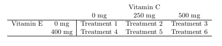

# Introduction to Statistical Modeling and Designed Experiments

We begin our dive into Statistical Modeling by first reviewing content from your introductory statistics course. The learning objective of this unit unclude:

* Understanding the basic structure of statistical model
* Understanding that statistical inference can be formulated as the comparison of models
* Distinguishing between observational studies and designed experiments
* Performing a full analysis involving a one-factor experiment

## Statistical Analyses is Modeling

Think of a model airplane.  It is just a simplified representation of the real thing.  

In many statistical problems (and all the problems we will encounter in this course), we are interested in describing the relationship that may exist among several different measured variables.  For example, your current GPA could be impacted by how much you study.  Or there may be several contributing factors – your credit hour load, your ACT score, whether or not you have a part-time job, etc.  

Of course, what makes your GPA is the result of a very highly complex combination of factors, some important and others not so important.

A **statistical model** is a mechanism we will use to try to describe the structural relationship between some measured outcome (called the response variable) and one or more impacting variables (called predictor variables or factors, depending on the contextual circumstance) in a simplified mathematical way.

It is in this sense that you can think of a statistical model as a “simplification” in much the same way as the model airplane: we know that the true relationship between response and predictor variables is very detailed and complex, but the goal of the model isn’t to capture all the intricacies of the complexity.  Rather, the model only seeks to describe the essential features of any relationships that exist. 

It turns out, we've already fit a statistical model. Consider a variation of the two-sample $t$-test we performed in the previous chapter. For cohesiveness we input the data again.

```{r ch2-1web, eval=FALSE}
uadata <- read.table("http://www.users.miamioh.edu/hughesmr/sta363/univadmissions.txt", 
                     header=TRUE)
```
```{r ch2-1}
uadata.trim <- uadata %>%
  filter(year %in% c(1996, 2000) )

t.test(act ~ year, data=uadata.trim, conf.level=0.98, 
       alternative="two.sided", var.equal=TRUE)
```

Looking at the code you'll note here we are performing a `two.sided` or "not equal to" test. More importantly note the `act ~ year` notation -- this is known as a **formula** in R. In particular, we are telling R that the ACT scores are a function of the student's incoming Year. This concept should be famliar as it is similar to the regression ideas from your Intro Statistics course. 

It turns out that nearly all statistical inference can be framed in terms of modeling. To see this we first much cover some light *math*.

Recall from Intro Statistics that a random variable $Y$ is typically assumed to come from a Normal distribution with mean $\mu$ and standard deviation $\sigma$. Standard shorthand notation for this is to write
$$Y \sim N(\mu, \sigma).$$
You may also remember that if you subtract off the mean, $\mu$, from a random variable it will just shift the distribution by $\mu$ units. For example
$$ Y - \mu \sim N(0, \sigma)$$
We could reformulate the above via
\begin{equation}
Y = \mu + \varepsilon 
(\#eq:baseModel)
\end{equation}
where
$$\varepsilon \sim N(0, \sigma).$$

The equation \@ref(eq:baseModel) can be considered a *baseline* model. Here, we are simply stating that the random variable $Y$ is a function of a mean $\mu$ and random component $\varepsilon$, which happens to be from a Normal distribution with mean 0 and standard deviation $\sigma$. In words have the model
$$\textbf{Data} = \textbf{Systematic Structure} + \textbf{Random Variation}$$
where in the base model the Systematic Structure is simply the constant $\mu$. We will consider more complicated structures later.

**Estimation**


A quick note about estimation. In your Intro Stat class you worked with this model regularly. We would estimate $\mu$ with the sample mean $\bar{Y}$ and estimate $\sigma$ with the sample standard deviation $S$. You learned about one-sample hypothesis testing and confidence intervals all based from this baseline model.

**Two-sample $t$-test as a Model**

Now consider the case of testing if ACT scores were different in 1996 compared to 2000. Let's create a new variable called $\tau$ that measures how the 2000 ACT scores deviate from the 1996 ACT scores. That is, considering a model
$$Y_i = \mu + \tau + \varepsilon_i$$
Here the value $\mu$ corresponds to the mean ACT score in 1996 and is the baseline, $\tau$ measures how the year 2000 ACT scores differs from 1996 and $\varepsilon_i$ is the underlying random part.

Another way to frame this model is to consider a variable $X$ such that if observation $i$ is from 1996 then $X_i$ takes on the value zero and if the observation if from 2000 then $X_i$ takes on the value one. We'll let $Y_i$ be the observed ACT score for student $i$ and consider the following

\begin{equation}
Y_i = \mu + \delta\cdot X_i + \varepsilon_i.
(\#eq:twoSampleTtest)
\end{equation}

Now $\mu$ is the mean of 1996 ACT scores, $\delta$ is the effect the year 2000 has on ACT scores (*i.e.*, if ACT scores increased by 4 units from 1996 to 2000, $\delta=4$), thus $\mu+\delta$ is the mean ACT score in the year 2000. Lastly, $\varepsilon$ is how observation $i$ deviates from the mean and we assume $\varepsilon \sim N(0, \sigma)$ for standard deviation $\sigma$.

When performing a two-sample $t$-test we are essentially testing $H_0:\ \delta=0$ versus $H_A:\ \delta\neq 0$. Note that if $H_0$ were true, we are back to the baseline model \@ref(eq:baseModel). 

So to put it another way, a two-sample $t$-test essentially is a choice of

$$H_0: \textrm{Baseline Model} ~~ Y_i = \mu + \varepsilon_i$$
and
$$H_A: \textrm{More complex model} ~~ Y_i = \mu + \delta\cdot X_i + \varepsilon.$$

To tie everything together note that in $H_A$ we are essentially saying observation $Y_i$ is a function of variable $X_i$. 

Because of this we typically refer to $Y_i$ as the **response** (or dependent) variable and $X_i$ as a **predictor** (or independent) variable. This coincides with the R `formula` notation, `response ~ predictor`.


## Observational Studies versus designed experiments

Before we introduce more statistical models we need to step back and discuss the source of our **data**. Are the data a “sample of convenience”, or were they obtained via a designed experiment or random sampling?  How the data were collected has a crucial impact on what conclusions can be meaningfully made.

It is important to recognize that there are two primary methods for obtaining data for analysis: **designed experiments** and **observational studies**. It is important to know the distinction because each type of data results in a different approach to interpreting estimated models. 

### Observational Studies

In many situations a practioner (perhaps you, or a client) simply collect measurements on predictor and response variables as they naturally occur, without intervention from the data collector. Such data is called **observational data**.

Interpreting models built on observational data can be challenging.
There are many opportunities for error and any conclusions will carry with them substantial unquantifiable uncertainty.
Nevertheless, there are many important questions for which only observational data will ever be available.
For example, how else would we study something like differences in prevalence of obesity, diabetes and other cardiovascular risk factors between different ethnic groups?
Or the effect of socio-economic status on self esteem?
It may be impossible to design experiments to investigate these, so we must make the attempt to build good models with observational data in spite of their shortcomings.

In observational studies, establishing causal connections between response and predictor variables is nearly impossible.
In the limited scope of a single study, the best one can hope for is to establish associations between predictor variables and response variables.
But even this can be difficult due to the uncontrolled nature of observational data.  Why?
It’s because unmeasured and possibly unsuspected “lurking” variables may be the real cause of an observed relationship between $Y$ and some predictor $X$.

In observational studies, it is important to adjust for the effects of possible confounding variables. Unfortunately, one can never be sure that the all relevant confounding variables have been identified.  As a result, one must take care in interpreting estimated models involving observational data.

This topic will be more thoroughly visited later.


### Designed experiments

In a **designed experiment**, the researcher has control over the settings of the predictor variables. For example, suppose we wish to study several physical exercise regimens and how they impact calorie burn. Typically the values of the predictor variables are discrete (that is, a countably finite number of controlled values). Because of this, predictor variables of this type are known as **factors**. The **experimental units** (EUs) are the people we use for the study.  We can control some of the predictors such as the amount of time spent exercising or the amount of carbohydrates consumed prior to exercising. Some other predictors may not be controlled but could be measured, such as baseline metabolic variables.  Other variables, such as the temperature in the room or the type of exercise done, could be held fixed.

Having control over the conditions in an experiment allows us to make stronger conclusions from the analysis. Another key feature from a designed experiment is that the model is chosen for us! We will see later in the class that with observational data we typically need to select a model. But with a designed experiment the model is predetermined based on the experiment. 


## Designed experiement vocabulary

### What is an experiment?

In an experiment, a researcher manipulates one or more variables, while holding all other variables constant. The main advantage of well-designed experiments over observational studies is that we can establish cause and effect relationships between the predictors and response. 

One of the most important things to keep in mind with analyzing designed experiments is that **the structure of the experiment dictates how the analysis may proceed**.  There are a plethora of structural possibilities of which we will only scratch the surface here.   

Consider, for example, these four scenarios:

1. Suppose a study is conducted on the effects a new drug has on patient blood pressure. At the start of the study the blood pressure of all participants is measured. After receiving the drug for two months the blood pressure of each patient is measured again. The anlaysis to determine the effect of the drug on blood pressure is the **Paired $t$-test** from your Intro stat class. Here the *pairing* of each observation is the difference between the before and after blood pressure.

2. We may have a simple design with only one factor, where each subject (experimental unit) is measured only under one of the factor levels. For example, suppose three different drugs are administered to 18 subjects.  Each person is randomly assigned to receive only one of the three drugs.  A response is measured after drug administration. The analysis we use for such data is known as a **one-way analysis of variance**.

3.	We may have a design with two factors, where every level of the first factor appears with every level of the second factor.  For example, suppose your data are from an experiment in which alertness levels of male and female subjects were measured after they had been given one of two possible dosages of a drug.  Such an experimental design is known as a factorial design.  Here, the two factors are gender and dosage.  The analysis we use for such data is known as a **two-way analysis of variance.**

4.	Suppose we have a design with only one factor of interest (word type).  Five subjects are asked to memorize a list of words. The words on this list are of three types: positive words, negative words and neutral words. The response variable is the number of words recalled by word type, with a goal of determining if the ability to recall words is affected by the word type. Note that even though there is only one factor of interest (word type) with three levels (negative, neutral and positive), this data structure differs greatly from a one-way analysis of variance mentioned earlier because each subject is observed under every factor level.  Thus, there will be variability in the responses within subjects as well as between subjects.  This fact will affect how we analyze the data.  

We will cover each of these analyses. 

### Analysis of variance

**Analysis of variance** (ANOVA) is an analytical tool in statistics to partition the variation in a response variable and attribute it to known sources in the experiment. It is essentially an extension of the more familiar $t$-test. As stated earlier, there are many different experimental structures possible when conducting an experiment.  Some of the other widely used structures in practice are known as nested designs, split-plot designs, and repeated measures designs.  It is worth saying again that the structure of the experimental data will dictate how an analysis of variance is used to model the data. In each of these designs, some variant of an Analysis of Variance is used for analysis.

### Elements of a designed experiment

All experiments have factors, a response variable, and experimental units.  Here are some definitions and terms:

* **Factors**: A factor is an explanatory variable manipulated by the experimenter.  Each factor has two or more levels (i.e., different values of the factor).  Combinations of factor levels form what are called **treatments**. The table below shows factors, factor levels, and treatments for a hypothetical experiment:
```{r ch2-2, echo=FALSE}
# 
tab <- data.frame("Vitamin E" = c("0 mg", "400 mg"),
                  "0 mg" = c("Treatment 1", "Treatment 4"),
                  "250 mg" = c("Treatment 2", "Treatment 5"),
                  "500 mg" = c("Treatment 3", "Treatment 6"))
names(tab) <- c("Vitamin E", "0 mg", "250 mg", "500 mg")
kable(tab) %>% kable_styling(full_width=FALSE) %>%
  add_header_above(c(" " = 1, "Vitamin C" = 3))
```
In this hypothetical experiment, the researcher is studying the possible effects of Vitamin C and Vitamin E on health. There are two factors: dosage of Vitamin C and dosage of Vitamin E. The Vitamin C factor has three levels: 0 mg per day, 250 mg per day, and 500 mg per day. The Vitamin E factor has 2 levels: 0 mg per day and 400 mg per day. The experiment has six treatments. Treatment 1 is 0 mg of E and 0 mg of C; Treatment 2 is 0 mg of E and 250 mg of C; and so on.

* **Response variable**: In the hypothetical experiment above, the researcher is looking at the effect of vitamins on health. The response variable in this experiment would be some measure of health (annual doctor bills, number of colds caught in a year, number of days hospitalized, etc.).

* **Experimental units**: The recipients of experimental treatments are called experimental units. The experimental units in an experiment could be anything - people, plants, animals, or even inanimate objects. 

In the hypothetical experiment above, the experimental units would probably be people (or lab animals). But in an experiment to measure the tensile strength of string, the experimental units might be pieces of string. When the experimental units are people, they are often called participants; when the experimental units are animals, they are often called subjects.

**Three characteristics of a well-designed experiment.**  While the elements above are common to all experiments, there are aspects to the manner in which the experiment is run which are critical to it being a “well-designed” experiment. A well-designed experiment includes design features that allow researchers to eliminate extraneous variables as an explanation for the observed relationship between the factor(s) and the response variable. Some of these features are listed below.

* **Control**: Control refers to steps taken to reduce the effects of extraneous variables (i.e., variables other than the factor(s) and response). These extraneous variables are called lurking variables.  Control involves making the experiment as similar as possible for experimental units in each treatment condition. Two control strategies are control groups and placebos:

    + **Control group**: A control group is a baseline group that receives no treatment or a neutral treatment. To assess treatment effects, the experimenter compares results in the treatment group to results in the control group.

    + **Placebo**: Often, participants in an experiment respond differently after they receive a treatment, even if the treatment is neutral. A neutral treatment that has no “real” effect on the dependent variable is called a placebo, and a participant's positive response to a placebo is called the placebo effect. To control for the placebo effect, researchers often administer a neutral treatment (i.e., a placebo) to the control group. The classic example is using a sugar pill in drug research. The drug is effective only if participants who receive the drug have better outcomes than participants who receive the sugar pill.

    + **Blinding**: Of course, if participants in the control group know that they are receiving a placebo, the placebo effect will be reduced or eliminated; and the placebo will not serve its intended control purpose.  Blinding is the practice of not telling participants whether they are receiving a placebo. In this way, participants in the control and treatment groups experience the placebo effect equally. Often, knowledge of which groups receive placebos is also kept from people who administer or evaluate the experiment. This practice is called double blinding. It prevents the experimenter from "spilling the beans" to participants through subtle cues; and it assures that the analyst's evaluation is not tainted by awareness of actual treatment conditions. 

* **Randomization**: Randomization refers to the practice of using chance methods (random number generation, etc.) to assign experimental units to treatments. In this way, the potential effects of lurking variables are distributed at chance levels (hopefully roughly evenly) across treatment conditions. For example, suppose we had 12 experimental units which we wanted to completely randomly allocate to three different treatments (call them A, B and C). We can accomplish this as follows in R:

```{r ch2-3}
ids <- 1:12
trt <- rep(c('A','B','C'), each=4)
randomized <- sample(ids, size=length(ids), replace=FALSE)
CRD <- data.frame(trt, randomized)
CRD
```
Such a design is known as a **completely randomized design** (or CRD).

* **Replication**: Replication refers to the practice of assigning each treatment to many experimental units.  The purpose of replication is as follows:

    + Estimate the noise in the system.  Recall early in the text when we discussed sources of variation in data. What do I mean by that? Well, think of this: if you were to apply precisely the same treatment to a set of different individuals, the response would naturally vary  due to myriad reasons of little to no interest to the researcher.  So, responses vary to some degree due to simple random chance fluctuations, or “noise.”  For our purposes, this constitutes a single source of variation. 
    + Now, let’s apply different treatments to a set of individuals.  The responses would still vary, but now there are two sources of variation: the random chance element from above (because we still have different individuals), but now we add in the effect that the different treatments have on the response.  So, one purpose of replication is so that **we can estimate how much noise is naturally in the system, so that we can see if the variability in response introduced by changing the treatment rises above the noise**.  The more replication in an experiment, the better you can estimate the noise. However, this comes at an expense!
    + Help wash out the effect of lurking variables.  Now, I know this was mentioned as a reason for randomization, but replication provides the “opportunity” to your experiment to have a mix of all those lurkers appear under each treatment.

#### Confounding

This sounds serious.  What is it?  

**Confounding** is a condition that occurs when the experimental controls do not allow the experimenter to reasonably eliminate plausible alternative explanations for an observed relationship between factors and the response.   Needless to say, confounding renders experimental results to be seriously impaired, if not totally useless.  Consider this example:

**Example.**  A drug manufacturer tests a new cold medicine with 200 participants: 100 men and 100 women. The men receive the drug, and the women do not. At the end of the test period, the men report fewer colds.

*What’s the problem?* This experiment implements no controls!  As a result, many variables are confounded, and it is impossible to say whether the drug was effective. For example:

* Gender is confounded with drug use. Perhaps, men are less vulnerable to the particular cold virus circulating during the experiment, and the new medicine had no effect at all. Or perhaps the men experienced a placebo effect.

This experiment could be strengthened with a few controls.  Women and men could be randomly assigned to treatments. One treatment group could receive a placebo.  Blinding could be implemented to reduce the influence of “expectation” on the part of participants with regard to the outcome of a treatment.  Then, after all this, if the treatment group (i.e., the group getting the medicine) exhibits sufficiently fewer colds than the control group, it would be reasonable to conclude that the medicine was the reason for effectively preventing colds, and not some other lurking reason. 


## Paired *t*-test

Now that the framework for experimental design is complete let's consider our first example, the paired *t*-test (also known as the matched pairs design). Arguably the simplest example of such a design is a before and after study.

**Example.** In an effort to student the effectiveness of a new cholesterol drug 20 patients with high cholesterol are selected and their cholesterol is meaured at the beginning of the study. The patients then take the new drug for 45 days. At the conclusion of the 45 days their cholesterol is measured and compared to that at the beginning of the study.

The above is an example of a designed experiment. The experimental units are the 20 individuals, the response is the difference in cholesterol (before and after) and the pairing attempts to control for confounding variability (variability within an individual is somewhat controlled via the pairing mechanism).

The use of the paired *t*-test is not limited to experimental designs, it also appears in observational studies. The paired *t* does follow the model form discussed above but is actually somewhat complex due to the pairing mechanism. We will revisit the model statement in a later section.

**Implementation in R**

To demonstrates its implementation in R we consider another example. 

**Example.** (originally in @WeissText) The makers of the MAGNETIZER Engine Energizer System (EES) claim that it improves the gas mileage and reduces emissions in automobiles by using magnetic free energy to increase the amount of oxygen in the fuel for greater combustion efficiency. Test results for 14 vehicles that underwent testing is availble in the file `carCOemissions.csv`. The data includes the emitted carbon monoxide (CO) levels, in parts per million, of each of the 14 vehicles tested before and after installation of the EES.

This is a classic before-after (Paired designe) study. Below is some code to implement the test.

```{r, eval=FALSE}
www <- "http://users.miamioh.edu/hughesmr/sta363/carCOemissions.csv"
vehicleCO <- read.csv(www)
vehicleCO
```

```{r ch2-4, echo=FALSE}
vehicleCO <- read.csv("carCOemissions.csv")
vehicleCO
```

First we note each row of the data consist of an `id` with a `before` and `after` measurement. In the paired *t*-test, we are comparing the differences between the before and after measuremements. We perform this test in two different ways: (1) we explicitly calculuate the difference and (2) we use features in the `t.test` function.

**Method 1**
```{r ch2-5a}
vehicleCO <- vehicleCO %>%
  mutate(Difference = before - after)
t.test(vehicleCO$Difference)
```

**Method 2**
```{r ch2-5b}
t.test(vehicleCO$before, vehicleCO$after, paired=TRUE)
```

In the first method, since we explicitly calculated the Difference as a new variable, we are determining if it is significantly different than zero. In the second method, we compare the before and after measures but we tell R that the data are paired with the `paired=TRUE` option. Lastly we note both methods provide the same findings with a $p$-value of approximately `r round(t.test(vehicleCO$before, vehicleCO$after, paired=TRUE)$p.value, 4)`, thus we have strong evidence to support that the EES system changes carbon monoxide levels.

**Graphical comparison**

To graphically compare paired data we must use some caution and consider the pairing feature in the data. Ultimately we are interested in the pairwise difference between observations. Thus, side-by-side boxplots are not appropriate since they do not account for the pairing. We can however report a boxplot of the differences. Figure \@ref(fig:ch2-5) provides a horizontal boxplot (the `coord_clip()` function causes the switch) of the differences.

```{r ch2-5, fig.align='center', fig.cap='Box-whiskers plot showing the distribution of difference in CO emissions (Before installation of EES - After installation) demonstrating a CO emissions decreased for most vehicles under study.', out.width='70%', fig.asp=0.55}
ggplot(vehicleCO) + 
  geom_boxplot(aes(x="",y=Difference) )+
  labs(x="", y="Changes in CO Levels (ppm)", 
       title="Effects of Engine Energizer System (EES) on 14 vehicles", 
       subtitle="Change in Carbon Monoxide Emissions after installation of EES") +
  coord_flip() +
  theme_minimal()
```

Another type of plot that can be handy for this sort of data (and will be more important later) is known as a profile plot. Here we use the `id` values to group data. Basically we wish to draw a line for each and every individual vehicle.
We begin with some data manipulation.

```{r ch2-6}
vehicleCO.tall <- vehicleCO %>%
  select(-Difference) %>% 
  pivot_longer(c(before, after), names_to="Time", values_to="CO") %>%
  mutate(id=factor(id),
         Time=factor(Time, levels=c("before","after")))
```

Let's step through the above R code. In the first statement `select(-Difference)` we are telling R to drop the `Difference` variable as we do not need it for the plot. Then we are pivoting from wide-to-long format with the `before` and `after` measurements. The resulting two new variables, one called `Time` which states if it is the before or after measure and another called `CO` with the corresponding Carbon Monoxide emissions at that time.  Lastly, we tell R to treat `id` as a factor and set the levels of `Time` so that `before` is first (otherwise it would put things in alphabetical order, by default).

Now that the data is in a tall format, we can make our profile plot in Figure \@ref(fig:ch2-7). Here we simply tell R to treat the factor `Time` as the $x$-variable with `CO` as the $y$-variable, but group each line by vehicle `id`.

```{r ch2-7, fig.align='center', fig.cap='Profiles of each vehicle demonstrating a general decrease in CO emissions after EES installation.',out.width='70%', fig.asp=0.55}
ggplot(vehicleCO.tall) + 
  geom_line(aes(x=Time, y=CO, group=id) ) +
  theme_minimal() + 
  labs(y="CO Emissions (ppm)", x="Installation of EES")
```

To jazz up our plot we can add the overall effect by including some summary values.
First we calculate summary statistics. Since we use a `group` variable for each vehicle we need to *trick* R into plotting the overall summary line as well, thus we create an `id="Summary"` variable in `vehicleCO.summary` to use as a `group` variable.
We also tweak the $x$-axis scale by limiting the amount of space around the before and after markings.
The code below produces Figure \@ref(fig:ch2-7).

```{r ch2-7annotated, message=FALSE, fig.align='center', fig.cap='Profiles of each vehicle, with average profile highlighted in a thick dark red line, demonstrating a general decrease in CO emissions after EES installation.', out.width='70%', fig.asp=0.55}
vehicleCO.summary <- vehicleCO.tall %>%
  group_by(Time) %>%
  summarize(CO=mean(CO),
            id="Summary")

ggplot(vehicleCO.tall) + 
  geom_line(aes(x=Time, y=CO, group=id), color="gray50" ) +
  geom_line(data=vehicleCO.summary, aes(x=Time, y=CO, group=id), color="darkred", size=2) +
  labs(y="CO Emissions (ppm)", x="Installation of EES") + 
  scale_x_discrete(expand=c(0.075, 0.075) ) + 
  theme_minimal()
```

Based on the two plots, coupled with the results of the paired $t$-test, it is clear there is significant decrease in CO emissions after installation of the EES.

## One-Way ANOVA

When there is a single factor whose levels may only change between different EUs, we can analyze the effect of the factor on the response by using a one-way analysis of variance (one-way ANOVA) on the between-subjects factor.  If we had a single factor with just two levels, you could still use a one-way ANOVA, but it would be equivalent to running an independent samples t-test (see earlier material).  

In this design, we observe random samples from $k$ different populations.  As a designed experiment, these populations may be defined on the basis of an administered treatment.  The levels of the factor being manipulated by the researcher form the different treatments.  Frequently, the data are obtained by collecting a random sample of individuals to participate in the study, and then randomly allocating a single treatment to each of the study participants.  If so, then **the individual subjects (experimental units) receiving treatment $i$ may be thought of as a random sample from the population of all individuals who could be administered treatment $i$**. 

The one-way data structure looks like the following:

$$\begin{array}{cccc}
\hline
\textbf{Treatment 1} & \textbf{Treatment 2} & \cdots & \textbf{Treatment}~k  \\
\hline
Y_{11} & Y_{21} & \ldots & Y_{k1} \\
Y_{12} & Y_{22} & \ldots & Y_{k2} \\
Y_{13} & Y_{23} & \ldots & Y_{k3} \\
\vdots & \vdots & \vdots & \vdots \\
Y_{1n_{1}} & Y_{2n_{2}} & \ldots & Y_{kn_{k}} \\
\hline
\end{array}$$

The model for such data has the form $Y_{ij} = \mu_i + \varepsilon_{ij}$, or more commonly,
$$Y_{ij} = \mu + \tau_i + \varepsilon_{ij}$$
where 

* $Y_{ij}$ is the jth observation in the ith treatment
* $\mu$ is the overall mean of all the populations combined
* $\tau_i$ is the deviation of the mean by the $i^\mathrm{th}$ treatment population from the overall mean $\mu$
* $\varepsilon_{ij}$ is the random error term

The usual test of interest in a one-way analysis of variance is to compare the population means.  The null and alternative hypotheses are given by:

$$H_0: \mu_1 = \mu_2 = \ldots = \mu_k$$
$$H_a: \textrm{at least two of the population means differ}$$

Expressed in terms of the more commonly used model parameters, we really want to test to see if there are no treatment mean deviations among the populations, so the above hypotheses can be equivalently expressed as follows:

$$H_0: \tau_1 = \tau_2 = \ldots = \tau_k = 0$$
$$H_a: \textrm{at least one } \tau_i \neq 0$$

In terms of modeling, we are testing

$$H_0: \textrm{Baseline Model:} ~~ Y_{ij} = \mu + \varepsilon_{ij}$$

$$H_0: \textrm{More Complex Model:} ~~ Y_{ij} = \mu + \tau_j + \varepsilon_{ij},~~\textrm{at least one}~\tau_j\neq0$$

We test these hypotheses by partitioning the total variability in the response into two components: (1) variation between treatments, and (2) variation within treatments.  The latter partition is essentially residual error. An $F$-test is performed to run the test. 

The $F$-test works like other hypothesis test. The test statistic is a ratio of variance estimates and follows the Fisher-Snedecor distribution (or $F$-distribution for short). The details of this distribution are not important for this course. An example of a one-way ANOVA in R is provided below.

**Example:** Drug effects on alertness.  Three different medications are tested on a sample of 18 individuals to see if they impact alertness.  Each subject is randomly assigned one drug, the drug is administered.  After 60 minutes, a test is administered that scores the alertness level of each subject (a higher score means higher alertness).  The data appear in the R dataframe `onewaydrug.RData` in our repository: `http://users.miamioh.edu/hughesmr/sta363/`

```{r ch2-8, fig.align='center', fig.cap='Side-by-side Box-whiskers plots showing the distribution of `alertness` for each of the three drug treatments, `a`, `b` and `c`. Overall we see alertness is highest in treatment `a`, followed by `b` and `c`. We Also note that variability appears greatest in treatment `a`, followed by `b` and `c`.', out.width='70%', fig.asp=0.55}
load("onewaydrug.RData")
glimpse(onewaydrug)
ggplot(onewaydrug) + 
  geom_boxplot(aes(x=drug, y=alertness)) + 
  theme_minimal()
```

Visually it appears the scores under drug C seem to be noticeably lower on average than for the other two drugs.  Also, we may suspect the variance is different between the three drug. That is, the distributions of scores for drugs A and B are more disperse than for drug C.  

To perform One-Way ANOVA we employ the `aov` function (for Analysis Of Variance). We use the `summary()` function to see its full output.

```{r ch2-9}
fit.drug <- aov(alertness ~ drug, data=onewaydrug)
summary(fit.drug)
```

We see One-Way ANOVA report a significant *p*-value (less than 0.01) but we'll soon see there are problems with this result.

## Assumption Checking

Arguably the most important aspect in statistics is the assumptions made with the chosen statistical model. In the field of statistics there are two types of assumptions made:

1. Assumptions about the systematic structure.
2. Assumptions about the random variation.

Most of the time, when referring to assumptions we are concerned about 2: Assumptions about the random variation. It is important to consider the assumptions on the structure. In all of our models/testing discussed above, we are assuming the response variable is a linear function on the predictor variable (consider \@ref(eq:twoSampleTtest)). Based on context, it is important to consider if a linear structure is appropriate.

In this class, along with nearly all methods you learned in your Intro Stat course, we make the following assumptions about the underlying stochastic (i.e., random) part of the response variable, $\varepsilon$

* The $\varepsilon_i$ terms are independent
* The variance of $\varepsilon_i$ is homogeneous; i.e., $Var(\epsilon_i)=\sigma^2$ is constant for all $i=1,\ldots,n$. This is sometimes known as being homoskedastic.
* The $\varepsilon_i$ terms are Normally distributed.

Collectively, the three assumptions simply state
$$\varepsilon_i \stackrel{iid}{\sim} N(0, \sigma^2), ~~\textrm{for variance}~\sigma^2$$

**Important Note.** In the above bullet points, the assumptions are listed in their order of importance. If you lack independence, nearly all statistical methods we will cover in this class are invalid. The constant variance assumption can be important but in many cases we can address it. Lastly, the Normality assumption tends to not be all that important except in small sample sizes and when the data is heavily skewed -- we can also address it in many cases.

### Independence

In general, independence (or lack thereof) is the result of the sampling scheme employed during data collection. If you collect your data according to a well designed experiment or a simple random sampling scheme with one observation per subject, there is usually no reason to suspect you will have a problem. Data collected sequentially in time (e.g., daily high temperatures) will exhibit a phenomenon known as autocorrelation (or serial correlation) and is a major problem!

### Constant Variance


To assess the constant variance assumption we typically consider two simple plots: a Residuals vs Fitted plot and Scale-Location plot.

```{r ch2-10, echo=FALSE,  fig.cap='Residual diagnostic plots showing a *fanning* effect in the residuals vs fitted and increasing linear trend in the Scale-Location plot, thus suggesting the variance increases with the mean.', out.width='70%', fig.align='center', fig.asp=0.8}
autoplot(fit.drug, which=c(1,3), nrow=1)
```

Consider the baseline model \@ref(eq:baseModel). We can estimate $\mu$ with $\bar{Y}$ and we would estimate each observed $Y$ with $\hat{Y}_i=\bar{Y}$. From there, we can approximate the random variation $\varepsilon_i$ with $e_i = Y_i - \hat{Y}_i$. The values $\hat{Y}_i$ are known as the *fitted*, or *predicted*, values and $e_i$ as the sample *residuals*.


A residuals versus fitted plot is provided to the right. If all is well, you should see fairly uniform (“constant”) spread of the points in the vertical direction and the scatter should be symmetric vertically around zero. The vertical spread here looks like it might be expanding as the fitted values increase (fanning effect), suggesting that there may be subtle non-constant error variance.  

An attempt at refining the residuals vs fitted plot is given in the second of the four plot display, called the Scale-Location plot. The difference now is that instead of plotting the raw residuals ei on the vertical axis, R first standardizes them (so you can better check for extreme cases), takes their absolute value (to double the resolution in the plot) and then takes their square root (to remove skew that sometimes affects these plots).  R then adds a trend line through the points: if the constant variance assumption is OK, this trend line should be roughly horizontal. Here, you can see it trending upward, so we may have a constant variance problem. 

Using the absolute values of the residuals is a good refinement.  The reason is because we really don’t care if a residual is positive or negative: all we are looking for is if the scatter is uniform across the plot.  Thus, by looking at the magnitude of the residuals only (and not their direction) by taking absolute values, we are actually improving the resolution of the information that the plot contains in addressing constant variance.

### Checking Normality


We typically make our assessment with a Normal quantile-quantile (Q-Q) plot. 

```{r ch2-11, echo=FALSE, out.width='45%', fig.cap='Normal Q-Q plot demonstrating the residuals are reasonably Normally distributed.', fig.align='center'}
autoplot(fit.drug, which=c(2), nrow=1)
```

In a normal Q-Q plot, the observed sample values (the “sample quantiles”) are plotted against the corresponding quantiles from a reference normal distribution (the “theoretical quantiles”).  If the parent population is normally distributed, then the sample values should reasonably match up one-to-one with normal reference quantiles, resulting in a plot of points that line up in a linear (straight line) fashion.  

A normal Q-Q plot of the residuals is presented to the right. There is some minor deviation from the line here, coupled with the issues with variance, we may have evidence to suggest the normality assumption is not met.

### Code to check assumption

The code to generate the above plots can be achieved via the `autoplot` function when including the `ggfortify` library [@R-ggfortify]. The `autoplot` function provides 4 plots by default seen in Figure \@ref(fig:ch2-13) (note: we will discuss the Constant Leverage plot in Section \@ref(detecting-and-dealing-with-unusual-observations))

```{r ch2-12, eval=FALSE}
library(ggfortify)
autoplot(fit.drug)
```

### Transforming your response

We have evidence from the above plots that the variance appears to be increasing with the response (determined by assessing the constant variance assumption). One way to typically address this issue is to transform the response variable. We will go into more details later but common transformations include $Y^*=log(Y)$, $Y^*=\sqrt{Y}$ and $Y^*=1/Y$. Here we will use a logarithmic as it is fairly common. Later in the class we will describe the other transformations in more detail. We can acheive this in R with the following which provides the residuals plots in Figure \@ref(fig:ch2-13).

```{r ch2-13, fig.width=7, fig.height=7, fig.align='center', fig.cap='Residual diagnostic plots when the response variable is the logarithm of the alertness. Here the heteroskedasticity in the original model has been improved, albeit not entirely mitigated, with some minor indication of increasing variability with the mean.', fig.asp=1, out.width='80%'}
fit.log.drug <- aov(log(alertness) ~ drug, data=onewaydrug)
autoplot(fit.log.drug)
```

This is maybe a bit better, but a stronger transformation might be warranted. For now we proceed with the logarithmic transformation.

The test comparing the three drug population means (on a log scale) is given via the `summary()` command:

```{r ch2-14}
summary(fit.log.drug)
```

The result is significant ($F$ = 14.167, $df_1$ = 2, $df_2$ = 15, $p$-value = 0.00035). Thus, we could conclude that at least two of the drugs produce significantly different mean alertness responses.

Of course, what remains to be seen is which pairs of drugs produce different mean alertness levels.  For that, we will need to look at techniques known as multiple comparison procedures.


## Follow-up procedures -- Multiple Comparisons

When there is no significant difference detected among treatment means, we can safely conclude that the treatment had no effect on the mean response that was any larger than the type of change we might expect just due to random chance. In such a case, the analysis is essentially over, except that we might want to assess the size of the observed treatment differences for descriptive purposes.

However, if significant differences are detected among the treatments (as in the example above), the ANOVA $F$-test does not inform you where the differences lie. In such a situation, a follow-up procedure known as a multiple comparison procedure is warranted for seeking out pairwise mean differences where they exist.

There are numerous multiple comparison methods in existence, and they all have certain advantages and disadvantages, and some are designed for specific sorts of follow-up comparisons. Here we will discuss two procedures for handling the following scenarios:

1. All possible pairwise comparisons
2. All comparisons versus a control group

So for example, if we had a one-way design with five treatment groups *A*, *B*, *C*, *D* and *E*, there would be 10 possible pairwise comparisons:

$$\begin{array}{cccc}
A~\textrm{vs.}~B & B~\textrm{vs.}~C & C~\textrm{vs.}~D & D~\textrm{vs.}~E \\
A~\textrm{vs.}~C & B~\textrm{vs.}~D & C~\textrm{vs.}~E &                  \\
A~\textrm{vs.}~D & B~\textrm{vs.}~E &                  &                  \\
A~\textrm{vs.}~E &                  &                  &                  
\end{array}$$

whereas if (say) *A* was a control group and we were only interested in comparisons versus a control group, then there would be only 4 pairwise comparisons of interest:

$$\begin{array}{c}
A~\textrm{vs.}~B  \\
A~\textrm{vs.}~C  \\
A~\textrm{vs.}~D  \\
A~\textrm{vs.}~E  \\
\end{array}$$

So what’s the big deal? Well, if you find yourself in a multiple comparison situation, it’s because you have declared that at least two groups differ based on the result of a single hypothesis test (the $F$-test). For that test, you used a specific criterion to make the decision (probably p-value < 0.05).

But to tease out where the differences are, you now need to run multiple tests under the same “umbrella”. That gives rise to something known as the multiple testing problem. The problem is an increase in the false positive rate (also known as Type I error rate) that occurs when statistical tests are used repeatedly.

**Multiple testing problem**. If $m$ independent comparisons are made, each using a Type I error rate of $\alpha_{PCER}$, then the family-wise (overall) Type I error rate for all comparisons considered simultaneously is given by
$$\alpha_{FWER} = 1 -  (1 - \alpha_{PCER})^m.$$

**Illustration: Coin flips.** Suppose that we declare that a coin is biased if in 10 flips it landed heads at least 9 times. Indeed, if one assumes as a null hypothesis that the coin is fair, then it can be shown that the probability that a fair coin would come up heads at least 9 out of 10 times is 0.0107. This is relatively unlikely, and under usual statistical criteria such as “reject H 0 if *p*-value < 0.05”, one would declare that the null hypothesis should be rejected — i.e., declare the coin is unfair.

A multiple testing problem arises if one wanted to use this test (which is appropriate for testing the fairness of a single coin) to test the fairness of many coins. Now, imagine if you were to test 100 fair coins by this method. Given that the probability of a fair coin coming up 9 or 10 heads in 10 flips is 0.0107, one would expect that in flipping 100 fair coins ten times each, to see a particular (i.e., pre-selected) coin come up heads 9 or 10 times would still be very unlikely, but seeing *some* coin behave that way, without concern for which one, would be more likely than not. In fact, the likelihood that all 100 fair coins are identified as fair by this criterion is $(1 - 0.0107)^{100} \approx 0.34$. Therefore the application of a “single-test coin-fairness criterion” to multiple comparisons would more likely than not falsely identify at least one fair coin as unfair!

But alas, multiple testing is a reality and a natural follow-up procedure to ANOVA. To address the problem, many multiple comparison procedures have been developed that help control the accumulation of the false positive rate. Some methods perform better than others, but common to all of them is making adjustments to $p$-values or CIs based upon how many comparisons are being made. Multiple comparisons in an ANOVA framework can be performed using the add-on R package `emmeans`. We will focus on two useful methods: Tukey’s HSD and Dunnett’s.

### Tukey’s HSD method

One of the more widely used methods is attributable to statistician John Tukey (creator of the Box-Whiskers plot). It is sometimes referred to as Tukey’s Honestly Significant Difference method (honestly!). It has the advantage of controlling the Type I error rate when performing all possible pairwise comparisons.
First we load the library and then run our fitted model `fit.log.drug` through the `emmeans()` function. Then we tell it to do a "pairwise" comparison via the `contrast()` function.

```{r ch2-15}
library(emmeans)
drug.mc <- emmeans(fit.log.drug, "drug")
contrast(drug.mc, "pairwise")
```

The significant differences are what we expected based on our earlier EDA: drug *C* is significantly different in terms of mean alertness as compared to the other two drugs. This is borne out from the Tukey-adjusted p-values of 0.0003 (when comparing drugs *A* and *C*) and 0.0027 (when comparing drugs *B* and *C*). *B* and *A* are not significantly different. The $p$-values in this output have been adjusted, so we can just compare them to our usual 0.05.

We can also obtain simultaneous 95% confidence intervals for the true mean differences due to
each drug pairing using the `confint()` function on our `contrast` of an `emmeans` object:

```{r ch2-16}
confint(contrast(drug.mc, "pairwise"))
```

These may be interpreted as follows:

95\% CI for $\mu_A - \mu_B$ = (-0.1203, 0.355788).  This interval contains 0, so we cannot conclude that the true log-mean alertness scores significantly differ between drugs *A* and *B*.

95\% CI for $\mu_A - \mu_C$ = (0.2521, 0.7702). We can be 95\% confident that drug *A* procudes a true log-mean alertness score that is between 0.2521 to 0.7702 higher than drug *C*.

95\% CI for $\mu_B - \mu_C$ = (0.1429, 0.6439). We can be 95\% confident that drug *B* produces a true log-mean alertness score that is between 0.1429 and 0.6439 higher than drug *C*.

To put back in the original units we could "un"-log the intervals by taking exponents (use the `exp()` function).

We can also visualize these results via a plot:

```{r ch2-17, fig.align='center', fig.cap='Tukey adjusted confidence interval plots comparing treatments treatments `a`, `b` and `c`. Here, we see that treatments `b` and `c` are significantly different as well as treatments `a` and `c`. We also note there is no significant difference between treatments `a` and `b`.', out.width='70%', fig.asp=0.55}
plot(contrast(drug.mc, "pairwise"))
```

Here, we are interesting in comparing each plotted confident band to the value of 0.

### Dunnett multiple comparisons

The Dunnett method is applicable when one of your experimental groups serves as a natural control to which you want to compare the remaining groups. In this situation, it is advisable to use a method that only controls the family-wise error rate for the comparisons of interest, rather than over-controlling by using a method like Tukey. We still use the `emmeans` package but specify the comparisons are against a *control* group. The code is below:

```{r ch2-18}
contrast(drug.mc, "trt.vs.ctrl")
```

The two comparisons provided are *A* vs. *B* and *A* vs. *C*. The only significant difference is between *A* and *C* (p-value = 0.0002). As before, here are simultaneous CIs and plots:

```{r ch2-19, fig.align='center', fig.cap='Dunnett adjusted confidence interval plots demonstrating that treatment `c` is significantly different than control group `a`, while treatment `b` is not significantly different than control group `a`.', out.width='70%', fig.asp=0.55}
confint(contrast(drug.mc, "trt.vs.ctrl"))
plot(contrast(drug.mc, "trt.vs.ctrl"))
```

It is interesting to compare the results you get via the two methods for the same comparisons (e.g. *A* vs. *C*). Can you explain what you see?

**Note.** Group *A* was automatically chosen as the reference group for Dunnett (R’s default is to choose the group appearing first alphabetically). To change this from the default, just tell R to do so in the `contrast` statement. In the below example we set the second (2) factor, *B*, to be the control.

```{r ch2-20}
contrast(drug.mc, "trt.vs.ctrl", ref=2)
```


