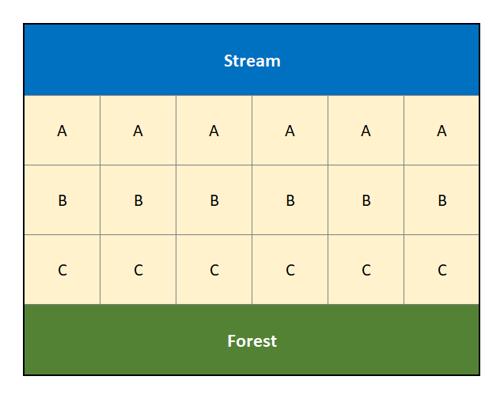
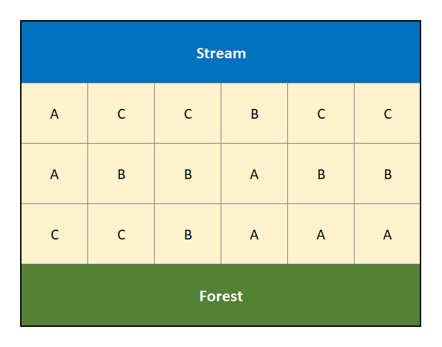
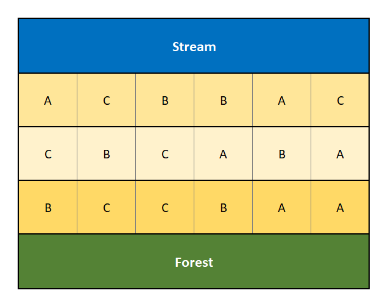

# Multiple Factor Designed Experiments

In the previous chapters we have seen how one variable (perhaps a factor with multiple treatments) can influence a response variable.
It should not be much of a stretch to consider the case of multiple predictor variables influencing the response. 

**Example.** Consider the admissions dataset with ACT scores as a response, besides the year of entry maybe a student's home neighborhood or state could also be a predictor?

In this chapter we will explore two key analyses for designed experiments -- a Block design and Two-factor experiment.
The learning objectives of this unit include:

* Understanding the structure of a multi-factor model.
* Understanding the rationale of a block design.
* Understanding the rationale and structure of a two-factor design.
* Performing a full analysis involving multiple predictor variables.


## Blocking

Randomized Block Designs are a bit of an odd duck.
The type of design itself is straightforward, but the analysis might seem a bit unusual. 

The design is best described in terms of the agricultural field trials that gave birth to it. 
When conducting field trials to compare plant varieties, there is concern that some areas of a field may be more fertile than others (*e.g.*, soil nutrients, access to water, shade versus sun, etc...). 
For example, if one were comparing three plant varieties (call them A, B and C), it would not be a good idea to use one variety in one location (say next to a creek), another variety in a different location, and the third variety way back in another part of the field near a forest because the effects of the varieties would be confounded with the natural fertility of the land.
See Figure \@ref(fig:ch3-field) as an example of a poorly designed experiment.

```{r ch3-field, echo=FALSE, fig.align='center', fig.cap='Diagram of a poorly designed experiment that is ignoring the potential confouding factors of a creek and forest.', fig.width=4.25, fig.height=3.25}

```

The natural fertility (next to the creek, compared to next to the forest, compared to the middle) in this situation is a **confounding factor**.
A confounding factor is something we are not necessarily interested in, but that none the less will have an impact on our assessment of the factor of interest (*e.g.*, plant variety).  

We could attempt to mitigate the effect of this confounding factor through randomization. 
For example, suppose by random allocation the treatments are distributed as such as in Figure \@ref(fig:ch3-field-random).

```{r ch3-field-random, echo=FALSE, fig.align='center', fig.cap='Randomized Design that attempts to account for the confouding factors of a creek and forest.', fig.width=4.25, fig.height=3.25}

```

In Figure \@ref(fig:ch3-field-random) the treatments have been randomly assigned to the different locations in an effort to mitigate the effects of the stream and forest on land fertility.
However, by random chance we note that treatment "C" has 4 of its 6 replicates in proximity to the stream, with the remaining 2 next to the forest. 
A block design looks to address this limitation of randomization when there are suspected (known) confounding effects.

A **block** is defined to be "a relatively homogeneous set of experimental material." 
This essentially means that we would like to be able to assess the treatment effects without undue influence from a contaminating or confounding factor, such as land fertility.
One way to do this would be to apply all the different treatments (*e.g.*, the three plant varieties) to the same area of the field.
Within one area (say next the creek in Figures \@ref(fig:ch3-field) and \@ref(fig:ch3-field-random)), we should see consistency in natural fertility levels.
Thus any differences observed in a measured response (such as crop yield) between plant varieties will not be due to variation in fertility levels, but rather due to the different plant varieties themselves.

A bock design is one that attempts to reduce the noise in the measured response in order to "clarify" the effect due to the treatments under study.

A **randomized block design** in the field study would be conducted in the following way: 

* The field is divided into blocks.
   + In our working example we use 3 blocks for the land next to the creek, next to the forest and that in the middle.
* Each block is divided into a number of units equal to, or more than, the number of treatments. 
   + In the example we have 6 units in each block.
* Within each block, the treatments are assigned at random so that a different treatment is applied to each unit. When all treatments are assigned at least once in each block, it is known as a "Complete" Block Design. **The defining feature of the Randomized (Complete) Block Design is that each block sees each treatment at least once.**
   + We have randomly allocated 2 replicates of each treatment in each block for a complete and balanced design.

Figure \@ref(fig:ch3-field-block) displays a randomized complete block design for the same experiment involving three plant varieties, "A", "B" and "C".

```{r ch3-field-block, echo=FALSE, fig.align='center', fig.cap='Diagram of a Randomized Complete Block Design that accounts for the confouding factors of a creek and forest.', fig.width=4.25, fig.height=3.25}

```

A good experimental design will be able to "parse out" the variability due to potential confounding factors, and thus give clarity to our assessment of the factor of interest.
A block design can accomplish this task.

**What can serve as a block?**  It is important to note that subjects (*i.e.*, experimental units) themselves may form blocks in a block design.  It is also possible that different experimental units may collectively form a "block".  It depends on the circumstances.  All that is needed is that a block, however, formed, creates a "relatively homogeneous set of experimental material."

**An example.** You've already seen the concept of a block design! Consider the paired *$t$-test included in Section \@ref(paired-t-test). There, the individual vehicles are essentially treated as blocks. 
We observe two responses within each block (or vehicle).

### Data structure, model form and analysis of variance of a Randomized Block Design

Here is the data structure for a randomized block design (RBD) with one treatment replicate per block:

$$\begin{array}{c|cccc}
\hline
         & \textbf{Treatment 1} & \textbf{Treatment 2} & \ldots & \textbf{Treatment } k \\
\hline
\textbf{Block 1} & Y_{11} & Y_{21} & \ldots & Y_{k1} \\
\textbf{Block 2} & Y_{12} & Y_{22} & \ldots & Y_{k2} \\
\vdots & \vdots & \vdots & \vdots & \vdots \\
\textbf{Block } b & Y_{1b} & Y_{2b} & \ldots & Y_{kb} \\
\hline
\end{array}$$

The model for such data has the form

$$Y_{ij} = \mu + \tau_i + \beta_j + \varepsilon_{ij}$$

where 

* $Y_{ij}$ is the observation for treatment $i$ within block $j$.
* $\mu$ is the overall mean.
* $\tau_i$ is the effect of the $i^\mathrm{th}$ treatment on the mean response.
* $\beta_j$ is the effect of the $j^\mathrm{th}$ block on the mean response.
* $\varepsilon_{ij}$ is the random error term.

The usual test of interest is the same as in a one-way analysis of variance: to compare the population means due to the different treatments.
The null and alternative hypotheses are given by:
$$H_0: \tau_1 = \tau_2 = \ldots = \tau_k = 0 ~~\textrm{versus}~~ H_a: \textrm{at least one } \tau_i \neq 0$$
We may also test for differences between blocks, but this is usually of secondary interest at best.  

### Block ANOVA Example

As a first example consider the following *classic* barley yield experiment.

**Example.** Barley Yields (from @Fisher1935).

Data was collected on the yields of five varieties of barley grown at six different locations in 1931 and 1932. 
Of statistical interested is the mean difference in yield between the five different varieties.

Original Source: @ImmerHayesPowers1934

Before proceeding with the data analysis, we first note the variables and factors of interests in this study.

* Barley yield - this is the response variable.
* Barley variety - the variety, or species, of barley. This is the factor variable of interest. It has 5 levels.
* Location and Year - The six different location and years serve as a block term in this model. We note that within each location and year, the environment should be fairly homogenous, so the location and year will serve as a blocking term.

The data is available in the file `fisherBarley.RData` on the class repository.

```{r ch3-barleyNoEval, eval=FALSE}
load(url("https://tjfisher19.github.io/introStatModeling/data/fisherBarley.RData"))
glimpse(fisherBarleyData)
```

```{r ch3-barley, echo=FALSE}
load("docs/data/fisherBarley.RData")
glimpse(fisherBarleyData)
```

We note the data includes a `LocationYear` variable that combines the information of both the `Location` and `Year`.
We also note we have a single observation for each `Variety` and `LocationYear` -- this we have a complete randomized block design with a single observation in each.

We first proceed with an inappropriate simple visualization of the data.
We do this for demonstration and learning purposes.

```{r ch3-3, fig.align='center', fig.cap="Boxplot distribution of the barley yeilds of `LocationYear` and barley `Variety`.",out.width='100%', fig.asp=0.55}
p1 <- ggplot(fisherBarleyData) + 
  geom_boxplot(aes(x=LocationYear, y=Yield) ) +
  labs(x="Location & Year", y="Yield (bushels)")
p2 <- ggplot(fisherBarleyData) + 
  geom_boxplot(aes(x=Variety, y=Yield)) +
  labs(x="Barley Variety", y="Yield (bushels)")
grid.arrange(p1, p2, nrow=1)
```
First, a quick note about the above code.
We build a simple boxplot of the yield by the block term and call it `p1`.
Similarly we build a boxplot of yield by variety, called `p2`.
We then use the `grid.arrange()` function in the `gridExtra` package [@R-gridExtra] to put the two plots side-by-side.
The results are in Figure \@ref(fig:ch3-3).

**Incorrect plots.** We note that these plots are not necessarily appropriate for this data.
For one, Boxplots display a 5 number summary -- for each block term we only have five observations (one for each variety), so the figure on the left appears to summarize a sample of data when in fact we only have 5 observations -- why not just display the raw data?
Second, the figure on the right is ignoring the block structure -- this is effectively equivalent to ignoring the *pairing* in a matched pairs design. 
Each environmental condition consisting of a location & year will have its own climate, rainfall, soil nutrients, etc...
For example, it is possible a particular barley may grow well in one Location and year due to *optimal* preciptation and sunshine levels, but another variety may grow poorly there. 
Likewise, a different variety may prefer a different climate -- this information cannot be deduced from this plot.

**A better plot** to consider is a profile plot similar to that used in the matched pairs design in Figure \@ref(fig:ch2-7) from Section \@ref(paired-t-test).
Here, we explore the response at each treatment level within each block term.

```{r ch3-3profile, fig.align='center', fig.cap='Profiles of each barley yield by variety profiling across each of the 12 Location & Year combinations.',out.width='70%', fig.asp=0.55}
ggplot(fisherBarleyData) + 
  geom_line(aes(x=Variety, y=Yield, 
                color=LocationYear, group=LocationYear) ) +
  labs(x="Barley Variety", y="Yield (bushels)", color="Location & Year") + 
  theme_minimal()
```

This plot in Figure \@ref(fig:ch3-3profile) is an improvement over the previous result but can be further tweaked for visual improvement.
In particular, each line corresponds to one of the block terms (this is the common approach for these plots) but there are 12 different colors displayed, and it can be difficult to distinguish them.
This can be considered *visual clutter*.
Since the specific Location & Year combinations are not necessarily of interest in our study, we can *mute* their impact by plotting each line with the same color as in Figure \@ref(fig:ch3-ImprovedProfile).

```{r ch3-ImprovedProfile, fig.align='center', fig.cap='Profiles of each barley yield by variety profiling across each of the 12 Location & Year combinations.',out.width='70%', fig.asp=0.55}
ggplot(fisherBarleyData) + 
  geom_line(aes(x=Variety, y=Yield, 
                group=LocationYear), color="gray30" ) +
  labs(x="Barley Variety", y="Yield (bushels)") + 
  theme_minimal()
```

From the profile plots in Figures \@ref(fig:ch3-3profile) and \@ref(fig:ch3-ImprovedProfile) it is clear that certain Location & Years were more fruitful than others, in terms of barley yield.
However, this is not the research question of interest - we are interested in determine how the different varieties influence yield.
From the plots, this is not as clear.
There is some evidence that the Trebi variety may result in more yield across all the blocks as well as maybe the Peatland variety. 

To determine the effect variety has on yield we proceed with a formal analysis.
Below is a formal analysis in a call of `aov()` -- making sure to check underlying assumptions in Figure \@ref(fig:ch3-4).

```{r ch3-4, fig.width=7, fig.height=7, fig.align='center', fig.cap='Residual diagnostic plots when the response variable is the barley yield as  a function of location & year (block) and variety. Here, the residuals appear fairly homoskedastic based on the Residuals vs Fitted and Scale-Location plots. The normality assumption is satisfied based on the Normal Q-Q plot.', fig.asp=1, out.width='80%'}
barley.fit <- aov(Yield ~ LocationYear + Variety, data=fisherBarleyData)
autoplot(barley.fit)
```

The assumptions look generally fine here (nothing too concerning about constant variance or normality).
So, on to the analysis:

```{r ch3-5}
summary(barley.fit)
```

We see that there is a significant difference in the yield between the five varieties ($F$ = 7.779, $\textrm{df}_1$ = 4, $\textrm{df}_2$ = 44, $p$-value = 0.0000785)

You can also see how the total variation was partitioned into three components: 

1.	Within-LocationYear (*i.e.*, the block term) sum of squares (31913).
2.	Between variety (*i.e.*, treatment) sum of squares (5310).
3.	Residual sum of squares (7509).   

We see that R also reports an $F$-statistic and associated $p$-value for the `LocationYear`.
This is the block term and is not of concern to our analysis.
So we **ignore** that $F$-statistic and $p$-value!

We can investigate the differences in yields between the five varieties using a multiple comparison procedure.  

```{r ch3-5a, fig.align='center', fig.cap='Tukey adjusted confidence interval plots comparing the give barley varieties (treatments). Here, we see that Trebi variety is statistically different than the other four varieties, while those four are all statistically similar (recall, we look for zero in the confidence interval of the differences).', out.width='70%', fig.asp=0.55}
barley.mc <- emmeans(barley.fit, "Variety")
plot(contrast(barley.mc, "pairwise") )
```


We see that six of the ten Confidence Intervals in Figure \@ref(fig:ch3-5a) contain the value zero, thus concluding there is not statistical difference between these varieties of barley.
However, in four of the intervals zero is not included, and all four involve the 'Trebi' variety of barley - this we have statistical evidence to conclude that the Trebi variety results in a different yield than the other four varieties.
Furthermore, based on the values of this intervals, it suggest that the Trebi variety will result in a greater yield than the other varieties (Trebi $-$ Variety $>0$ implies Trebi $>$ Variety, and Variety $-$ Trebi $<0$ implies Trebi $>$ Variety).


### Another Block ANOVA Example

The previous Block designed had roots in agriculture, much like our original description. 
Here is a different example of block terms in an design. 

**Example.** Weight loss study (published in @Walpole2007).

Two reduction treatments and a control treatment were studied for their effects on weight change in obses women.
The two reduction treatments involved were a self-induced weight reduction program and a therapist-controlled reduction program.
Each of 10 subjects were assigned to the three treatment programs in a random order and measured for weight loss.

Original Source: @Hall1975

```{r ch3-1, echo=FALSE}
weightloss <- read_csv("docs/data/weightlossStudy.csv", col_types=cols())
knitr::kable( weightloss %>% pivot_wider(id_cols=Subject, names_from=Treatment, values_from=WtChanges))
```

There data are available in the R dataframe `wordrecall.RData` on the class repository (`https://tjfisher19.github.io/introStatModeling/data/`). Below is an analysis of this data.


```{r ch3-2noeval, eval=FALSE}
weightloss <- read_tsv("https://tjfisher19.github.io/introStatModeling/data/weightlossStudy.csv")
glimpse(weightloss)
```

```{r ch3-2, echo=FALSE}
glimpse(weightloss)
```

Each subject gives three responses instead of one as in a usual one-way design.
In this manner, each subject (or person) forms a block (a person is a fairly homogeneous).
The design is a randomized block design, because the experimenter randomly determines the order of treatments for each subject.

Before the formal analysis we build profile plots to explore the effects of the three treatments within each subject in Figure \@ref(fig:ch3-WeightPprofiles).

```{r ch3-WeightPprofiles, fig.align='center', fig.cap="Profiles of each subject's weight loss for the different treatments, with an overlayed 'average' highlighted in blue.",out.width='70%', fig.asp=0.55}
ggplot(weightloss, aes(x=Treatment, y=WtChanges)) + 
  geom_line(aes(group=Subject), color="gray30" ) +
  stat_summary(fun="mean", geom="line", size=2, group=1, color="blue") + 
  labs(x="Weight Loss Treatment", y="Weight Change") + 
  theme_minimal()
```

Overall, in Figure \@ref(fig:ch3-WeightPprofiles) the effect of the different treatments appears quite stark, with the Therapist and Self-induced treatments improving over the control. 
There is also quite a bit of subject-to-subject variability (*i.e.*, each person has their own profile!) and some subjects do not follow the "average" profile.

Here is how to do a formal analysis in a call of `aov()` -- making sure to check underlying assumptions in Figure \@ref(fig:ch3-weightlossANOVA).

```{r ch3-weightlossANOVA, fig.width=7, fig.height=7, fig.align='center', fig.cap='Residual diagnostic plots when the response variable is the weight change as a function of subject (block) and treatment. Here, the residuals appear to show some minor violations to the constant variance assumption as indicated by the Residuals vs Fitted and Scale-Location plots. Except for a single concerning observation, the normality assumption is satisfied based on the Normal Q-Q plot.', fig.asp=1, out.width='80%'}
weightloss.fit <- aov(WtChanges ~ Subject + Treatment, data=weightloss)
autoplot(weightloss.fit)
```

There appears to be a minor violation in the constant variance assumption (there is some indication that fitted values away from zero are more variable?).
But, this type of violation cannot be easily be remedied by the standard techniques (a logarithm or square root transformation is not possible due to the negative values, and an reciprocal transformation is not possible due to a 0 observation).
A single observation (observation 16) has a largest $z$-score value which deviates from the Normal line.
We proceed with the analysis making note of some potential minor assumption violations.

```{r ch3-545}
summary(weightloss.fit)
```

We see that there is a significant difference in the mean weight change between the three treatments ($F$ = 6.878, $\textrm{df}_1$ = 2, $\textrm{df}_2$ = 26, $p$-value = 0.004).

As a follow-up, we can investigate the differences in mean weight changes between the three treatments using a multiple comparison procedure and noting that there is a control treatment.

```{r ch3-WeightMC, fig.align='center', fig.cap="Dunnett adjusted confidence interval plots comparing the two weight-loss treatments against the control. Here, we see that Self-induced treatment is not statistically different than the control (zero is in the interval) while the Therapist based treatment results in significantly more weight loss than the control.", out.width='70%', fig.asp=0.55}
weightloss.mc <- emmeans(weightloss.fit, "Treatment")
plot(contrast(weightloss.mc, "trt.vs.ctrl") )
```


The confidence intervals comparing the therapist-based weight loss treatment to the control in Figure \@ref(fig:ch3-WeightMC) does not contain the value zero, so we have evidence to suggest that the therapist based method results in a bigger weight change.
However, the interval comparing the self-induced method to the control indicates there is not statistical difference (zero is included in the interval).


## Two-factor Designs

A **factorial** structure in an experimental design is one in which there are two or more factors, and the levels of the factors are all observed in combination.
For example, suppose you are testing for the effectiveness of three drugs (A, B, C) at three different dosages (5 mg, 10 mg, 25 mg). 
In a factorial design, you would observed a total of nine treatments, each of which consists of a combination of drug and dose (*e.g.*, treatment 1 is drug A administered at 5 mg, treatment 2 is drug A administered at 10 mg, etc). 
Note how quickly things will grow if you have more than two factors!

In this design, the data are usually obtained by collecting a random sample of individuals to participate in the study, and then randomly allocating a single treatment to each of the study participants as in a one-way design structure. 
The only difference now is that a "treatment" consists of a combination of different factors. 
If there are two factors, the data may be analyzed using a two-way ANOVA.

The two-way data structure with two factors $\mathbf{A}$ and $\mathbf{B}$ looks like the following:

$$\begin{array}{c|cccc}
\hline
 & \mathbf{A_1} & \mathbf{A_2} & \mathbf{\ldots} & \mathbf{A_a} \\
\hline
\mathbf{B_1} & Y_{111}, Y_{112}, \ldots & Y_{211}, Y_{212}, \ldots, & \ldots & Y_{a11}, Y_{a12}, \ldots \\
\mathbf{B_2} & Y_{121}, Y_{122}, \ldots & Y_{221}, Y_{222}, \ldots, & \ldots & Y_{a21}, Y_{a22}, \ldots \\
\mathbf{B_3} & Y_{131}, Y_{132}, \ldots & Y_{231}, Y_{232}, \ldots, & \ldots & Y_{a31}, Y_{a32}, \ldots \\
\vdots & \vdots & \vdots & \vdots & \vdots \\
\mathbf{B_b} & Y_{1b1}, Y_{1b2}, \ldots & Y_{2b1}, Y_{2b2}, \ldots, & \ldots & Y_{ab1}, Y_{ab2}, \ldots \\
\hline
\end{array}$$


Note there is replication (*i.e.*, multiple independent observations) in each treatment (combination of factors $\mathbf{A}$ and $\mathbf{B}$).

The general model for such data has the form

$$Y_{ijk} = \mu + \alpha_i + \beta_j + \alpha\beta_{ij} + \varepsilon_{ijk}$$
where

* $Y_{ijk}$ is the $k^\mathrm{th}$ observation in the $i^\mathrm{th}$ level of factor $A$ and the $j^\mathrm{th}$ level of factor $B$.
* $\mu$ is the overall mean.
* $\alpha_i$ is the "main effect" of the $i^\mathrm{th}$ level of factor $A$ on the mean response.
* $\beta_j$ is the "main effect" of the $j^\mathrm{th}$ level of factor $B$ on the mean response.
* $\alpha\beta_{ij}$ is the "interaction effect" of the $i^\mathrm{th}$ level of factor $A$ and the $j^\mathrm{th}$ level of factor $B$ on the mean response.
* $\varepsilon_{ijk}$ is the random error term.

### Analysis of a two-factor design

First recall an important feature of designed experiments -- the analysis is determined by the experiment! 
In most cases of factorial designs, the primary interest is to determine if some interaction between the two factors influences the response. 
Therefore it is crucial to test the interaction term before assessing the effects of factor $A$ alone on the response, because if $A$ and $B$ interact, then we cannot separate their effects. 
In other words, if the interaction between $A$ and $B$ significantly influences the response, then the effect that factor $A$ has on the response changes depending on the level of factor $B$.

The usual testing strategy is as follows:

1. Fit a full interaction model.
2. Test for significant interaction between $A$ and $B$:
    a. If the interaction term is significant, you must look at comparisons in terms of treatment combination; *i.e.*, you cannot separate the effects of $A$ and $B$.
    b. If the interaction term is non-significant, you can look into deleting the interaction term from your model, fitting a reduced **main-effects model**. Then (and only then) may you look at the effects of $A$ and $B$ separately.
    
We consider two examples below.

### Example with No Interaction

**Example.** Highway Signage (published in @WeissText). 

An experiment was conducted to determine the effects that the sign size and sign material have on *detection distance* (the distance at which drivers can first detect highway caution signs). 
Four drivers were randomly selected for each combination of sign size (small, medium, and large) and sign material (marked 1, 2, and 3).
Each driver covered the same streth of highway at a constant speed during the same time of day, and the detection distance (in feet) was determined for hte driver's assignment caution sign.

Original Source: @Younes1994

The data appear in the csv file `highwaySigns.tsv` in the textbook repository. 

First note the data is stormed in a "Tab separated values" file, or TSV.
This is similar to the more common, "Comma Separated values", or CSV, format.
The `readr` package includes a `read_tsv()` function that works just like `read_csv()` and `read_table()`.


```{r ch3-6data-noeval, eval=FALSE}
highway_signs <- read_tsv("https://tjfisher19.github.io/introStatModeling/data/highwaySigns.tsv", col_types=cols())
glimpse(highway_signs)
```

```{r ch3-6data, echo=FALSE}
highway_signs <- read_tsv("docs/data/highwaySigns.tsv", col_types=cols() )
glimpse(highway_signs)
```
Take a look at the detection distances by treatment and note that we need to coerce the `Material` variable to be a factor variable since it is coded as a numer.
We will also turn `Size1 into a factor with a more logical order (recall that R will put the values in alphabetical order by default).

```{r ch3-highwayFix}
highway_signs <- highway_signs %>%
  mutate(Material = as.factor(Material),
         Size = factor(Size, levels=c("Small", "Medium", "Large")))
```

Now we wish to construct a plot of the data.
We note that we have 4 observations per treatment (combination of size and material) so a boxplot makes no sense here. 
We attempt to plot the raw data, using color to distinguish the three sign materials.
We also add some *jittering* and *dodging* to separate data points and materials.

```{r ch3-6, fig.align='center', fig.cap='Boxplot distribution of the texture values as a function of sauce and fish type.',out.width='100%', fig.asp=0.55}
ggplot(highway_signs) + 
  geom_point(aes(x=Size, y=Distance, color=Material),
              position=position_jitterdodge() ) + 
  labs(x="Sign Size", y="Detection Distance (ft)") +
  theme_bw()
```

From Figure \@ref(fig:ch3-6), there appears to be a size effect: Large signs have larger detection distances, followed by medium sized and then small.
There may be a material effect as material type 3 appears to have lower detection distances than type 1.
Material type 2 is somewhere between types 1 and 3 in terms of detection distances. 

We fit the interaction model in `aov()` by telling R to include an interaction term with the notation `factor1:factor2`. 
Below is the specific example for this study but first run a check on the residuals in Figure \@ref(fig:ch3-7).

```{r ch3-7, fig.width=7, fig.height=7, fig.align='center', fig.cap='Residual diagnostic plots when the response variable is the detection distance as a function of sign size and sign material. Here, the residuals appear fairly homoskedastic based on the Residuals vs Fitted and Scale-Location plots. The normality assumption is satisfied based on the Normal Q-Q plot.', fig.asp=1, out.width='80%'}
highway.fit <- aov(Distance ~ Size + Material + Size:Material, data=highway_signs)
autoplot(highway.fit)
```

The assumptions look to be reasonably met. 
While there may be some minor issues with constant variance, it does not appear to be systemically related to the predicted (fitted) values, so transformations will not be helpful.
Likewise, those few observations in the QQ-Plot are not overly concerning given their $z$-score values are in the range $(-2,2)$.

At this point, we can also generate tables of response means after we fit the interaction model.
These consist of:

* The "grand mean" (overall mean, all data pooled together and estimate $\mu$).
* Main effect means (*i.e.*, means for each factor level, taken one factor at a time).
* Interaction means (*i.e.*, treatment means for all factor combinations).

These means are estimates from the data and are purely descriptive (like the boxplots were), but informative nonetheless. 
We could calculate each one of the above using a series of `tidyverse` commands or using the R function `model.tables()`:

```{r ch3-8}
model.tables(highway.fit, "means")
```

We proceed to the hypothesis tests:

```{r ch3-9}
summary(highway.fit)
```

**The first test to inspect is the interaction test.** The interaction is insignificant ($F$ = 1.031, $\textrm{df}_1$ = 4, $\textrm{df}_2$ = 27, $p$-value = 0.409). Thus, we could conclude the effect that sign size type has on the mean detection distance does not depend on material type.

A visualization of the interaction effect may be obtained using an interactions plot. 
An interaction plot is basically a plot of treatment means, whereby the means for all treatments having a given fixed level of one of the factors are visually "connected". 
We can build the interaction plot seen in Figure \@ref(fig:ch3-10) using aesthetic options in `ggplot()` and with the `stat_summary` functions. 
Note both `color` and `group` are determined based on the `gender` variable.

```{r ch3-10, fig.align='center', fig.cap='Interaction plot demonstrating that the gender and dosage factors do not interact.', out.width='70%', fig.asp=0.55}
ggplot(highway.fit, 
       aes(x=Size, y=Distance, color=Material, group=Material) ) +  
  stat_summary(fun=mean, geom="point") + 
  stat_summary(fun=mean, geom="line") +
  labs(x="Sign Size", y="Mean Detection Distance (ft)", color="Material")
```

There are three treatment mean traces, one for each material type. 
Each trace connects the mean detection distance of the sign size within each material.

**The lack of significant interaction is evidenced by the parallelism of these traces:** the material effect for small signs is depicted by the "gaps" between the traces on the left. 
Similarly, the material effect for the medium signs is depicted by the gaps at the middle points. 
Likewise, the material effect for the large signs is dipicted by the gaps at the right points.
Overall the three lines are reasonably parallel, and the interaction is not significant, this implies that the effect of material type within three sign sizes is about the same across all sign sizes.

In other words, the effect of material type does not depend on sign size. 

The interaction term was non-significant.
Visually, we may have support that the two factors do not interact.
We can consider a reduced model that eliminates the interaction term and includes only main effects:

```{r ch3-11}
highway.main.fit <- aov(Distance ~ Size + Material, data=highway_signs)
summary(highway.main.fit)
```

From the results here (or with the interaction model), we see that the both material type and sign size appear to influence the detection distance of the fish (both $p$-values are smaller than typically-used significance levels).

At this point, the follow-up work would involve multiple comparisons among the levels of the significant main effect factors. 
Here, since ther is no interaction, we can perform multiple comparisons within each of the main effects separately. 
First, we look at the influence of sign size.

```{r ch3-12}
twoway.size.mc <- emmeans(highway.main.fit, "Size")
confint(contrast(twoway.size.mc, "pairwise"))
```

We note that the adjusted 95\% confidence do not include the value 0, thus all sign sizes result in different detection distances.

For the three different material types.

```{r ch3-12fish}
twoway.material.mc <- emmeans(highway.main.fit, "Material")
confint(contrast(twoway.material.mc, "pairwise"))
```

Similar to the above, we note that all three confidence intervals do not include the value of 0, indicating that all three material types result in different mean detection distances.


### Example with Interaction


**Example.** Tooth growth in guinea pigs (original from @Crampton-1947).

Consider an example that investigates the effects of ascorbic acid and delivery method on tooth growth in guinea pigs.
Sixty guinea pigs are randomly assigned to receive one of three levels of ascorbic acid (0.5, 1.0 or 2.0 mg) via one of two delivery methods (orange juice or Vitamin C), under the restriction that each treatment combination has an equal number of guinea pigs. 
The response variable `len` is the length of odontoblasts (cells responsible for tooth growth). 
The two-way data structure here looks like this:

```{r tooth_table, echo=FALSE}
tab <- data.frame("Supplement" = c("Orange Juice", "Vitamin C"),
                  "0.5 mg" = c("Treatment 1", "Treatment 4"),
                  "1.0 mg" = c("Treatment 2", "Treatment 5"),
                  "2.0 mg" = c("Treatment 3", "Treatment 6"))
names(tab) <- c("Supplement", "0.5 mg", "1.0 mg", "2.0 mg")
kable(tab) %>% kable_styling(full_width=FALSE) %>%
  add_header_above(c(" " = 1, "Dose" = 3))
```

As alluded to before, there are ten replicate guinea pigs per treatment. 
The data appear in the R workspace `ToothGrowth` included in the `datasets` package [@R-base]. 
Here is the head of the dataframe:

```{r ch3-14}
data("ToothGrowth")
head(ToothGrowth)
```

Let us bypass generating numeric descriptive statistics for the moment, and instead jump to an interaction plot of the length response in Figure \@ref(fig:ch3-15). 

```{r ch3-15, fig.align='center', fig.cap='Interaction plot demonstrating that the dose and supplement may interact in predicting tooth length.', out.width='70%', fig.asp=0.55}
ggplot(ToothGrowth, aes(x=dose, y=len, group=supp, color=supp) ) +  
  stat_summary(fun=mean, geom="point") + 
  stat_summary(fun=mean, geom="line") +
  labs(x="Dosage (mg per day)", y="Length of dontoblasts",
       color="Supplement")
```

There are a couple of things to note here:

1. There appears to be a substantial dose effect, in that higher doses of ascorbic acid generally result in higher mean length.
2. **However, there may be a substantial interaction effect between the type of supplement and dose in determining mean tooth length.** In particular, orange juice appears to be more effective than Vitamin C as a delivery method (longer tooth length), but only at lower dose levels. At the high dose level, there appears to be no difference between the supplements.

Once again, non-parallel traces may be the red flag. 
But, we need to run the ANOVA test for interaction to confirm if this is a significant effect. 
First, check assumptions in Figure \@ref(fig:ch3-16).

```{r ch3-16, fig.width=7, fig.height=7, fig.align='center', fig.cap='Residual diagnostic plots when the response variable is the tooth length as a function of supplement and dosage. Here, the residuals appear fairly homoskedastic based on the Residuals vs Fitted and Scale-Location plots. The normality assumption is satisfied based on the Normal Q-Q plot.', fig.asp=1, out.width='80%'}
tooth.fit <- aov(len ~ factor(dose) + supp + factor(dose):supp, data=ToothGrowth)
autoplot(tooth.fit)
```

All assumptions look fine here.
So, proceed to the ANOVA tests:

```{r c3.17}
summary(tooth.fit)
```

The test for interaction is significant ($F$ = 4.107, $\textrm{df}_1$ = 2, $\textrm{df}_2$ = 54, $p$-value = 0.0218).
Thus, we conclude the effect that supplement has on the mean tooth growth does depend on the dosage level. **We then ignore the main effects tests if the interaction is significant.**

Remember the strategy we introduced earlier:

1. Fit a full interaction model.
2. Test for significant interaction between $A$ and $B$:
    a. **If interaction is significant, you must look at comparisons in terms of treatment combinations; *i.e.*, you cannot separate the effects of $A$ and $B$**.
    b. If interaction is non-significant, you may delete the interaction term from the model, fitting a reduced main-effects model. Then (and only then) may you look at the effects of $A$ and $B$ separately.

**Performing multiple comparisons. **In the case of a significant interaction effect in a two-factor ANOVA model, we typically follow up by performing multiple comparisons for the levels of one of the factors while holding the other factor fixed (the "conditioning" factor). 
So for example, in the present problem we could either

* Compare the supplements at each of the dose levels (3 tests total), or
* Compare the dose levels within each of the supplement types (3 × 2 = 6 tests total).

Frequently in practice, the context of the problem will dictate to the researcher which way makes the most sense. 
We'll provide code that performs both cases using the `emmeans` package.

```{r ch3-18}
tooth.mc1 <- emmeans(tooth.fit, pairwise ~ factor(dose) | supp)
tooth.mc2 <- emmeans(tooth.fit, pairwise ~ supp | factor(dose) )
tooth.mc1
tooth.mc2
```

Here we see the output includes the estimates and confidence intervals for the means (while holding one factor fixed) and also includes the contrasts (comparisons) of one factor while holding the second factor constant.

At a dose level of 0.5 mg, ascorbic acid delivery via orange juice produces significantly larger mean tooth growth than does delivery via Vitamin C. 
We determined this based on the the second set of output, where we see an adjusted $p$-value of 0.0021 comparing orange juice with Vitamin C. 
Similarly, at `dose=1.0`, there is still a difference but not at `dose=2.0`.

We can also use plotting features to graphically explore the factors while holding another factor constant.

```{r ch3-19, fig.align='center', fig.cap='Graphical exploration of all treatments noting that the OJ supplement tends to result in higher tooth lengths than Vitamin C.', out.width='70%', fig.asp=0.75}
plot(tooth.mc1)
```

Here we explore the performance of the dosage amounts conditioning (essentially faceting) on the delivery type. 
Graphically we can see that the OJ method tends to have higher tooth lengths than Vitamin C for the low dosage levels of ascorbic acid.


