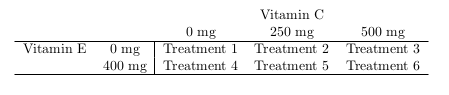

# Multiple Factor Designed Experiments

In the previous chapters we have seen how one variable (perhaps a factor with multiple treatments) can influence the response variable. It should not be much of a stretch to consider the case of multiple predictor variables influencing the response. 

**Example.** Consider the admissions dataset with ACT scores as a response, besides the year of entry maybe a student's home neighborhood or state could also be a predictor?

In this chapter we will explore two key analyses for designed experiments -- a Block design and Two-factor experiment. The learning objectives of this unit include:

* Understanding the structure of a multi-factor model
* Understanding the rationale of a block design
* Understanding the rationale and structure of a two-factor design
* Performing a full analysis involving multiple predictor variables

## Blocking

Randomized Complete Block Designs are a bit of an odd duck. The type of design itself is straightforward, but the analysis might seem a bit unusual. 

The design is best described in terms of the agricultural field trials that gave birth to it. When conducting field trials to compare plant varieties, there is concern that some areas of a field may be more fertile than others (e.g., soil nutrients, access to water, shade versus sun, etc...). So, if one were comparing three plant varieties, it would not be a good idea to use one variety in one location, another variety in a different location, and the third variety way out back in another part of the field because the effects of the varieties would be confounded with the natural fertility of the land.  

The natural fertility in this situation is a **confounding factor**, something we are not necessarily interested in, but that none the less will have an impact on our assessment of the factor of interest (e.g., plant variety).  

A **block** is defined to be “a relatively homogeneous set of experimental material.” This essentially means that we would like to be able to assess the treatment effects without undue influence from a contaminating or confounding factor, such as land fertility.   One way to do this would be to apply all the treatments (e.g., plant varieties) to the same area of the field.  Within one area, we should see consistency in natural fertility levels. Thus differences observed in a measured response (such as crop yield) between plant varieties will not be due to variation in fertility levels, but rather due to the different plant varieties themselves.

A bock design is one that attempts to reduce the noise in the measured response in order to “clarify” the effect due to the treatments under study.

A **randomized block design** in the field study would be conducted in the following way: 

* The field is divided into blocks.
* Each block is divided into a number of units equal to the number of treatments. 
* Within each block, the treatments are assigned at random so that a different treatment is applied to each unit. That is, all treatments are observed within each block. **The defining feature of the Randomized (Complete) Block Design is that each block sees each treatment exactly once.**

A good experimental design will be able to “parse out” the variability due to potential confounding factors, and thus give clarity to our assessment of the factor of interest.  A block design can accomplish this task.

**What can serve as a block?**  It is important to note that subjects (i.e., experimental units) themselves may form blocks in a block design.  It is also possible that different experimental units may collectively form a “block”.  It depends on the circumstances.  All that is needed is that a block, however, formed, creates a “relatively homogeneous set of experimental material.”

**An example.** You've already seen the concept of a block design! Consider the paired *t*-test included in Section \@ref(paired-t-test). There, the individual vehicles are essentially treated as blocks. We observe two responses within each block (or vehicle).

### Data structure, model form and analysis of variance of a Randomized Block Design

Here is the general data structure for a randomized block design (RBD):

$$\begin{array}{c|cccc}
\hline
         & \textbf{Treatment 1} & \textbf{Treatment 2} & \ldots & \textbf{Treatment } k \\
\hline
\textbf{Block 1} & Y_{11} & Y_{21} & \ldots & Y_{k1} \\
\textbf{Block 2} & Y_{12} & Y_{22} & \ldots & Y_{k2} \\
\vdots & \vdots & \vdots & \vdots & \vdots \\
\textbf{Block } b & Y_{1b} & Y_{2b} & \ldots & Y_{kb} \\
\hline
\end{array}$$

The model for such data has the form

$$Y_{ij} = \mu + \tau_i + \beta_j + \varepsilon_{ij}$$

where 

* $Y_{ij}$ is the observation for treatment $i$ within block $j$
* $\mu$ is the overall mean
* $\tau_i$ is the effect of the $i^\mathrm{th}$ treatment on the mean response
* $\beta_j$ is the effect of the $j^\mathrm{th}$ block on the mean response
* $\varepsilon_{ij}$ is the random error term

The usual test of interest is the same as in a one-way analysis of variance: to compare the population means due to the different treatments.  The null and alternative hypotheses are given by:
$$H_0: \tau_1 = \tau_2 = \ldots = \tau_k = 0 ~~\textrm{versus}~~ H_a: \textrm{at least one } \tau_i \neq 0$$
We may also test for differences between blocks, but this is usually of secondary interest at best.  

Here is an example in R.

**Example:** Word recall study. Five subjects are asked to memorize a list of words. The words on this list are of three types: positive words, negative words and neutral words. The response variable is the number of words recalled by word type (Negative (Neg), Neutral (Neu) and Positive (Pos)), with a goal of determining if the ability to recall words is affected by the word type.  Each subject provides the number of recalled words of each type.  Here are the data:

```{r ch3-1, echo=FALSE}
load("wordrecall.RData")
knitr::kable( wordrecall %>% dplyr::select(-obs) %>% spread(word.type, recall))
```

There data are available in the R dataframe `wordrecall.RData` on the class repository. Below is an analysis of this data.


```{r ch3-2}
load("wordrecall.RData")
glimpse(wordrecall)
```

Each subject gives three responses instead of one as in a usual one-way design.  In this manner, each subject (or person) forms a block.  The design is a randomized block design, because the experimenter randomly determines the order of word type for recalling for each subject.

Before doing a formal analysis, here are some descriptive looks at word type and subject factors. First we perform a little data cleaning so the `word.type` variable is displayed in a complete word.

```{r ch3-3wordClean}
wordrecall <- wordrecall %>%
  mutate(word.type = factor(word.type, labels=c("Negative", "Neutral", "Positive")))
```

Now we can look at some plots of the data.

```{r ch3-3, fig.align='center', fig.cap='Boxplot distribution of the number of Word recalls as a function of Subject and Word Types.',out.width='100%', fig.asp=0.55}
p1 <- ggplot(wordrecall) + 
  geom_boxplot(aes(x=subject, y=recall) ) +
  labs(x="Subject", y="Words Recalled")
p2 <- ggplot(wordrecall) + 
  geom_boxplot(aes(x=word.type, y=recall)) +
  labs(x="Word Type", y="Words Recalled")
grid.arrange(p1, p2, nrow=1)
```

In the above code, we build a simple boxplot of the words recalled by subject and call it `p1`. Similarly we build a boxplot of words recalled by word type, called `p2`. We then use the `grid.arrange()` function in the `gridExtra` package to put the two plots side-by-side. The results are in Figure \@ref(fig:ch3-3).

The effect of word type appears quite stark, with positive word recalls being higher than the other two types.  There is also a bit of subject-to-subject variability, but not much.

Here is how to do a formal analysis in a call of `aov()` -- making sure to check underlying assumptions in Figure \@ref(fig:ch3-4).

```{r ch3-4, fig.width=7, fig.height=7, fig.align='center', fig.cap='Residual diagnostic plots when the response variable is the number of words recalled as  a function of subject (block) and word type. Here, the residuals appear fairly homoskedastic based on the Residuals vs Fitted and Scale-Location plots. The normality assumption is satisfied based on the Normal Q-Q plot.', fig.asp=1, out.width='80%'}
word.fit <- aov(recall ~ subject + word.type, data=wordrecall)
autoplot(word.fit)
```

The assumptions look generally fine here (nothing too concerning about constant variance or normality). So, on to the analysis:

```{r ch3-5}
summary(word.fit)
```

We see that there is a significant difference in the mean recall between the three word types ($F$ = 189.11, $\textrm{df}_1$ = 2, $\textrm{df}_2$ = 8, $p$-value = 0.0000001841)

You can also see how the total variation was partitioned into three components: 

1.	Within-subject (i.e. block) sum of squares (105.067)
2.	Between word type (i.e. treatment) sum of squares (2029.73)
3.	Residual sum of squares (42.93).   

We see that R also reports an $F$-statistic and associated $p$-value for the `subject`. This is the block term and is not of concern to our analysis. So we ignore that $p$-value!

We can investigate the differences in mean recall between the three word types using a multiple comparison procedure.  

```{r ch3-5a, fig.align='center', fig.cap='Tukey adjusted confidence interval plots comparing the three word types (treatments). Here, we see that Positive words are recalled at a greater rate than Neutral or Negative words and that Negative words are recalled at a greater rate than Neutral words.', out.width='70%', fig.asp=0.55}
word.mc <- emmeans(word.fit, "word.type")
plot(contrast(word.mc, "pairwise") )
```


None of the Confidence Intervals in Figure \@ref(fig:ch3-5a) contain the value zero, so all word types are significantly different from each other.  Negative word types have significantly more recalls than neutral types; positive word types have significantly more recalls on average than either negative or neutral word types.


## Two-factor Designs

A **factorial** structure in an experimental design is one in which there are two or more factors, and the levels of the factors are all observed in combination. For example, suppose you are testing for the effectiveness of three drugs (A, B, C) at three different dosages (5 mg, 10 mg, 25 mg). In a factorial design, you would observed a total of nine treatments, each of which consists of a combination of drug and dose (e.g. treatment 1 is drug A administered at 5 mg, treatment 2 is drug A administered at 10 mg, etc). Note how quickly things will grow if you have more than two factors!

In this design, the data are usually obtained by collecting a random sample of individuals to participate in the study, and then randomly allocating a single treatment to each of the study participants as in a one-way design structure. The only difference now is that a “treatment” consists of a combination of different factors. If there are two factors, the data may be analyzed using a two-way ANOVA.

The two-way data structure with two factors $\mathbf{A}$ and $\mathbf{B}$ looks like the following:

$$\begin{array}{c|cccc}
\hline
 & \mathbf{A_1} & \mathbf{A_2} & \mathbf{\ldots} & \mathbf{A_a} \\
\hline
\mathbf{B_1} & Y_{111}, Y_{112}, \ldots & Y_{211}, Y_{212}, \ldots, & \ldots & Y_{a11}, Y_{a12}, \ldots \\
\mathbf{B_2} & Y_{121}, Y_{122}, \ldots & Y_{221}, Y_{222}, \ldots, & \ldots & Y_{a21}, Y_{a22}, \ldots \\
\mathbf{B_3} & Y_{131}, Y_{132}, \ldots & Y_{231}, Y_{232}, \ldots, & \ldots & Y_{a31}, Y_{a32}, \ldots \\
\vdots & \vdots & \vdots & \vdots & \vdots \\
\mathbf{B_b} & Y_{1b1}, Y_{1b2}, \ldots & Y_{2b1}, Y_{2b2}, \ldots, & \ldots & Y_{ab1}, Y_{ab2}, \ldots \\
\hline
\end{array}$$


Note there is replication (i.e. multiple independent observations) in each treatment (combination of factors $\mathbf{A}$ and $\mathbf{B}$.

The general model for such data has the form

$$Y_{ijk} = \mu + \alpha_i + \beta_j + \alpha\beta_{ij} + \varepsilon_{ijk}$$
where

* $Y_{ijk}$ is the $k^\mathrm{th}$ observation in the $i^\mathrm{th}$ level of factor $A$ and the $j^\mathrm{th}$ level of factor $B$.
* $\mu$ is the overall mean
* $\alpha_i$ is the "main effect" of the $i^\mathrm{th}$ level of factor $A$ on the mean response
* $\beta_j$ is the "main effect" of the $j^\mathrm{th}$ level of factor $B$ on the mean response
* $\alpha\beta_{ij}$ is the "interaction effect" of the $i^\mathrm{th}$ level of factor $A$ and the $j^\mathrm{th}$ level of factor $B$ on the mean response
* $\varepsilon_{ijk}$ is the random error term

### Analysis

First recall an important feature of designed experiments -- the analysis is determined by the experiment! In most cases of factorial design, the primary interest is to determine if some interaction between the two factors influences the response. Therefore it is crucial to test the interaction term before assessing the effects of factor $A$ alone on the response, because if $A$ and $B$ interact, then we cannot separate their effects. In other words, if the interaction between $A$ and $B$ significantly influences the response, then the effect that factor $A$ has on the response changes depending on the level of factor $B$.

The usual testing strategy is as follows:

1. Fit a full interaction model.
2. Test for significant interaction between $A$ and $B$:
    a. If the interaction term is significant, you must look at comparisons in terms of treatment combination; i.e., you cannot separate the effects of $A$ and $B$.
    b. If the interaction term is non-significant, you can look into deleting the interaction term from your model, fitting a reduced **main-effects model**. Then (and only then) may you look at the effects of $A$ and $B$ separately.
    
We consider two examples below.

#### Example: An alertness study with two factors. 

An experimental medication is tested on a sample of 16 individuals at two dosage levels (10 mg, 25 mg) to see how it impacts alertness. It is also of interest to investigate the effect of gender, and to see if the effect of a particular dosage on alertness depends on gender. Thus, this is a two-factor factorial design: factor A is dosage (two levels) and factor B is gender (two levels). Sometimes this is referred to as a 2×2 factorial design. Each subject is randomly assigned one drug, the drug is administered. After 60 minutes, a test is administered that scores the alertness level of each subject (a higher score means higher alertness). The data appear in the R dataframe `twowaydrug.Rdata` in our repository.

First take a look at the alertness scores by treatment (note that we need to coerce dosage to be an R factor since it is coded numerically and add labels on the gender variable) in Figure \@ref(fig:ch3-6):

```{r ch3-6, fig.align='center', fig.cap='Boxplot distribution of the number of the alertness level as a function of dosage and gender.',out.width='100%', fig.asp=0.55}
load("twowaydrug.RData")
glimpse(twowaydrug)
twowaydrug <- twowaydrug %>%
  mutate(dosage = factor(dosage),
         gender = factor(gender, labels=c("Female", "Male")) )
ggplot(twowaydrug) + 
  geom_boxplot(aes(x=dosage, y=alertness) ) + 
  facet_grid(.~gender) + 
  theme_bw()
```

There may be a gender effect: it appears that male responses are graphically lower than females. However, the large spread in the 25 mg dosage
group for males may mask this effect.

We fit the interaction model in `aov()` by telling R to include an interaction term with the notation `factor1:factor2`. Below is the specific example for our study but first run a check on the residuals in Figure \@ref(fig:ch3-7).

```{r ch3-7, fig.width=7, fig.height=7, fig.align='center', fig.cap='Residual diagnostic plots when the response variable is the alertness as a function of gender and dosage. Here, the residuals appear fairly homoskedastic based on the Residuals vs Fitted and Scale-Location plots. The normality assumption is satisfied based on the Normal Q-Q plot.', fig.asp=1, out.width='80%'}
twoway.fit <- aov(alertness ~ dosage + gender + dosage:gender, data=twowaydrug)
autoplot(twoway.fit)
```

The assumptions look to be reasonably met. While there may be some issue with constant variance, it does not appear to be systemically related to the predicted (fitted) values, so transformations will not be helpful.

At this point, we can also generate tables of response means after we fit the interaction model.
These consist of:

* The “grand mean” (overall mean, all data pooled together and estimate $\mu$)
* Main effect means (i.e. means for each factor level, taken one factor at a time)
* Interaction means (i.e. treatment means for all factor combinations)

These means are estimates from the data and are purely descriptive (like the boxplots were), but informative nonetheless. We could calculate each one of the above using a series of `tidyverse` commands or using the R function `model.tables()`:

```{r ch3-8}
model.tables(twoway.fit, "means")
```

We proceed to the hypothesis tests:

```{r ch3-9}
summary(twoway.fit)
```

**The first test to inspect is the interaction test.** The interaction is insignificant ($F$ = 0.0024, $\textrm{df}_1$ = 1, $\textrm{df}_2$ = 12, $p$-value = 0.9617). Thus, we could conclude the effect that dosage has on the mean alertness level does not depend on gender.

A visualization of the interaction effect may be obtained using an interactions plot. An interaction plot is basically a plot of treatment means, whereby the means for all treatments having a given fixed level of one of the factors are visually “connected”. We can build the interaction plot seen in Figure \@ref(fig:ch3-10) using aesthetic options in `ggplot()` and with the `stat_summary` functions. Note both `color` and `group` are determined based on the `gender` variable.

```{r ch3-10, fig.align='center', fig.cap='Interaction plot demonstrating that the gender and dosage factors do not interact.', out.width='70%', fig.asp=0.55}
ggplot(twowaydrug, aes(x=dosage, y=alertness, color=gender, group=gender) ) +  
  stat_summary(fun.y=mean, geom="point") + 
  stat_summary(fun.y=mean, geom="line")
```

There are two treatment mean traces, one for each gender. Each trace connects the mean alertness level of the dosage within each gender level.

**The lack of significant interaction is evidenced by the parallelism of these traces:** the gender effect for 10mg dosage is depicted by the “gap” between the traces on the left. Similarly, the gender effect for the 25mg dosage is depicted by the gap between the traces at the far right. Note that these two “gaps” are of roughly the same size (which happens when the traces are parallel): this means that the effect of dose within females is about the same as the effect of dose within males.

In other words, the effect of dose does not depend on gender. This is the textbook definition of non-interaction between dose and gender in determining mean alertness.

Since the interaction term was non-significant and we have visual support that the two factors do not interact, we may look at a reduced model that eliminates the interaction term and includes only main effects:

```{r ch3-11}
twoway.main.fit <- aov(alertness ~ gender + dosage, data=twowaydrug)
summary(twoway.main.fit)
```

The only thing happening here is a very marginal effect of gender. Dosage level does not appear to make a significant difference in terms of mean alertness level, regardless of gender.

At this point, the follow-up work would involve multiple comparisons among the levels of the significant main effect factors (here that would be only gender). However, since there are only two levels of gender, multiple comparisons are not necessary except perhaps to construct a confidence interval for the mean alertness level difference between males and females, regardless of dosage. 

```{r ch3-12}
twoway.mc <- emmeans(twoway.main.fit, "gender")
confint(contrast(twoway.mc, "pairwise"))
```

We note that the adjusted 95\% confidence includes the value 0, this should not be surprising given we only had marginal ($p$-value $\approx$ 0.097) evidence that alertness was different between genders.

#### Example: Tooth growth in guinea pigs.

Let us consider an example that investigates the effects of ascorbic acid and delivery method on tooth growth in guinea pigs, @Crampton-1947. Sixty guinea pigs are randomly assigned to receive one of three levels of ascorbic acid (0.5, 1.0 or 2.0 mg) via one of two delivery methods (orange juice or Vitamin C), under the restriction that each treatment combination has an equal number of guinea pigs. The response variable `len` is tooth length. The two-way data structure here looks like this:

```{r tooth_table, echo=FALSE}
# 
tab <- data.frame("Supplement" = c("Orange Juice", "Vitamin C"),
                  "0.5 mg" = c("Treatment 1", "Treatment 4"),
                  "1.0 mg" = c("Treatment 2", "Treatment 5"),
                  "2.0 mg" = c("Treatment 3", "Treatment 6"))
names(tab) <- c("Supplement", "0.5 mg", "1.0 mg", "2.0 mg")
kable(tab) %>% kable_styling(full_width=FALSE) %>%
  add_header_above(c(" " = 1, "Dose" = 3))
```

As alluded to before, there are ten replicate guinea pigs per treatment. The data appear in the R workspace `ToothGrowth` included in the `datasets` package [@R-base]. Here is the head of the dataframe:

```{r ch3-14}
data("ToothGrowth")
head(ToothGrowth)
```

Let us bypass generating numeric descriptive statistics for the moment, and instead jump to an interaction plot of the length response in Figure \@ref(fig:ch3-15). 

```{r ch3-15, fig.align='center', fig.cap='Interaction plot demonstrating that the dose and supplement may interact.', out.width='70%', fig.asp=0.55}
ggplot(ToothGrowth, aes(x=dose, y=len, group=supp, color=supp) ) +  
  stat_summary(fun.y=mean, geom="point") + 
  stat_summary(fun.y=mean, geom="line")
```

There are a couple of things to note here:

1. There appears to be a substantial dose effect, in that higher doses of ascorbic acid generally result in higher mean length.
2. **However, there may be a substantial interaction effect between the type of supplement and dose in determining mean tooth length.** In particular, orange juice appears to be more effective than Vitamin C as a delivery method (longer tooth length), but only at lower dose levels. At the high dose level, there appears to be no difference between the supplements.

Once again, non-parallel traces may be the red flag. But, we need to run the ANOVA test for interaction to confirm if this is a significant effect. First, check assumptions in Figure \@ref(fig:ch3-16).

```{r ch3-16, fig.width=7, fig.height=7, fig.align='center', fig.cap='Residual diagnostic plots when the response variable is the tooth length as a function of supplement and dosage. Here, the residuals appear fairly homoskedastic based on the Residuals vs Fitted and Scale-Location plots. The normality assumption is satisfied based on the Normal Q-Q plot.', fig.asp=1, out.width='80%'}
tooth.fit <- aov(len ~ factor(dose) + supp + factor(dose):supp, data=ToothGrowth)
autoplot(tooth.fit)
```

All assumptions look fine here. So, proceed to the ANOVA tests:

```{r c3.17}
summary(tooth.fit)
```

The test for interaction is significant ($F$ = 4.107, $\textrm{df}_1$ = 2, $\textrm{df}_2$ = 54, $p$-value = 0.0218). Thus, we conclude the effect that supplement has on the mean tooth growth does depend on the dosage level. **Ignore the main effects tests if the interaction is significant.**

Remember the strategy we introduced earlier:

1. Fit a full interaction model.
2. Test for significant interaction between $A$ and $B$:
    a. **If interaction is significant, you must look at comparisons in terms of treatment combinations; i.e., you cannot separate the effects of $A$ and $B$**.
    b. If interaction is non-significant, you may delete the interaction term from the model, fitting a reduced main-effects model. Then (and only then) may you look at the effects of $A$ and $B$ separately.

**Performing multiple comparisons. **In the case of a significant interaction effect in a two-factor ANOVA model, we typically follow up by performing multiple comparisons for the levels of one of the factors while holding the other factor fixed (the “conditioning” factor). So for example, in the present problem we could either

* Compare the supplements at each of the dose levels (3 tests total), or
* Compare the dose levels within each of the supplement types (3 × 2 = 6 tests total)

Frequently in practice, the context of the problem will dictate to the researcher which way makes the most sense. We'll provide code that performs both cases using the `emmeans` package.

```{r ch3-18}
tooth.mc1 <- emmeans(tooth.fit, pairwise ~ factor(dose) | supp)
tooth.mc2 <- emmeans(tooth.fit, pairwise ~ supp | factor(dose) )
tooth.mc1
tooth.mc2
```

Here we see the output includes the estimates and confidence intervals for the means (while holding one factor fixed) and also includes the contrasts (comparisons) of one factor while holding the second factor constant.

At a dose level of 0.5 mg, ascorbic acid delivery via orange juice produces significantly larger mean tooth growth than does delivery via Vitamin C. We determined this based on the the second set of output, where we see an adjusted $p$-value of 0.0021 comparing orange juice with Vitamin C. Similarly, at `dose=1.0`, there is still a difference but not at `dose=2.0`.

We can also use plotting features to graphically explore the factors while holding another factor constant.

```{r ch3-19, fig.align='center', fig.cap='Graphical exploration of all treatments noting that the OJ supplement tends to result in higher tooth lengths than Vitamin C.', out.width='70%', fig.asp=0.75}
plot(tooth.mc1)
```

Here we explore the performance of the dosage amounts conditioning (essentially faceting) on the delivery type. Graphically we can see that the OJ method tends to have higher tooth lengths than Vitamin C for the low dosage levels of ascorbic acid.


