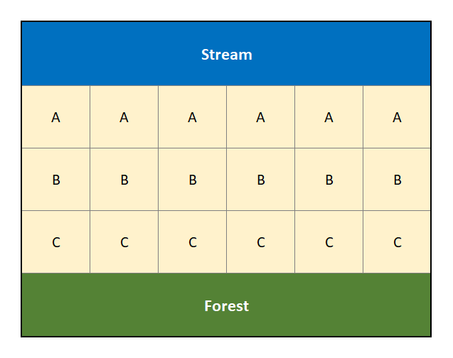
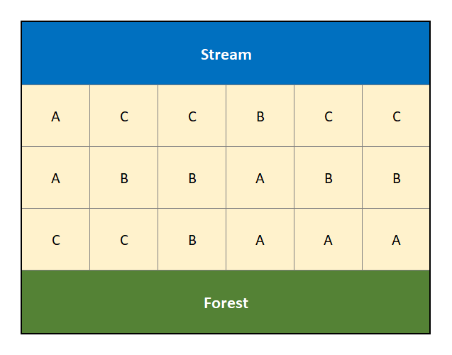
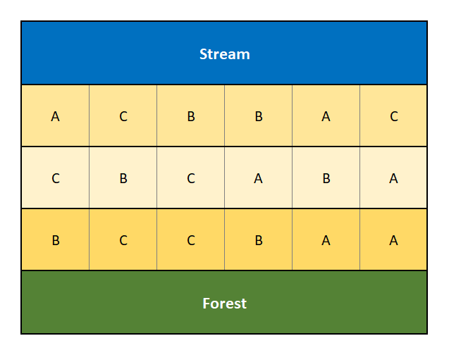

# Multiple Factor Designed Experiments

In the previous chapters we have seen how one variable (perhaps a factor with multiple treatments) can influence a response variable.
It should not be much of a stretch to consider the case of multiple predictor variables influencing the response. 

**Example.** Consider the admissions dataset with ACT scores as a response, besides the year of entry maybe a student's home neighborhood or state could also be a predictor?

In this chapter we will introduce the ideas of including multiple predictors into a model. 
Specifically, we look at two key analyses for designed experiments -- a Block design and Two-factor experiment.
The learning objectives of this unit include:

* Understanding the structure of a multi-factor model.
* Understanding the rationale of a block design.
* Understanding the rationale and structure of a two-factor design.
* Performing a full analysis involving multiple predictor variables.

```{r ch3-setup, include=FALSE}
library(knitr)
library(kableExtra)
library(tidyverse)
library(broom)
library(emmeans)
library(patchwork)
library(ggfortify)
options(dplyr.summarise.inform = FALSE,
        warn = -1)
```


## Blocking

Randomized Block Designs are a bit of an odd duck.
The details of the model are fairly straightforward (we are just adding another term to the ANOVA model in \@ref{eq:onewayAnovaModel}) but the analysis is nuanced.
Essentially, the model includes *predictor* variables we suspect are influencing the response, but we are not interesting in statistically testing its impact.
In some settings, the influence of the block terms can be substantial and when it is not included in the model, the impacts of the treatments are *hidden* by the strong effects of the block terms.
Thus, when a design includes block terms, it is vital that the statistical model include these effects.

The design is best described in terms of the agricultural field trials that gave birth to it. 
When conducting field trials to compare plant varieties, there is concern that some areas of a field may be more fertile than others (*e.g.*, soil nutrients, access to water, shade versus sun, etc... all will influence plant growth). 
For example, if one were comparing three plant varieties (call them A, B and C), it would not be wise to plant one variety in one location (say along a creek), another variety in a different location, and the third variety way back near a forest because the effects of the three plant varieties could be confounded with the natural fertility of the land.
See Figure \@ref(fig:ch3-field) as an example of a poorly designed experiment.

```{r ch3-field, echo=FALSE, fig.align='center', fig.cap='Diagram of a poorly designed experiment that is ignoring the potential confouding factors of a creek and forest.', fig.width=4.25, fig.height=3.25}

```

The natural fertility (next to the creek, compared to next to the forest, compared to the middle of the field) in this situation is a **confounding factor**.
A confounding factor is something we are not necessarily interested in, but that none the less will have an impact on our assessment of the factor of interest (*e.g.*, plant variety).  

We could attempt to mitigate the effect of this confounding factor through randomization. 
For example, suppose by random allocation the treatments are distributed as such as in Figure \@ref(fig:ch3-field-random).

```{r ch3-field-random, echo=FALSE, fig.align='center', fig.cap='Randomized Design that attempts to account for the confouding factors of a creek and forest.', fig.width=4.25, fig.height=3.25}

```

In Figure \@ref(fig:ch3-field-random) the treatments have been randomly assigned to the different locations in an effort to mitigate the effects of the stream and forest on land fertility.
However, by random chance we note that treatment "C" has 4 of its 6 replicates in proximity to the stream, with the remaining 2 next to the forest (never in the middle of the field). 
A block design looks to address this limitation of randomization when there are suspected (known) confounding effects.

A **block** is defined to be "a relatively homogeneous set of experimental material." 
In our hypothetical scenario, the plots adjacent to the stream may be a block, the plots adjacent to the forest a block, and everything in the middle is a block.

We aim to assess the treatment effects without undue influence from a contaminating or confounding factor, such as land fertility.
One way to do this would be to apply all the different treatments (*e.g.*, the three plant varieties) to the same area of the field (within a particular block term).
That is, within one block area (say next the creek in Figures \@ref(fig:ch3-field) and \@ref(fig:ch3-field-random)), we should see consistency in natural fertility levels.
Thus any differences observed in a measured response (such as crop yield) between plant varieties in that particular block will not be due to variation in fertility levels, but rather due to the different plant varieties themselves.

A bock design is one that includes these potentially confounding effects in the model.
It attempts to reduce the noise in the measured response in order to "clarify" the effect due to the treatments under study.

A **randomized block design** in the field study would be conducted in the following way: 

* The field is divided into blocks.
   + In our working example we use 3 blocks for the land next to the creek, next to the forest and that in the middle.
* Each block is divided into a number of units equal to, or more than, the number of treatments. 
   + In the example we have 3 treatments and segment each block into 6 units.
* Within each block, the treatments are assigned at random so that a different treatment is applied to each unit. When all treatments are assigned at least once in each block, it is known as a "Complete" Block Design. **The defining feature of the Randomized (Complete) Block Design is that each block sees each treatment at least once.**
   + We have randomly allocated 2 replicates of each treatment in each block for a complete and balanced design.

Figure \@ref(fig:ch3-field-block) displays a randomized complete block design for the same experiment involving three plant varieties, "A", "B" and "C".

```{r ch3-field-block, echo=FALSE, fig.align='center', fig.cap='Diagram of a Randomized Complete Block Design that accounts for the confouding factors of a creek and forest.', fig.width=4.25, fig.height=3.25}

```

A good experimental design will be able to "parse out" the variability due to potential confounding factors, and thus give clarity to our assessment of the factor of interest.
A block design can accomplish this task.

**What can serve as a block?**  It is important to note that subjects (*i.e.*, experimental units) themselves may form blocks in a block design.
It is also possible that different experimental units may collectively form a "block".
It depends on the circumstances.
All that is needed is that a block, however formed, creates a "relatively homogeneous set of experimental material."

**An example.** You likely have already seen the concept of a block design!
Recall the paired $t$-test from your introductory statistics course.
There, the *pairing* essentially acts as a block.
You observe two responses within each block and those two responses act as a *treatment* in some way.
We provide an example of a paired $t$-test below.

### Model form of a Randomized Block Design

Here is the data structure for a randomized block design (RBD) with one treatment replicate per block:

$$\begin{array}{c|cccc}
\hline
         & \textbf{Treatment 1} & \textbf{Treatment 2} & \ldots & \textbf{Treatment } k \\
\hline
\textbf{Block 1} & Y_{11} & Y_{21} & \ldots & Y_{k1} \\
\textbf{Block 2} & Y_{12} & Y_{22} & \ldots & Y_{k2} \\
\vdots & \vdots & \vdots & \vdots & \vdots \\
\textbf{Block } b & Y_{1b} & Y_{2b} & \ldots & Y_{kb} \\
\hline
\end{array}$$

The model for such data has the form

$$Y_{ij} = \mu + \tau_i + \beta_j + \varepsilon_{ij}$$

where 

* $Y_{ij}$ is the observation for treatment $i$ within block $j$.
* $\mu$ is the overall mean.
* $\tau_i$ is the effect of the $i^\mathrm{th}$ treatment on the mean response.
* $\beta_j$ is the effect of the $j^\mathrm{th}$ block on the mean response.
* $\varepsilon_{ij}$ is the random error term.

The usual test of interest is the same as in a one-way analysis of variance: to compare the population means due to the different treatments.
The null and alternative hypotheses are given by:
$$H_0: \tau_1 = \tau_2 = \ldots = \tau_k = 0 ~~\textrm{versus}~~ H_a: \textrm{at least one } \tau_i \neq 0$$
We may also test for differences between blocks, but this is usually of secondary interest at best.  


### Block ANOVA Example

As a first example consider the following *classic* barley yield experiment.
Here, the block terms correspond to growing fields & farming seasons.

**Example.** Barley Yields (from @Fisher1935).

Data was collected on the yields of five varieties of barley grown at six different locations in 1931 and 1932. 
Of statistical interested is the mean difference in yield between the five different varieties.

Original Source: @ImmerHayesPowers1934

Before proceeding with the data analysis, we first note the variables and factors of interests in this study.

* Barley yield - this is the response variable, recorded in Bushels per acre.
* Barley variety - the variety, or species, of barley. This is the factor variable of interest. It has 5 levels.
* Location and Year - The six different location and years serve as a block term in this model. We note that within each location and year, the environment should be fairly homogenous, so the location and year will serve as a blocking term.

The data is available in the file `fisherBarley.RData` on the class repository.

```{r ch3-barleyNoEval, eval=FALSE}
load(url("https://tjfisher19.github.io/introStatModeling/data/fisherBarley.RData"))
glimpse(fisherBarleyData)
```

```{r ch3-barley, echo=FALSE}
load("docs/data/fisherBarley.RData")
glimpse(fisherBarleyData)
```

We note the data includes a `LocationYear` variable that combines the information of both the `Location` and `Year`.
We also note we have a single observation for each `Variety` and `LocationYear` -- this we have a complete randomized block design with a single observation in each.

#### EDA on a Block Design

Although the design may not seem too complicated, we mentioned that the introduction of block effects make the analysis more nuanced. 
This begins when performing an exploratory data analysis.
Any summary statistics or plots of the data should incorporate the block effects in the analysis. 
This can be difficult in some cases -- in our working example we only have a single observation for each treatment and block combination, so summary statistics are not viable.
However we can make visuals to *see* what is happening with our data.

We first proceed with an inappropriate simple visualization of the data.
We do this strictly for demonstration and learning purposes.

```{r ch3-3, fig.align='center', fig.cap="Boxplot distribution of the barley yeilds of `LocationYear` and barley `Variety`.",out.width='70%', fig.asp=0.50}
library(patchwork)
p1 <- ggplot(fisherBarleyData) + 
  geom_boxplot(aes(x=LocationYear, y=Yield) ) +
  labs(x="Location & Year", y="Yield (bushels/acre)")
p2 <- ggplot(fisherBarleyData) + 
  geom_boxplot(aes(x=Variety, y=Yield)) +
  labs(x="Barley Variety", y="Yield (bushels/acre)")
p1 | p2
```
First, a quick note about the code that generates Figure \@ref(fig:ch3-3).
We build a simple boxplot of the yield as a function the block term and call it `p1`.
Similarly we build a boxplot of yield by barley variety, called `p2`.
We then use the functionality of the `patchwork` package [@R-patchwork] to put the two plots side-by-side (`p1 | p2`).
The results are in Figure \@ref(fig:ch3-3).

**Incorrect plots.** We note that the plots in **Figure \@ref(fig:ch3-3) are not appropriate for this data**.
For one, Boxplots display a 5 number summary -- for each block term we only have five observations (one for each variety). The figure on the left appears to summarize a sample of data when in fact we only have 5 observations; why not just display the raw data?
Second, the figure on the right is ignoring the block structure. 
Each environmental condition consisting of a location & year will have its own climate, rainfall, soil nutrients, etc... and may influence the barley yield.
For example, it is possible a particular barley variety may grow well in one Location and year due to *optimal* precipitation and sunshine levels, but another variety may grow poorly in that block term. 
This information cannot be deduced from this plot.

**A better plot** to consider is a **profile plot**.
It is a special line plot where each line corresponds to a block.
Here, we explore the response at each treatment level within each block term.

```{r ch3-3profile, fig.align='center', fig.cap='Profiles of each barley yield by variety profiling across each of the 12 Location and Year combinations.', out.width='60%', fig.asp=0.55}
ggplot(fisherBarleyData) + 
  geom_line(aes(x=Variety, y=Yield, 
                color=LocationYear, group=LocationYear) ) +
  labs(x="Barley Variety", y="Yield (bushels/acre)", color="Location & Year") + 
  theme_minimal()
```

This plot in Figure \@ref(fig:ch3-3profile) is an improvement over the previous result but can be further tweaked for visual improvement.
In particular, each line corresponds to one of the block terms (this is the common approach for these plots) but there are 12 different colors displayed, and it can be difficult to distinguish them.
This is considered *visual clutter*.
Since the specific Location & Year combinations are not necessarily of interest in our study, we can *mute* their impact by plotting each line with the same color as in Figure \@ref(fig:ch3-ImprovedProfile).

```{r ch3-ImprovedProfile, fig.align='center', fig.cap='Profiles of each barley yield by variety profiling across each of the 12 Location and Year combinations.',out.width='60%', fig.asp=0.55}
ggplot(fisherBarleyData) + 
  geom_line(aes(x=Variety, y=Yield, 
                group=LocationYear), color="gray30" ) +
  labs(x="Barley Variety", y="Yield (bushels/acre)") + 
  theme_minimal()
```

From the profile plots in Figures \@ref(fig:ch3-3profile) and \@ref(fig:ch3-ImprovedProfile) it is clear that certain Location & Years were more fruitful than others in terms of barley yield.
However, this is not the research question of interest - we are interested in determine how the different varieties of barley influence yield (not which field and year combinations were better).
From the plots, this is not as clear although there is some evidence that the Trebi variety may result in more yield across all the blocks.
The Peatland variety variety also may result in a higher yeild than the other varieties. 

#### ANOVA Analysis

To determine the effect variety has on yield we proceed with a formal analysis.
Below is a formal analysis in a call of `aov()` -- making sure to check underlying assumptions in Figure \@ref(fig:ch3-4).

```{r ch3-4, fig.width=7, fig.height=7, fig.align='center', fig.cap='Residual diagnostic plots when the response variable is the barley yield as a function of location and year (block) and variety. Here, the residuals appear fairly homoskedastic based on the Residuals vs Fitted and Scale-Location plots. The normality assumption is satisfied based on the Normal Q-Q plot.', fig.asp=0.9, out.width='70%'}
barley.fit <- aov(Yield ~ LocationYear + Variety, data=fisherBarleyData)
autoplot(barley.fit)
```

The assumptions look fine here (nothing concerning about constant variance or normality and independence is assumed from the design).
So, on to the analysis:

```{r ch3-5}
summary(barley.fit)
```

To perform the analysis, we need to focus on the `Variety` line in the ANOVA table.
The table includes a `LocationYear` line, but this is not of statistical interest -- we are not interested in testing if the different block terms influence barley yield.

We see that there is a significant difference in the yield between the five varieties ($F$ = 7.779, $\textrm{df}_1$ = 4, $\textrm{df}_2$ = 44, $p$-value = 0.0000785).

You can also see how the total variation was partitioned into three components: 

1.	Within-LocationYear (*i.e.*, the block term) sum of squares (31913).
2.	Between variety (*i.e.*, treatment) sum of squares (5310).
3.	Residual sum of squares (7509).   

We see that R also reports an $F$-statistic and associated $p$-value for the `LocationYear`.
This is the block term and is not of concern to our analysis.
So we **ignore** that $F$-statistic and $p$-value!

We can investigate the differences in yields between the five varieties using a multiple comparison procedure.  

```{r ch3-5a, fig.align='center', fig.cap='Tukey adjusted confidence interval plots comparing the give barley varieties (treatments). Here, we see that Trebi variety is statistically different than the other four varieties, while those four are all statistically similar (recall, we look for zero in the confidence interval of the differences).', out.width='60%', fig.asp=0.55}
barley.mc <- emmeans(barley.fit, ~Variety)
plot(contrast(barley.mc, "pairwise") )
```


We see that six of the ten Confidence Intervals in Figure \@ref(fig:ch3-5a) contain the value zero, thus concluding there is no statistical difference between these varieties of barley.
However, in four of the intervals zero is not included, and all four involve the 'Trebi' variety of barley - thus we have statistical evidence to conclude that the Trebi variety results in a different yield than the other four varieties.

Furthermore, based on the values of this intervals, it suggest that the Trebi variety will result in a greater yield than the other varieties 

* When 'Trebi' $-$ 'Other Variety' $>0$, this implies 'Trebi' $>$ 'Other Variety' and,
* 'Other Variety' $-$ 'Trebi' $<0$, this implies 'Trebi' $>$ 'Other Variety'.

#### Importance of including Block effects

In our initial discussion on block designs, we indicated that the inclusion of block effects in a model is imperative and that block terms can help *clarify* the effects the of the treatments.
The barley variety dataset serves as such a example. 
To explain, look at the full ANOVA table once again:

```{r ch3-5bAnovaTable, echo=FALSE}
tidy(barley.fit) |>
  bind_rows(tidy(barley.fit) |>
              summarize(across(is.numeric, sum) ) |>
              mutate(term = "Total")) |>
  rename(Term=term, `Sum Sq`=sumsq, `Mean Sq`=meansq, `F-stat`=statistic, `p-value`=p.value) |>
  kable(digits=4) |>
  kable_styling(full_width=FALSE, bootstrap_options = "striped") |>
  row_spec(4, bold=TRUE)
```

The total sum of squares (effectively, the total variance) of barley yield is more than 44,000 (squared bushels/acre). 
When this variability is decomposed, the sum of squares on the block term (the Location and Yield) is almost 32,000, or 71.3% of the total variability. 
The variability attributed to the different variety of barley is significant ($p$-value = 0.0000785).
However, the variability attributed to the barley variety is only 11.9% of the total variability. 
Notice what happens when we fit the **wrong model** to the data and forget to include the block effect.

```{r ch3-5c}
bad.barley.fit <- aov(Yield ~ Variety, data=fisherBarleyData)
summary(bad.barley.fit)
```
Here, the $k=5$ different varieties of barley still explain the same amount of variability (sum of squares of about 5,310, about 11.9%) but the residual (or unexplained variability) has increased substantially. 
Now, the $F$-statistic is not significant and we are unable to claim a different in barley yields by variety.
By not including the block term in our model, we lose the ability to parse out the effects of the different treatments.
In this sense, including block terms helps *clarify* the treatments. 
Another phrasing says that block terms increase the *sensitivity* of our testing procedures.


### Paired $t$-test as a Block ANOVA

In introductory statistics courses, the paired $t$-test (also known as the **matched pairs design**) is typically covered.
Arguably the simplest example of such a design is a before and after study as outlined in the fictional example below.

**Example.** In an effort to study the effectiveness of a new cholesterol drug 20 patients with high cholesterol are selected and their cholesterol is measured at the beginning of the study.
The patients then take the new drug for 45 days.
At the conclusion of the 45 days their cholesterol is measured and compared to that at the beginning of the study.

The above is an example of a designed experiment.
The experimental units are the 20 individuals.
The response variable is the difference in cholesterol (before and after) levels.
The pairing attempts to control for confounding variability (that is, the variability within each individual is somewhat controlled by the pairing).

The use of the paired $t$-test is not limited to experimental designs, it also appears in observational studies.
We will revisit the model statement in a later section.

#### Paired $t$-test data example

To demonstrates the implementation of a paired $t$-test in R consider the following example. 

**Example.** Carbon Emissions (originally in @WeissText).

The makers of the MAGNETIZER Engine Energizer System (EES) claim that it improves the gas mileage and reduces emissions in automobiles by using magnetic free energy to increase the amount of oxygen in the fuel for greater combustion efficiency.
Test results for 14 vehicles that underwent testing is available in the file `carCOemissions.csv`.
The data includes the emitted carbon monoxide (CO) levels, in parts per million, of each of the 14 vehicles tested before and after installation of the EES.

This is a classic before-after (Paired design) study. Below is some code to input the data.

```{r, eval=FALSE}
www <- "https://tjfisher19.github.io/introStatModeling/data/carCOemissions.csv"
vehicleCO <- read_csv(www, col_types = cols())
glimpse(vehicleCO)
```

```{r ch3pairedData, echo=FALSE}
vehicleCO <- read_csv("docs/data/carCOemissions.csv", col_types = cols())
glimpse(vehicleCO)
```

First note each row of the data consist of an `id` with a `before` and `after` measurement.
In the paired $t$-test, we are comparing the differences between the before and after measurements.
This can easily be implemented in R with different approaches.
We outline all three below but first look at visualizing the data.

#### Graphical comparison for paired design

Much like when including the block term in our above example, when graphically comparing paired data we must use some caution and consider the pairing feature in the data. 
Ultimately we are interested in the pairwise difference between observations. 
Thus, side-by-side boxplots are **not** appropriate since they do not account for the pairing. 

However, there are multiple options for reporting paired data.
For one, we can build a visualization of the differences.
Figure \@ref(fig:ch3pairedBoxPlot) provides a boxplot, with overlayed *jittered* observations and mean (gray diamond), of the differences from before to after (the *jittering* has been customized by specifying a maximum shift with `width=0.25`).
Note that the first step in the code is to create the new variable `Difference` by using the `mutate()` function.

```{r ch3pairedBoxPlot, fig.align='center', fig.cap='Box-whiskers plot showing the distribution of difference in CO emissions (Before installation of EES - After installation) demonstrating a CO emissions decreased for most vehicles under study.', out.width='60%', fig.asp=0.55}
vehicleCO <- vehicleCO |>
  mutate(Difference = before - after)

ggplot(vehicleCO, aes(x=Difference, y="")) + 
  geom_boxplot( )+
  geom_jitter(width=0.25 ) +
  stat_summary(geom="point", shape=23, fun="mean", size=3, fill="gray60") +
  labs(x="Changes in CO Levels (ppm)", y="",
       title="Effects of Engine Energizer System (EES) on 14 vehicles", 
       subtitle="Change in Carbon Monoxide Emissions after installation of EES") +
  theme_minimal()
```

When analyzing Figure \@ref(fig:ch3pairedBoxPlot) we note that most changes in CO levels are positive. 
On average, the change in CO levels is `r round(mean(vehicleCO$Difference), 3)` ppm.

Another plot that is easy to build for paired data is a scatter plot.
Specifically, we can assign the `Before` measurements to one axis, and the `After` to the other (the assignment is technically arbitrary).
If there is no difference between the two treatments (the 'before' or 'after' measurements), all the points should line up on a 45-degree line.
It is customary to include the "mean" before and after measurements and the plot can be seen in Figure \@ref(fig:ch3pairedPairsPlot). 


```{r ch3pairedPairsPlot, fig.align='center', fig.cap='Pairs plot showing the distribution CO emissions after installation of the EES as a function before before the. The overall mean effect is plotted with the open circle', out.width='60%', fig.asp=0.55}
vehicleCO_means <- vehicleCO |>
  summarize(before = mean(before),
            after = mean(after) )

ggplot(vehicleCO, aes(x=before, y=after) ) +
  geom_abline(intercept=0, slope=1, color="gray70") +  # 45-degee line
  geom_point(color="gray20") + 
  stat_summary(data=vehicleCO_means, aes(x=before, y=after), 
               geom="point", shape=21, fun="mean", size=4, stroke=2) +
    stat_summary(data=vehicleCO_means, aes(x=before, y=after), 
               geom="label", fun="mean",
               label="Mean difference", color="gray30", size=5, 
               hjust=0, position=position_nudge(x=0.15)) +
  labs(x="CO Levels (ppm) before installation of EES", 
       y="CO Levels (ppm) after installation of EES",
       title="Effects of Engine Energizer System (EES) on 14 vehicles", 
       subtitle="Carbon Monoxide Emissions before & after installation of EES") +
  theme_minimal()
```

The code above calculates the mean 'before' and 'after' measurements and stores them in the data frame `vehicleCO_means`. 
On average, the mean 'before' installation was `r round(mean(vehicleCO$before), 3)` ppm and `after` installation is `r round(mean(vehicleCO$after), 3)` ppm.
The pairs plot is constructed with multiple layers to demonstrate `ggplot` functionality in Figure \@ref(fig:ch3pairedPairsPlot). 
The layer with the summary statistics allows a reader to easily see how things have changed, on average.


Lastly, as with the barley example we can also build a profile plot.
Here we use the `id` values to group data.
Basically we wish to draw a line for each individual vehicle (by `id`).
Ultimately, to make this plot we need the data in the following form:

* A variable indicating the vehicle (`id`).
* A **single variable** indicating the different treatments (a variable recording the *time*, 'before' or 'after')
* A **single variable** with the response (`CO emissions`)

Our data currently has the CO emissions spread across two variables (called `before` and `after`), so we begin with some data munging.
We must pivot our data from the original wide format into a longer or tall format.

```{r ch3pairedTallData}
vehicleCO.tall <- vehicleCO |>
  select(-Difference) |> 
  pivot_longer(c(before, after), names_to="Time", values_to="CO") |>
  mutate(id=factor(id),
         Time=factor(Time, levels=c("before","after")))
```

Let's step through the above R code since some of this functionality has not been used since Section \@ref{numericSummaries}.
In the first statement `select(-Difference)` we are telling R to drop the `Difference` variable as we do not need it for the plot.
Then we are pivoting from wide-to-long format (or wide-to-tall) with the `before` and `after` measurements.
The resulting dataset has two new variables, one called `Time` which states if it is the *before* or *after* measure and another called `CO` with the corresponding Carbon Monoxide emissions at that time.
Lastly, we tell R to treat `id` as a factor and set the levels of `Time` so that `before` is first (otherwise it would put things in alphabetical order, by default).

Now that the data is in a tall format, we can make the profile plot in Figure \@ref(fig:ch3pairedProfilePlot).
Here we simply tell R to treat the factor `Time` as the $x$-variable with `CO` as the $y$-variable, but group each line by vehicle `id`.

```{r ch3pairedProfilePlot, fig.align='center', fig.cap='Profiles of each vehicle demonstrating a general decrease in CO emissions after EES installation.',out.width='60%', fig.asp=0.55}
ggplot(vehicleCO.tall) + 
  geom_line(aes(x=Time, y=CO, group=id) ) +
  theme_minimal() + 
  labs(y="CO Emissions (ppm)", 
       x="Installation of EES",
       title="Effects of Engine Energizer System (EES) on 14 vehicles", 
       subtitle="Carbon Monoxide Emissions before & after installation of EES")
```

To jazz up our plot we can add the overall effect by including some summary values.
First we calculate summary statistics. 
Since we use a `group` variable for each vehicle we need to *trick* R into plotting the overall summary line as well, thus we create an `id="Summary"` variable in `vehicleCO.summary` dataset to use as a `group` variable.
We also customize the $x$-axis scale by limiting the amount of space around the before and after markings.
The code below produces Figure \@ref(fig:ch3pairedProfilePlotAnnotated).

```{r ch3pairedProfilePlotAnnotated, message=FALSE, fig.align='center', fig.cap='Profiles of each vehicle, with average profile highlighted in a thick dark red line, demonstrating a general decrease in CO emissions after EES installation.', out.width='60%', fig.asp=0.55}
vehicleCO.summary <- vehicleCO.tall |>
  group_by(Time) |>
  summarize(CO=mean(CO),
            id="Summary")

ggplot(vehicleCO.tall) + 
  geom_line(aes(x=Time, y=CO, group=id), color="gray50" ) +
  geom_line(data=vehicleCO.summary, aes(x=Time, y=CO, group=id), 
            color="firebrick", linewidth=2) +
  scale_x_discrete(expand=c(0.075, 0.075) ) + 
  theme_minimal() +
  labs(y="CO Emissions (ppm)", 
       x="Installation of EES",
       title="Effects of Engine Energizer System (EES) on 14 vehicles", 
       subtitle="Carbon Monoxide Emissions before & after installation of EES")

```

Based on the three plots, it appears there may be a decrease in CO emissions after installation of the EES.

#### Performing a paired $t$-test in R

The traditional paired $t$-test (as covered in intro stat) is implemented in R in one of two ways: (1) we explicitly calculate the difference and test on the differences, or (2) we use options in the `t.test` function.

**Method 1**

```{r ch3tTestOneSample}
t.test(vehicleCO$Difference)
```

In this **first method**, since we explicitly calculated the Difference as a new variable (done above to build the Box-whiskers plot), we can statistically test if they differ from zero.
Essentially this is a one-sample $t$-test (from your intro stat class) on the new variable we created. 

**Method 2**

```{r ch3tTestPaired}
t.test(vehicleCO$before, vehicleCO$after, paired=TRUE)
```
In this **second method**, we compare the before and after measures but we tell R that the data are paired with the `paired=TRUE` option. 
Unfortunately, the `t.test()` function in R does not allow you to specify a paired $t$-test using a formula, so we must pass in the two measurements as separate variables.

Lastly note that we have excluded assumption checking here but will cover it in the next section where the test is performed via ANOVA.
Both methods provide the same findings with the same $t$-statistic of `r round(t.test(vehicleCO$before, vehicleCO$after, paired=TRUE)$statistic, 3)` and $p$-value of approximately `r round(t.test(vehicleCO$before, vehicleCO$after, paired=TRUE)$p.value, 4)`, thus we have strong evidence to support that the EES system changes carbon monoxide levels.

#### Block ANOVA implementation

To implement the paired $t$-test as a block ANOVA, we need the data in the format equivalent to the profile plot (that is, the *tall* format). 
We simply tell the function `aov()` that the CO measurements (variable `CO`) are a function of when the measurement was taken (variable `Time` with values `before` and `after`) and the block term (variable `id`).
Note that the `id` variable, although recorded as a number, has been converted into a `factor` variable when building the profile plot. 
Below we fit the model and plot the residuals. 

```{r ch3pairedAsAnova, cho=FALSE,  fig.cap='Residual diagnostic plots for the before-and-after study of the EES system on CO emissions. - Top-left a Residuals vs Fitted Plot shows no sysematic patterns; Top-right a Normal Q-Q plot of the residuals shows the residuals are reasonably normal; Bottom-left the Scale-Location plot shows quite a bit of variability in residuals but nothing systematic; and Bottom-right a Residuals vs Leverage plot.', fig.asp=0.9, out.width='70%'}
ees_anova <- aov(CO ~ id + Time, data=vehicleCO.tall)
autoplot(ees_anova)
```

Before considering the results provided in the ANOVA table, we consider the residual plots provided in Figure \@ref(fig:ch3pairedAsAnova).
The residual plots are not "textbook" in any case (as a violation or confirmation).
In a sense, this simple paired $t$-test dataset provides a great example for analyzing residual plots.

* In the Residuals vs Fitted plot we see that four points appear to *separate* from the others in terms of variability. However, this deviation does not appear systematic (such as the *fanning* effect seen in \@ref(fig:ch2-12) ).
* The trend line in the Scale-Location plot is a bit all over the place, it decreases and then increases towards residual points 8 and 7. But again, nothing systematic such as in Figure \@ref(fig:ch2-12) when there was a fairly clear increase.
* The Normal Q-Q plot shows some wonkiness but no residuals deviate from the theoretical quantiles in a substantial way, so the normality assumption seems satisfactory.
* Although we have not discussed how it is constructed and its uses, the "Constant Leverage" plot in the lower-right panel is informative here. The $x$ axis is the combination of treatment and block terms (so `id=1,Time=before` and `id=1,Time=after` and so on... all $14\times 2$ combinations). The $y$-axis is the standardized residuals (think $Z$-scores from intro stat). When analyzing the plot from left-to-right, we see that the vertical spread in the residuals is fairly constant, except for the 4 points (three points are labeled, 7, 8 and 9). Due to the pairing nature of the design, these four points represent two vehicles. Even though those points may seem strange, notice their corresponding standardized values ($\approx\pm 2$), which by standard metrics is only slightly abnormal. 

Although not exactly "textbook", the residual plots do not show any clear violations in the underlying assumptions. 
Normality looks reasonable and there does not appear to be any systematic heterskedasticity in the residuals (the deer knockdown time example in chapter 2 is a clear example of variability increasing with the mean).
We proceed with an analysis using the ANOVA table.

```{r ch3pairedAnovaTable}
summary(ees_anova)
```

Again, we ignore the information provided on the `id` line as this is the block term. 
With an $F$-statistic of 9.897 on 13 and 1 degrees of freedom (corresponding $p$-value of 0.0077), we have evidence that there is a different in carbon monoxide emissions before and after the installation of the EES. 

### Another Block ANOVA Example

The first block design example had roots in agriculture, much like our original description of blocking. 
The second was the paired $t$-test implemented as a block design.
Here is a different example where once again the subjects, or experimental units, are treated as blocks but the data is not paired. 

**Example.** Weight loss study (published in @Walpole2007).

In a study for the treatment of obesity, 10 subjects with a median age of 41.5 were recruited. Two behavioral weight reduction treatment plans were compared with a control treatment were studied for their effects on weight change.
The two reduction treatments involved were a self-induced weight reduction program where patients were taught self-control (SC) and a therapist-controlled reduction program.
Each of 10 subjects were assigned to the three treatment programs in a random order. 
Their weight was tracked for 5 weeks and their weight change was measured under each of the two treatments and control. 

Original Source: @Hall1975

Each subject gives three responses instead of one as in a usual one-way design.
In this manner, each subject (or person) forms a block (a person is a fairly homogeneous).
This is similar to some paired $t$-test designs, except here each person undergoes three treatments (instead of two).
The design is a randomized block design because the experimenter randomly determines the order of treatments for each subject and each subject (block) is exposed to all three treatments.

There data are available the file `weightlossStudy.csv on the class repository (`https://tjfisher19.github.io/introStatModeling/data/`). Below is an analysis of this data.

```{r ch3-1, echo=FALSE}
weightloss <- read_csv("docs/data/weightlossStudy.csv", col_types=cols())
glimpse(weightloss)
```

```{r ch3-2noeval, eval=FALSE}
weightloss <- read_tsv("https://tjfisher19.github.io/introStatModeling/data/weightlossStudy.csv")
glimpse(weightloss)
```

Before the formal analysis we conduct a short exploratory data analysis.
We note that the data is in a tall-format.
This is the preferred format for the computer (the `Subject` will act as a block, the `Treatment` is the factor of study and `WtChanges` is the response).
However, it can be difficult for a person to read the data in that format.
We use this as an opportunity to utilize the `pivot_wider()` function (we've seen wide-to-tall examples a few times, but never tall-to-wide).

```{r}
weightloss_wide <- weightloss |>
  pivot_wider(id_cols=Subject, names_from=Treatment, values_from=WtChanges)
knitr::kable(weightloss_wide) |>
  kable_styling(full_width=FALSE, bootstrap_options = "striped")
```

The table above provides a look at the full dataset. We can make some quick assessments just by looking at the values in the table.

* In the control treatment, 5 participants gained weight (positive value) and 4 lost weight (negative value) with 1 person finding no change. Based on the magnitude of these values the weight change in the control group is near 0 (on average it is `r mean(weightloss_wide$Control)`).
* In the self-induced group, 9 patient experienced some weight loss and one found no change, on average the chant was `r mean(weightloss_wide$"Self-induced")`.
* In the Therapist treatment, we see 8 patients lost weight while 2 actually gained weight, however the overall change was `r mean(weightloss_wide$Therapist)`, on average.

We can also build profile plots to explore the effects of the three treatments within each subject in Figure \@ref(fig:ch3-WeightPprofiles).

```{r ch3-WeightPprofiles, fig.align='center', fig.cap="Profiles of each subject's weight loss for the different treatments, with an overlayed 'average' highlighted in blue.",out.width='60%', fig.asp=0.55}
ggplot(weightloss, aes(x=Treatment, y=WtChanges)) + 
  geom_line(aes(group=Subject), color="gray30" ) +
  stat_summary(fun="mean", geom="line", size=2, group=1, color="blue") + 
  labs(x="Weight Loss Treatment", y="Weight Change") + 
  theme_minimal()
```

Overall, in Figure \@ref(fig:ch3-WeightPprofiles) the effect of the different treatments appears quite stark, with the Therapist and Self-induced treatments improving over the control. 
There is also quite a bit of subject-to-subject variability (*i.e.*, each person has their own profile!) and some subjects do not follow the "average" profile (a few perform worse with a therapist while it appears to help most patients).

We now perform a formal analysis with a call of `aov()` -- making sure to check underlying assumptions in Figure \@ref(fig:ch3-weightlossANOVA).
We note that the variable `Subject` is a numeric in the original dataset, we make sure to convert it to a factor before conducting the ANOVA (otherwise the fitted model does not match the design). 

```{r ch3-weightlossANOVA, fig.width=7, fig.height=7, fig.align='center', fig.cap='Residual diagnostic plots when the response variable is the weight change as a function of subject (block) and treatment. Here, the residuals appear to show some minor violations to the constant variance assumption as indicated by the Residuals vs Fitted and Scale-Location plots. Except for a single concerning observation, the normality assumption is satisfied based on the Normal Q-Q plot.', fig.asp=0.9, out.width='70%'}
weightloss <- weightloss |>
  mutate(Subject = factor(Subject))
weightloss.fit <- aov(WtChanges ~ Subject + Treatment, data=weightloss)
autoplot(weightloss.fit) +
  theme_minimal()
```

There appears to be a minor violation in the constant variance assumption (there is some indication that fitted values away from zero are more variable?).
But, this type of violation cannot be easily be remedied by the standard techniques (a logarithm or square root transformation is not possible due to the negative values, and an reciprocal transformation is not possible due to a 0 observation).
A single observation (observation 16) has a largest $z$-score value which deviates from the Normal line.
In situations like this, we proceed with the analysis making note of some potential minor assumption violations.

```{r ch3-545}
summary(weightloss.fit)
```

We see that there is a significant difference in the mean weight change between the three treatments ($F$ = 8.865, $\textrm{df}_1$ = 2, $\textrm{df}_2$ = 18, $p$-value = 0.0021).

As a follow-up, we can investigate the differences in mean weight changes between the three treatments using a multiple comparison procedure and noting that there is a control treatment.

```{r ch3-WeightMC, fig.align='center', fig.cap="Dunnett adjusted confidence interval plots comparing the two weight-loss treatments against the control. Here, we see that Self-induced treatment is not statistically different than the control (zero is in the interval) while the Therapist based treatment results in significantly more weight loss than the control.", out.width='60%', fig.asp=0.55}
weightloss.mc <- emmeans(weightloss.fit, ~Treatment)
plot(contrast(weightloss.mc, "trt.vs.ctrl", ref=1) ) +
  theme_minimal() +
  labs(y="", x="Change in Weight Loss (lbs)",
       title="Improvement in Weight Loss Treatments",
       subtitle="A Therapist controlled and self-controlled program vs. a control")
```


Both confidence intervals comparing the therapist-based weight loss treatment and self-induced treatment to the control in Figure \@ref(fig:ch3-WeightMC) do not contain the value zero, so we have evidence to suggest that the treatments statistically result in a bigger weight change than the control.
However, we do note that the interval comparing the self-induced method to the control is just outside the range of including zero, so the improvement may not be as contextually practical.


## Two-factor Designs

A **factorial** structure in an experimental design is one in which there are two or more factors, and the levels of the factors are all observed in combination.
For example, suppose you are testing for the effectiveness of three drugs (A, B, C) at three different dosages (5 mg, 10 mg, 25 mg). 
In a factorial design, you would observed a total of nine treatments, each of which consists of a combination of drug and dose (*e.g.*, treatment 1 is drug A administered at 5 mg, treatment 2 is drug A administered at 10 mg, etc). 
Unlike in the block design, with a two-factor experiment we are interested in analyzing the effects of both factors on the response. 

In this design, the data are usually obtained by collecting a random sample of individuals to participate in the study, and then randomly allocating a single treatment to each of the study participants as in a one-way design structure. 
The only difference now is that a "treatment" consists of a combination of different factors.

When there are two factors, the data may be analyzed using a two-way ANOVA. The two-way data structure with two factors $\mathbf{A}$ and $\mathbf{B}$ looks like the following:
$$\begin{array}{c|cccc}
\hline
 & \mathbf{A_1} & \mathbf{A_2} & \mathbf{\ldots} & \mathbf{A_a} \\
\hline
\mathbf{B_1} & Y_{111}, Y_{112}, \ldots & Y_{211}, Y_{212}, \ldots, & \ldots & Y_{a11}, Y_{a12}, \ldots \\
\mathbf{B_2} & Y_{121}, Y_{122}, \ldots & Y_{221}, Y_{222}, \ldots, & \ldots & Y_{a21}, Y_{a22}, \ldots \\
\mathbf{B_3} & Y_{131}, Y_{132}, \ldots & Y_{231}, Y_{232}, \ldots, & \ldots & Y_{a31}, Y_{a32}, \ldots \\
\vdots & \vdots & \vdots & \vdots & \vdots \\
\mathbf{B_b} & Y_{1b1}, Y_{1b2}, \ldots & Y_{2b1}, Y_{2b2}, \ldots, & \ldots & Y_{ab1}, Y_{ab2}, \ldots \\
\hline
\end{array}$$


Note there is replication (*i.e.*, multiple independent observations) in each treatment (combination of factors $\mathbf{A}$ and $\mathbf{B}$).

The general model for such data has the form

$$Y_{ijk} = \mu + \alpha_i + \beta_j + (\alpha\beta)_{ij} + \varepsilon_{ijk}$$
where

* $Y_{ijk}$ is the $k^\mathrm{th}$ observation in the $i^\mathrm{th}$ level of factor $A$ and the $j^\mathrm{th}$ level of factor $B$.
* $\mu$ is the overall mean.
* $\alpha_i$ is the "main effect" of the $i^\mathrm{th}$ level of factor $A$ on the mean response.
* $\beta_j$ is the "main effect" of the $j^\mathrm{th}$ level of factor $B$ on the mean response.
* $(\alpha\beta)_{ij}$ is the "interaction effect" of the $i^\mathrm{th}$ level of factor $A$ and the $j^\mathrm{th}$ level of factor $B$ on the mean response.
* $\varepsilon_{ijk}$ is the random noise term.

### Analysis of a two-factor design

First recall an important feature of designed experiments -- the model and analysis is determined by the experiment! 
In most cases of factorial designs, the primary interest is to determine if some interaction between the two factors influences the response. 
Therefore it is crucial to test the interaction term before assessing the effects of factor $A$ alone on the response (the "main effect"), because if $A$ and $B$ interact, then we cannot separate their effects. 
In other words, if the interaction between $A$ and $B$ significantly influences the response, then the effect that factor $A$ has on the response changes depending on the level of factor $B$; thus you cannot consider the effects of $A$ without considering the impact of $B$.

The usual testing strategy is as follows:

1. Fit a full interaction model.
2. Test for significance of the interaction between $A$ and $B$:
   a. If the interaction term is significant, you must look at multiple comparisons in terms of treatment combinations; *i.e.*, you cannot separate the effects of $A$ and $B$.
   b. If the interaction term is non-significant, you can look into the "main effect" in the full interaction model. But only when the interaction terms is not significant (and only then) may you make meaningful interpretations about the effects of $A$ and $B$ separately.
      i. Generally speaking, it is **not recommended** that you *refit* the model using only main effects. 
      ii. Although the interaction term may not be significant, it was part of the design and the design dictates the model.
      iii. Similar to a block term, even if not significant it still provides some information on the relationship between the predictor variables and the response.
    
We consider two examples below -- one with no significant interaction and one with significant interaction.

### Example with No Significant Interaction{#highwaySigns}

**Example.** Highway Signage (published in @WeissText). 

An experiment was conducted to determine the effects that the sign size and sign material have on *detection distance* (the distance at which drivers can first detect highway caution signs). 
Four drivers were randomly selected for each combination of sign size (small, medium, and large) and sign material (marked 1, 2, and 3).
Each driver covered the same stretch of highway at a constant speed during the same time of day, and the detection distance (in feet from the sign) was determined for the driver's assignment caution sign.

Original Source: @Younes1994

In this study there are 3 sign sizes and 3 materials, for $3\times 3=9$ total treatments. 
Each treatment is applied to a sample of $4$ individuals, thus there are $9\times 4=36$ total observations in this study.
The data appear in the tsv file `highwaySigns.tsv` in the textbook repository.

Note the data is stored in a "Tab separated values" file, or TSV.
This is similar to the more common, "Comma Separated values", or CSV, format but tabs are used in place of commas.
The `readr` package includes a `read_tsv()` function that works just like `read_csv()` and `read_table()`.


```{r ch3-6data-noeval, eval=FALSE}
highway_signs <- read_tsv("https://tjfisher19.github.io/introStatModeling/data/highwaySigns.tsv")
glimpse(highway_signs)
```

```{r ch3-6data, echo=FALSE}
highway_signs <- read_tsv("docs/data/highwaySigns.tsv")
glimpse(highway_signs)
```

Take a look at the dataset of detection distances by treatment and note that we need to coerce the `Material` variable to be a factor variable since it is coded as a numeric.
We will also manipulate the `Size` variable into a factor with a more logical order (recall that R will put the values in alphabetical order by default).

```{r ch3-highwayFix}
highway_signs <- highway_signs |>
  mutate(Material = factor(Material),
         Size = factor(Size, levels=c("Small", "Medium", "Large")))
```

Now we will construct a plot of the data.
We have 4 observations per treatment (combination of size and material) so a boxplot makes no sense here. 
We plot the raw data using color to distinguish the three sign materials.
We also add some *jittering* to separate data points and materials.

```{r ch3-6, fig.align='center', fig.cap='Boxplot distribution of the texture values as a function of sauce and fish type.',out.width='60%', fig.asp=0.55}
ggplot(highway_signs) + 
  geom_jitter(aes(x=Size, y=Distance, color=Material), 
              width=0.15, height=0 ) +
  labs(x="Sign Size", y="Detection Distance (ft)") +
  theme_bw()
```

From Figure \@ref(fig:ch3-6), there appears to be a size effect: Large signs have larger detection distances, followed by medium sized and then small.
There may be a material effect as type 3 appears to have lower detection distances than type 1.
Material type 2 is somewhere between types 1 and 3 in terms of detection distances. 

We fit the interaction model in `aov()` by telling R to include an interaction term with the notation `factor1:factor2`. 
Below is the specific example for this study but first run a check on the residuals in Figure \@ref(fig:ch3-7).

```{r ch3-7, fig.width=7, fig.height=7, fig.align='center', fig.cap='Residual diagnostic plots when the response variable is the detection distance as a function of sign size and sign material. Here, the residuals appear fairly homoskedastic based on the Residuals vs Fitted and Scale-Location plots. The normality assumption is satisfied based on the Normal Q-Q plot.', fig.asp=0.9, out.width='70%'}
highway.fit <- aov(Distance ~ Size + Material + Size:Material, data=highway_signs)
autoplot(highway.fit)
```

The assumptions look to be reasonably met. 
While there may be some minor issues with constant variance, it does not appear to be systemically related to the predicted (fitted) values, so transformations will not be helpful.
Likewise, those few observations in the QQ-Plot are not overly concerning given their $z$-score values are in the range $(-2,2)$.

#### Coding Notes

We fit interactions terms in a model by including the `factor1:factor2` type notation in a formula, so the final formula looks like `response ~ factor1 + factor2 + factor1:factor2`.
An alternative to this formulation is using the `*` notation in the formula statement. 
The formula `response ~ factor1*factor2` fit a full interaction model (main effects and interaction term) for predictor variables `factor1` and `factor2`. 
In our working example, the code is

```{r, eval=FALSE}
alt.highway.fit <- aov(Distance ~ Size*Material, data=highway_signs)
```

The reason we introduce both is that the `*` notation will **include all interaction** terms in a model. In the next chapter we cover more complicated designs and the inclusion of all interaction terms is not always appropriate, so it is imperative to know both usages.

#### Analysis of Two-factor experiment

At this point, we can also generate tables of response means after we fit the interaction model.
These consist of:

* The "grand mean" (overall mean, all data pooled together and estimate $\mu$).
* Main effect means (*i.e.*, means for each factor level, taken one factor at a time).
* Interaction means (*i.e.*, treatment means for all factor combinations).

These means are purely descriptive, but informative nonetheless. 
We could calculate each one of the above using a series of `tidyverse` commands (*i.e.*, `summarize()` with `group_by()`). 
R includes a function `model.tables()` that takes the input of an ANOVA fit and provides the means for all main effects and interaction effects.

```{r ch3-8}
model.tables(highway.fit, "means")
```

The output above is informative as a first mechanism to *see* what is happening in our experiment. 
All comparisons should be made relative to the overall mean ($\approx 2552$) and we begin by looking at the individual treatment terms in the `Size:Material` table.
Small sizes with materials 2 and 3 appear to be less than this overall mean. 
Large size signs, especially with material 1 and 2 deviate from the overall mean as well.
Collectively, along with Figure \@ref(fig:ch3-6) it appears that the size and material of the sign likely influence detection distance. 

We proceed to the hypothesis tests:

```{r ch3-9}
summary(highway.fit)
```

**The first test to inspect is the interaction term.** 

The interaction is not significant ($F$ = 1.031, $\textrm{df}_1$ = 4, $\textrm{df}_2$ = 27, $p$-value = 0.409). Thus, we conclude the effect that sign size type has on the mean detection distance does not depend on material type. Likewise, the effect of material type on detection distance does not depend on sign size.

A visualization of the interaction between the two factors is informative here.
Below, we build an interactions plot. 
An interaction plot is very similar to the Profile plot used in Block design -- basically it is a plot of treatment means (here $3\times 3$ treatments), whereby the means for all treatments having a given fixed level of one of the factors are visually "connected". 
Typically you distinguish the lines via color or linetype which maps to the other factor variable.
We can build an interaction plot seen in Figure \@ref(fig:ch3-10) using aesthetic options in `ggplot()` and with the `stat_summary` functions. 
Note both `color` and `group` are determined based on the `Material` variable.

```{r ch3-10, fig.align='center', fig.cap='Interaction plot demonstrating that the gender and dosage factors do not interact.', out.width='60%', fig.asp=0.55}
ggplot(highway_signs, 
       aes(x=Size, y=Distance, color=Material, group=Material) ) +  
  stat_summary(fun=mean, geom="point") + 
  stat_summary(fun=mean, geom="line") +
  labs(x="Sign Size", y="Mean Detection Distance (ft)", color="Size\nMaterial")
```

There are three treatment mean traces or profiles (the plotted lines), one for each material type. 
Each trace connects the mean detection distance of the sign size within each material.

**The lack of significant interaction is evidenced by the parallelism of these traces.** 
The material effect for small signs is depicted by the "gaps" between the traces on the left.
Similarly, the material effect for the medium signs is depicted by the gaps at the middle points. 
Lastly, the material effect for the large signs is depicted by the gaps at the right points.
Overall the three lines are reasonably parallel; this implies that the effect of material type within three sign sizes is about the same across all sign sizes.
This is consistent with a no significant interaction term.

In other words, the effect of material type does not depend on sign size. 

Since thee interaction term was non-significant (and supported visually), we can consider an analysis of the main effects of the model.

```{r ch3-11}
summary(highway.fit)
```

From the results, we see that the both material type and sign size appear to influence the detection distance of the fish (both $p$-values are smaller than typically-used significance levels). Specifically,

* With an $F$-statistic of 50.912 on 2 and 27 degrees of freedom ($p$-value $\approx 10^{-10}$), we have significant evidence that the size of the sign influences detection distances.
* With an $F$-statistic of 23.198 on 2 and 27 degrees of freedom ($p$-value $\approx 10^{-6}$), we have significant evidence that the material of the sign influences detection distances.

#### Multiple Comparisons

The follow-up work involves multiple comparisons among the levels of the significant main effect factors. 
Here, since there is no interaction, we can perform multiple comparisons within each of the main effects separately. 

First, we look at the influence of sign size.

```{r ch3-12}
twoway.size.mc <- emmeans(highway.fit, ~Size)
confint(contrast(twoway.size.mc, "pairwise"))
```
We first note that `emmeans` provides a "NOTE" about potentially misleading results. 
The `emmeans()` function recognizes that the model `highway.fit` includes an interaction term and that we are ignoring it (`~Size`). 
It is basically reminding us to only consider this type of analysis if the interaction was deemed non-significant. 
We note that all of the adjusted 95\% confidence do not include the value 0, thus all sign sizes result in different detection distances.

For the three different material types we get a similar results. .

```{r ch3-12fish}
twoway.material.mc <- emmeans(highway.fit, ~Material)
confint(contrast(twoway.material.mc, "pairwise"))
```
Again, we are given the warning due to the interaction term in the model.
All three confidence intervals do not include the value of 0, indicating that all three material types result in different mean detection distances.

Furthermore, in this example we can say with some certainty that large signs and material 1 will result in the largest detection distances, while small signs and material 3 will results in the smallest detection distances. 


### Example with Significant Interaction {#twoWayInteraction}


**Example.** Tooth growth in guinea pigs (original from @Crampton-1947).

Consider an example that investigates the effects of ascorbic acid and delivery method on tooth growth in guinea pigs.
Sixty guinea pigs are randomly assigned to receive one of three levels of ascorbic acid (0.5, 1.0 or 2.0 mg) via one of two delivery methods (orange juice or Vitamin C), under the restriction that each treatment combination has an equal number of guinea pigs. 
The response variable is the length of odontoblasts (cells responsible for tooth growth, measured in micrometers, or $\mu m$). 
The two-way data structure here looks like this:

```{r tooth_table, echo=FALSE}
tab <- data.frame("Supplement" = c("Orange Juice", "Vitamin C"),
                  "0.5 mg" = c("Treatment 1", "Treatment 4"),
                  "1.0 mg" = c("Treatment 2", "Treatment 5"),
                  "2.0 mg" = c("Treatment 3", "Treatment 6"))
names(tab) <- c("Supplement", "0.5 mg", "1.0 mg", "2.0 mg")
kable(tab) |> kable_styling(full_width=FALSE) |>
  add_header_above(c(" " = 1, "Dose" = 3))
```

The data appear in the R workspace `ToothGrowth` included in the `datasets` package [@R-base]. 
Here is a look at the dataframe:

```{r ch3-14}
data("ToothGrowth")
glimpse(ToothGrowth)
```

The factor dosage (variable `dose`) has been recorded as a numeric value. 
Before proceeding we perform some light data wrangling to turn it into a factor variable. 
We also add some labels to the factor variables to improve the aesthetics of our plots.
We make a new copy of the dataset (called `ToothGrowthDF`) as it is generally poor practice to modify variables and datasets built into R.

```{r}
ToothGrowthDF <- ToothGrowth |>
  mutate(Supplement = factor(supp, levels=c("VC", "OJ"),
                             labels=c("Vitamin C", "Orange Juice") ),
         Dosage = factor(dose, levels=c(0.5, 1.0, 2.0),
                         labels = c("0.5 mg", "1.0 mg", "2.0 mg")),
         Length = len)
```


Let us bypass generating numeric descriptive statistics for the moment, and instead jump to an interaction plot of the length response in Figure \@ref(fig:ch3-15). 

```{r ch3-15, fig.align='center', fig.cap='Interaction plot demonstrating that the dose and supplement may interact in predicting tooth length.', out.width='60%', fig.asp=0.55}
ggplot(ToothGrowthDF, aes(x=Dosage, y=Length, group=Supplement, color=Supplement) ) +  
  stat_summary(fun=mean, geom="point") + 
  stat_summary(fun=mean, geom="line") +
  labs(x="Dosage (mg per day)", 
       y=expression("Length of odontoblast ("*mu*"m)" )) +
  theme_minimal()
```

There are a couple of things to note here:

1. There appears to be a substantial dose effect: higher doses of ascorbic acid generally result in higher mean length.
2. **However, there may be an important interaction effect between the type of supplement and dose in determining mean tooth length.** In particular, orange juice appears to be more effective than Vitamin C as a delivery method (longer tooth length) only at lower dose levels. At the high dose level, there appears to be no difference between the supplements.

Once again, non-parallel traces may be the red flag. 
But, even if we suspect the two factor levels interact, we need to run the ANOVA test to confirm if this is a significant effect. 
First, check assumptions in Figure \@ref(fig:ch3-16).

```{r ch3-16, fig.width=7, fig.height=7, fig.align='center', fig.cap='Residual diagnostic plots when the response variable is the tooth length as a function of supplement and dosage. Here, the residuals appear fairly homoskedastic based on the Residuals vs Fitted and Scale-Location plots. The normality assumption is satisfied based on the Normal Q-Q plot.', fig.asp=0.9, out.width='70%'}
tooth.fit <- aov(Length ~ Dosage + Supplement + Dosage:Supplement, data=ToothGrowthDF)
autoplot(tooth.fit)
```

All assumptions look reasonable here.

* The Residuals vs Fitted and Scale-Location plot shows no indication of a changing variance.
* The Normal Q-Q plot shows the residuals are consistent with being normally distributed.

So, proceed to the ANOVA tests:

```{r c3.17}
summary(tooth.fit)
```

The test for interaction is significant ($F$ = 4.107, $\textrm{df}_1$ = 2, $\textrm{df}_2$ = 54, $p$-value = 0.0218).
Thus, we conclude the effect that supplement has on the mean tooth growth depends on the dosage level. **We must ignore the main effects** since the interaction is significant.

Remember the strategy we introduced earlier:

1. Fit a full interaction model.
2. Test for significant interaction between $A$ and $B$:
   a. **If interaction is significant, you must look at comparisons in terms of treatment combinations; *i.e.*, you cannot separate the effects of $A$ and $B$**.
   b. If the interaction term is non-significant, you can look into the "main effect" in the full interaction model. But only when the interaction terms is not significant (and only then) may you make meaningful interpretations about the effects of $A$ and $B$ separately.

#### Multiple comparisons

In the case of a significant interaction effect in a two-factor ANOVA model, we typically follow up by performing multiple comparisons for the levels of one of the factors while holding the other factor fixed (the "conditioning" factor). 
So for example, in the present problem we could either

* Compare the supplements at each of the three dose levels (3 tests total), or
* Compare the dose levels within each of the supplement types (3 × 2 = 6 tests total).

Often in practice, the context of the problem will dictate to the researcher which way makes the most sense. 
We'll provide code that performs both cases using the `emmeans` package.
Note that only change in the code is a slight modification of the `formaul` into `emmeans`. 
Here, we use the notation `~ factor1 | factor2`.
This tells the `emmeans()` function to consider comparisons of `factor1` given values within `factor2`.
You likely saw similar notation in your introductory statistics class when covering conditional probability (*i.e.*, $P(A|B)$).

First, we consider how dosages influences length for a fixed supplement type.

```{r ch3-18}
tooth.mc.dose <- emmeans(tooth.fit, ~ Dosage | Supplement )
contrast(tooth.mc.dose, "pairwise")
```

Here, we see output that is similar to the output introduced in Chapter 2.
A Tukey HSD multiple comparisons has been performed comparing the three dosage levels (3 comparisons) across both of the supplement types (2 types).
For the Vitamin C supplement, we can conclude that all three dosages result in differing tooth lengths.
For Orange Juice, the dosage of 0.5 mg is different than 1.0 mg and 2.0 mg, but 1.0 mg and 2.0 mg of Orange Juice do not result in differing tooth lengths.

Similar, we can make comparisons by conditioning on the other factor variable (remember, typically the context of the problem will dictate the ordering).

```{r ch3-18a}
tooth.mc.supp <- emmeans(tooth.fit, ~ Supplement | Dosage )
contrast(tooth.mc.supp, "pairwise")
```

At a dose level of 0.5 mg, ascorbic acid delivery via orange juice produces significantly larger mean tooth growth than does delivery via Vitamin C (determined by the adjusted $p$-value of 0.0021).
Similarly, at `Dosage = 1.0 mg`, there is a difference in tooth length between Vitamin C and Orange Juice, but not at `Dosage = 2.0 mg`.

We can also use plotting features to graphically explore the factors while holding another factor constant.
Below, we build Bonferroni adjusted confidence intervals comparing the dosage levels for each of the two supplements. 
We add some labels to the plot as Figure \@ref(fig:ch3-19) provides a decent summarization of the findings.

```{r ch3-19, fig.align='center', fig.cap='Graphical exploration of all treatments noting that the OJ supplement tends to result in higher tooth lengths than Vitamin C.', out.width='60%', fig.asp=0.75}
plot(tooth.mc.dose, int.adjust="bonferroni", type="response") +
  theme_bw() + 
  labs(y="", x=expression("Length of odontoblast ("*mu*"m)" ),
       title="Impact of Dosage and Delivery method on odontoblast length")
```

Figure \@ref(fig:ch3-19)explore the performance of the dosage amounts while conditioning on the delivery type. 
Graphically we can see that the Orange Juice delivery method tends to have higher tooth lengths than Vitamin C for the low dosage levels of ascorbic acid, while they are about equivalent for the high dosage level.


### Two-factor reformulated as a One-Factor

It turns out, we have actually seen a two factor experiment in the previous chapter, section \@ref(completeOneWay).
Recall the experiment studying the strength of Spruce Tree seedlings.


**Example:** Growth Behavior of Spruce Tress (from the text @Devore2011).

A study was conducted looking at the bud strength of spruce seedlings under different conditions.
Seeds that were deemed *healthy* and *diseased* were exposed to a solution of two different pH levels for two days, an acidic solution (pH of 5.5) and a neutral solution (pH of 7).
Buds from the seedlings were then analyzed and a Bud Breaking Rating was recorded for each seedling (where a higher number indicates better *budding*).
In the experiment, healthy seedlings exposed to a neutral solutions were considered a control compared to the other treatments.

In this design there are actually two factors being studied, seed type (healthy or diseased) and solution type (pH of 5.5 or 7). This is a $2\times 2$ designed experiment.
In the previous chapter, we analyzed this data as if it was a one-way experiment with 4 treatments. 
It turns out that all factorial models can be formulated into a One-Way model, although this reformulation is not always easy.
Specifically, in the one-way design we consider each unique treatment combination (here, the $2\times 2$ combinations) to be the only factor in the study. 
This may make more sense by looking at the mathematical equations. First, recall the 2-factor equation from above:
$$Y_{ijk} = \mu + \alpha_i + \beta_j + (\alpha\beta)_{ij} + \varepsilon_{ijk}$$
Using the spruce seedling example for the description of our design, $\mu$ could be interpreted as the average bud strength under the control setting (healthy seedlings with pH 7 solution). 
The term, $\alpha_i$ may be the influence of a diseased seedling (thereby, $\alpha_i = 0$ when the seedling is healthy, and $\alpha_i\neq 0$ when the seedling is diseased). 
Similarly, $\beta_j$ may be the influence of the solution level having a pH of 5.5 (so $\beta_j=0$ when the solution is pH 7, but $\beta_j\neq 0$ when pH 5.5). 
Lastly, $(\alpha\beta)_{ij}$ is the term for diseased and pH of 5.5. 
So the model can be expressed as:
$$\begin{align}
\text{Control}:&~~~ Y_{ijk} = \mu + \varepsilon_{ijk} = \mu_1 + \varepsilon_{ijk}\\
\text{Diseased and pH 7}:&~~~Y_{ijk} = \mu + \alpha_i + \varepsilon_{ijk} = \mu_2 + \varepsilon_{ijk}\\
\text{Healthy and pH 5.5}&~~~Y_{ijk} = \mu + \beta_j + \varepsilon_{ijk} = \mu_3 + \varepsilon_{ijk}\\
\text{Diseased and pH 5.5}&~~~Y_{ijk} = \mu + \alpha_i + \beta_j + (\alpha\beta)_{ij} + \varepsilon_{ijk} = \mu_4 + \varepsilon_{ijk}
\end{align}$$
and in this formulation $\mu_1$ is the mean under the control, $\mu_2$ is the mean for diseased seedlings with pH of 7, $\mu_3$ the mean for healthy seedlings and pH 5.5, and $\mu_4$ the mean for diseased seedlings and pH 5.5.
The structure has been rewritten as a one-way model:
$$Y_{ik} = \mu_i + \varepsilon_{ik}$$
where $\mu_i$ is the mean of each individual treatment.
In this way, the two-factor design has been written as a one-factor design in the form of equation (\@ref(eq:onewayAnovaModel)). 

#### Comparison of One-way and Two-Way ANOVA output

We start, by briefly running the relevant code from the previous chapter.

```{r, eval=FALSE}
site <- "https://tjfisher19.github.io/introStatModeling/data/spruceTrees1way.csv"
spruce_trees <- read_csv(site, show_col_types=FALSE)

spruce_trees <- spruce_trees |>
  mutate(Trt_label = factor(Treatment, 
                            levels=c(0, 1, 2, 3),
                            labels=c("Control",
                                     "Neutral & Diseased Seed",
                                     "Acid & Healthy Seed",
                                     "Acid & Diseased Seed") ) )
```

```{r ch3-80, echo=FALSE}
spruce_trees <- read_csv("docs/data/spruceTrees1way.csv", show_col_types=FALSE)

spruce_trees <- spruce_trees |>
  mutate(Trt_label = factor(Treatment, 
                            levels=c(0, 1, 2, 3),
                            labels=c("Control",
                                     "Neutral & Diseased Seed",
                                     "Acid & Healthy Seed",
                                     "Acid & Diseased Seed") ) )
```

The One-Way model is fit as before

```{r ch3-81}
spruce.oneway <- aov(BudBreaking ~ Trt_label, data=spruce_trees)
```
Now, let's read in the data in the format of a two factor experiment.

```{r}
site <- "https://tjfisher19.github.io/introStatModeling/data/spruceTrees2way.csv"
spruce_trees_twoway <- read_csv(site, show_col_types=FALSE)
glimpse(spruce_trees_twoway)
```

```{r ch3-82, echo=FALSE}
spruce_trees_twoway <- read_csv("docs/data/spruceTrees2way.csv", show_col_types=FALSE)
glimpse(spruce_trees_twoway)
```

The two factor variables are spread across two different columns and everything is labeled nicely. Fit the model using two-factor notation.

```{r ch3-83}
spruce.twoway <- aov(BudBreaking ~ Acidity*Seed_Type, data=spruce_trees_twoway)
```

Now, let us compare the ANOVA tables for the two fits:

```{r ch3-84}
anova(spruce.oneway)
anova(spruce.twoway)
```
On a quick glance, these results may appear different, but look more closely.

* The sum of squares on the residuals in both fits is 0.352 on 16 degrees of freedom.
* In the table for the two-way fit, the sum of squares for the *three* inputs (Acidity, Seed type & the interaction) are 0.200, 0.392 and 0.128, respectively, each with 1 degree of freedom.
   + Note: $0.200+0.392+0.128 = 0.720$ and $1+1+1=3$, the sum of squares and degrees of freedom on the treatments in the one-way ANOVA.
* The two-way ANOVA effectively decomposes the one-way sum of squares on treatments into multiple components.

Also note the interaction term is significant in the two-factor model, so we cannot interpret the main effects.

#### Why know both approaches?

In general, when an experiment has two (or more) factor levels, it should be modeled as such (that is, treat it as a two-way ANOVA).
The ANOVA table breaks up the sum of squares in the structural part of the model providing insight in what components are influencing the response. 
Consider the two previous examples.


* In the highway signs example (see Section \@ref(highwaySigns)), the interaction term was not significant. 
   + That is, any influence *sign material* may have on detection distance did not vary within the different *sign sizes*. Likwise, any influence *sign size* may have on detection distance did not vary within the different *sign materials*.
   + Both main effects were significant. This tells us that both *sign size* and *sign material* were predictive of the response without any influence from the other factor.
   
* In the tooth growth example (see Section \@ref(twoWayInteraction)), the interaction term was significant.
   + We can not meaningfully interpret the main effects; 
   + the influence of dosage depended on the delivery method, and likewise, the influence of the delivery method depended on the dosage.
   
When reformulating these models as a One-Way experiment, we may lose some of this information.
Looking at the two ANOVA tables for the spruce seedling problem. When treated as a one-way model, all we can say is that the four different treatments result in different bud breaking strength. There is no insight as to what may be driving the result.
However, with the two-way ANOVA, we know that it is an interaction of pH level and seedling type that are influencing bud breaking strength.

The reformulation is still useful however! In spruce seedling example there is a control group (pH of 7 with healthy seedlings), but standard two-factor approaches do not allow us to compare all unique treatments to that control group.
Look at the the previous example for multiple comparisons when interaction is present, we used the notation `~ Factor1 | Factor2` telling the `emmeans()` function that the `Factor1` levels should be separated within `Factor2`. But here, the control group includes a level within each factor (essentially we have two values creating the control).

So in situations like this, it is often better to reformulate the model for the purpose of performing multiple comparisons.

```{r}
spruce_trees_twoway <- spruce_trees_twoway |>
  mutate(Treatments = paste(Acidity, Seed_Type) )
```

The `paste()` function "paste" together the values in `Acidity` with `Seed_Type` resulting in a new variable called `Treatments`. This variable will be a `character` variable and R will automatically sort in alphabetical order when using that variable. Let's look at the results of this variable in alphabetical order so we know the location of the control group..

```{r}
sort(unique(spruce_trees_twoway$Treatments))
```
Note the control group is the fourth listed. 

```{r}
spruce.anova.alt <- aov(BudBreaking ~ Treatments, data=spruce_trees_twoway)
spruce.twoway.em <- emmeans(spruce.anova.alt, ~Treatments)
contrast(spruce.twoway.em, "dunnett", ref=4)
```

The results above are verbatim the as in Section \@ref(completeOneWay).


