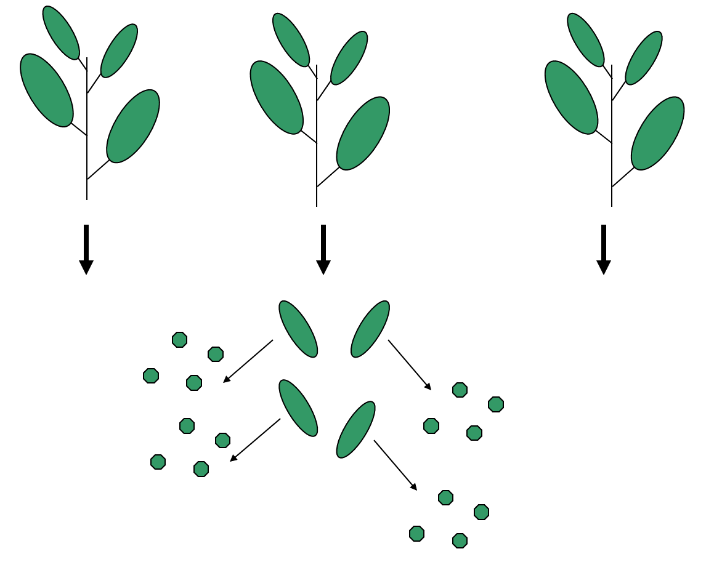

# Model Building

We now spend some time with the intricacies of regression modeling. 

## Regression assumptions revisited

Any time we run a hypothesis test or build a confidence or prediction interval in the context of a regression analysis or ANOVA, the validity of the findings depends on the assumptions being met.  Here they are again, just to remind you:

**Error assumptions:**
1. The errors are normally distributed (the normality assumption)
2. The errors have homogeneous variance (the constant variance assumption)
3. The errors are independent (the independence assumption)         

**Linearity assumption:**
We assume that the structural part of the linear regression model is correctly specified.

**Unusual observations:**
Occasionally, a few observations may not fit the model well.  These have the potential to dramatically alter the results, so we should check for them and investigate their validity.

We have already introduced graphical ways to check these assumptions using a process we call regression diagnostics.  Think of diagnostics as preventative medicine for your data.  

Our goal now is to investigate ways to address assumption violations so that we may trust the results of statistical tests and confidence intervals.  I can tell you that the typical approach to remedy assumption violations usually involves some form of data transformation.

## Normality violations

What if we have non-normal errors?   

* A treatment for non-normality comes usually in the form of a *power transformation* applied to the response variable $Y$.
* Note: you can actually get away with some mild violation of the normality assumption in many cases.  The reason is because of the Central Limit Theorem: if you have a large sample, the CLT will help bail you out when you have normality violations.  If your sample is small, though, the normality assumption is pretty important.

**Example:** 1993 Passenger Cars.  Cars were selected at random from among 1993 passenger car models that were listed in both the Consumer Reports issue and the PACE Buying Guide. Pickup trucks and Sport/Utility vehicles were eliminated due to incomplete information in the Consumer Reports source. Duplicate models (e.g., Dodge Shadow and Plymouth Sundance) were listed at most once.  That data reside in the `Cars93` data frame in the `MASS` package.  After loading the package, details about all the variables in the data frame may be obtained by typing `?Cars93`.

Let’s look at a simple linear regression to predict highway mileage (MPG.highway) from the weight of the car (Weight).  I will look at the normal Q-Q plot for the residuals, too:

```{r}
library(MASS)
data(Cars93)
m1 <- lm(MPG.highway ~ Weight, data=Cars93)
autoplot(m1, which=2)  
```

There is a noticeable skew in the points at the top of the plot, suggesting a skew in the residuals.  Since normally distributed data should be symmetric, this suggests a violation of the normality assumption.  What should we do?

Transformations of the response variable $Y$ can improve the fit and correct violations of model assumptions such as normality and constant error variance. The Box-Cox transformation method is a popular way to determine a normalizing data transformation for $Y$.  It is designed for strictly positive responses ($Y$ > 0) and determines the transformation to find the best fit to the data.  In the Box-Cox method, instead of fitting the original $Y$ as the response, we determine a transformed version $t_\lambda(Y)$, where

$$t_\lambda(Y) = \left\{\begin{array}{ll} \frac{Y^\lambda - 1}{\lambda} & \textrm{for } \lambda\neq 0 \\
\log(Y) & \textrm{for }\lambda=0\end{array}\right. $$

From the data, the “power” $\lambda$ is estimated.  Once optimally determined, we fit the linear model using the transformed response:

$$t_\lambda(Y) = \beta_0 + \beta_1 X_1 + \beta_2 X_2 + \ldots + \beta_k X_k + \varepsilon$$

<div style="float:right;position: relative; ">
```{r, echo=FALSE, fig.width=3.25, fig.height=3.25}
gg_boxcox(m1)
```
</div>


The `gg_boxcox()` function in the `lindia` package will produce a plot of the profile likelihood against the transformation parameter $\lambda$.  I do this here for model m1 just fitted:

```{r, eval=FALSE}
gg_boxcox(m1)
```

This function produces the plot at right.  The optimal choice of power transformation is near $\lambda = –0.75$.  The confidence interval for $\lambda$ runs from about –1.4 to 0.  For ease of interpretation, we typically use a convenient value of $\lambda$ nearest to the optimum.  So in this case, I would choose $\lambda = –1$ for my optimal transformation.  In other words, instead of fitting $Y$ as my response, I’d use

$$t_\lambda(Y) = \frac{Y^{-1}-1}{-1} = \frac{1}{Y}$$

Since $Y$ = `MPG.highway`, we instead use the reciprocal `1/MPG.highway` as our response variable. This should help normalize the residuals and hence validate any test or confidence or prediction intervals.  Let’s see:

```{r}
Cars93 <- Cars93 %>%
  mutate(Rec.MPG.highway = 1/MPG.highway)
t.m1 <- lm(Rec.MPG.highway ~ Weight, data=Cars93)
autoplot(t.m1, which=2)
```

This looks much better than the normal Q-Q plot for our original R model m1, which used `MPG.highway` as the response.  

Two notes:

1.	Regression coefficients will need to be interpreted with respect to the transformed scale. There is no straightforward way of “untransforming” them to values that can interpreted in the original scale.  Also, you cannot directly compare regression coefficients between models where the response transformation is different. Difficulties of this type may dissuade one from transforming the response.

2.	Even if you transform the response, you will want to express model predictions back in the original scale. This is simply a matter of “untransforming” by using the inverse function of the original transformation.  For example, suppose I use model trans.m1 to obtain a 95% PI for the true highway mileage for a car weighing 3000 lb:

```{r}
car.pred <- predict(t.m1, newdata=data.frame(Weight=3000),int="pred") 
car.pred
```

The PI (0.028, 0.0414) is in terms of `1/MPG.highway`. (Note that this is actually equivalent to “gallons per mile” here!)   To untransform, reciprocate:

```{r}
car.pred.mpg <- 1/car.pred
car.pred.mpg
```

We are 95% confident that the true highway mileage for an unobserved individual car weighing 3000 lb is somewhere between 24.11 to 35.53 miles per gallon. (Note: The lower and upper prediction limits in R are switched because of the reciprocal transformation we used.)

## Constant Variance Violations

For test and CI or PI results to be correct, we must assume that the variance of the errors is constant, i.e. it doesn’t change across varying values of the predictors or the response.  Constant error variance is sometimes referred to as homoscedacticity.  This is usually a more crucial assumption than normality in validating model inferences.  

The basic plot to investigate the constant variance assumption is a Residuals vs Fitted plot, i.e. a plot of  $e_i$ vs. $\hat{y}_i$. If all is well, you should see fairly uniform (“constant”) variability in the vertical direction and the scatter should be symmetric vertically around zero. This plot is the first of the four-plot diagnostic summary in R:

```{r}
appraisal.fit <- lm(saleprice ~ landvalue + impvalue + area, data=appraisal)
autoplot(appraisal.fit, nrow=1)
```

R adds a smoother to help you determine trend, which looks non-existent here (which is good).  However, don’t put too much credence in the smoother if the sample size is small.
The thing you should notice is what a violation looks like.  Typically, a violation appears as a systematic fanning or funneling of points on these plots.  This can occur in either direction: left to right, or right to left. Our experience has been that students learning regression diagnostics for the first time tend to over-interpret these plots, looking at every twist and turn as something potentially troublesome.  You'll especially want to be careful about putting too much weight on residual vs. fitted plots based on small datasets.  Sometimes datasets are just too small to make plot interpretation worthwhile.  Don't worry!  With a little practice, you will learn how to read these plots.

A refinement of the residuals vs fitted plot is the Scale-Location plot (third plot above).  The difference is that instead of plotting the raw residuals ei on the vertical axis, R first standardizes them (so you can better check for extreme cases), takes their absolute value (to double the resolution in the plot) and then takes their square root (to remove skew that sometimes affects these plots). A smoother trending upward or downward from left to right indicates a constant variance problem.  Again, only check the smoother if $n$ is large.

What if we have non-constant error variance?  There are a few strategies to address the problem, which I outline here:

1. Try a power transformation on $Y$. Sometimes problems of non-normality and non-constant variance go hand-in-hand, so treating one problem frequently cures the other. However, be aware that this is not always the case. Common “on-the-fly” first choices for transformations are $\sqrt{Y}$ and $\log(Y)$. The $\log$ transformation would be more appropriate for more severe cases.

2. Weighted least squares (WLS) regression.  WLS is a technique that fits a regression model not by minimizing $RSS = \sum e_i^2$ as in ordinary regression, but rather by minimizing a weighted residual sum of squares $WRSS = \sum w_i e_i^2$, where a “weight” $w_i$ is attached to observation $i$.  $w_i$ is chosen in such a way so that it is inversely proportional to the variance of the error $\varepsilon_i$ at that point.  We leave out the details to WLS here.

3. Use a Generalized Linear Model (GLM).  For certain response variables, there may be a natural connection between the value of the response and the variance of the response. Two common examples of this are when your $Y$ variable is a count or a proportion. In these cases, you should instead consider fitting a form of a generalized linear model. These types of models allow flexibility in choice of an error distribution (it doesn’t necessarily need to be normal) and error variance (doesn’t necessarily need to be constant).  We will see a bit more on this later in the couse.

**Example:** University admissions.  A director of admissions at a state university wanted to determine how accurately students’ grade point averages at the end of their freshman year could be predicted by entrance test scores and high school class rank.  We want to develop a model to predict `gpa.endyr1` from `hs.pct` (High school class rank as a percentile), `act` (ACT entrance exam score) and `year` (Calendar year the freshman entered university).  `year` will be treated as a categorical factor.

```{r}
uadata.fit <- lm(gpa.endyr1 ~ hs.pct + act + factor(year), data=uadata)
autoplot(uadata.fit)
```

We see some substantial non-constant variance (the residuals vs fitted plot shows clearly systematic fanning; the scale-location plot shows a downward trend in the adjusted residuals as the fitted values increase) as well as some non-normality.  Even though $n$ is large here and hence the non-normality isn’t a serious issue, let’s see what a Box-Cox normalizing transformation does for the error variance problem:

```{r}
gg_boxcox(uadata.fit)
```

Using $\lambda = 2$ (i.e. squaring the response `gpa.endyr1`) will be the best normalizing transformation.

How does the transformation improve our error variance problem?  Below is a direct comparison of the residuals vs fitted plots for the original response (model m, on the left) and the transformed response (model m2, on the right):

```{r}
uadata.fit2 <- lm(I(gpa.endyr1^2) ~ hs.pct + act + factor(year), data=uadata)
autoplot(uadata.fit, which=1)
autoplot(uadata.fit2, which=1)
```

The left skew in the residuals around 0 is gone, and the overall pattern looks much more uniform as a result of the transformation.  So, a normalizing transformation helped cure a non-constant variance problem.  The scale-location plots show the “cure” even better:

```{r}
autoplot(uadata.fit, which=3)
autoplot(uadata.fit2, which=3)
```

Thus, using $Y^2$ as our response (instead of $Y$) effectively treats the problem.   


## Violations of the independence assumption

We assume that the errors are independent (i.e. uncorrelated).  This is actually one of the most vital assumptions necessary to validate tests and confidence intervals.  Even mild violations can greatly tarnish statistical inferences.

In general, checking for independence is not easy.  However, if you collect your data according to a simple random sampling scheme with one observation per subject, there is usually no reason to suspect you will have a problem.  In such a case, simple random sampling of individuals ensures independence of the information contributed to the study by each individual.  The only circumstances where you will need to address the issue are outlined below.

Correlated (non-independent) errors can arise as a result of: 

1. Collecting data that are temporal or spatial in nature.  This means that the data are such that you can meaningfully think about the “proximity” of observations to each other.  This can happen by thinking in terms of time (e.g. measurements taken more closely together in time might tend to be more similar) or space (e.g. measurements located more geographically close to each other might tend to look more similar).  Here are two examples:

* **Example: Corn yields.** Suppose you are interested in studying the effect of annual rainfall on a crop yield (in bushels per acre).  For a particular plot of land, you have the following measurements:

* `year`		Year studied (1970-2007)
* `yield`	 Yield of corn (in bushels/acre)
* `rain`		Annual rainfall (in inches)

Here, we are repeatedly measuring the same plot of land over time.  It might be reasonable to suspect that the amount of rainfall in years immediately preceding a given year might have some impact on the yield in that given year (e.g. recovery from years of drought).  If so, the observations within this plot might not be independent.  

If the data are obtained in a time sequence, a residuals vs. order plot (or index plot) helps to see if there is any correlation between the error terms that are near each other in the sequence. This plot is only appropriate if you know the order in which the data were collected!  Highlight this, circle this, do whatever it takes to remember it — it is a very common mistake made by people new to regression diagnostics.  

Below is R code for the corn yield data. This code fits a simple linear regression model, and generates a plot of the standardized (mean 0, standard deviation of 1) residuals vs `year` (which corresponds to the order of the data).

```{r}
site <- "http://www.users.miamioh.edu/hughesmr/sta363/cornyield.txt"
corn <- read.table(site, header=TRUE)
corn.fit <- lm(yield ~ rain, data=corn)
corn <- corn %>%
  mutate(Std.Residuals = rstandard(corn.fit))
ggplot(corn) + 
  geom_abline(intercept=0, slope=0, color="gray40") + 
  geom_line(aes(x=year, y=Std.Residuals) ) + 
  geom_point(aes(x=year, y=Std.Residuals) ) + 
  theme_minimal()
```

In general, residuals exhibiting random fluctuation around the $e_i = 0$ line across time suggests that there is no correlation.  If there was correlation in the residuals, we would see longer consecutive runs of residuals either above or below the $e_i = 0$ line.  Unless these effects are strong, they can be difficult to spot.  Nothing is obviously wrong here.  

* **Example: Ground cover.**  Suppose we are engaged in a field study in a mountainous region.  We take measurements at various locations on a particular mountain in order to study how rainfall, elevation and soil pH impact the amount of cover (per square meter) of a certain species of moss.  

Why might non-independence be a concern in this example?  Think about two measurements taken at geographically close locations: they might tend to look more similar than those made between measurement locations far apart, even if the predictors are all similar in value.  In other words, proximity might produce similarity.  That violates independence. 

2. Pseudoreplication.  In the most basic form of a designed experiment, each separate subject (EU) contributes one independent piece of information about the response to the study.  But, common to all designed experiments is the notion of replication: this means we assign the same experimental conditions to several independent subjects (EUs), the idea being that we want to know how much natural variation in the response is present without changing the conditions of the experiment in order to estimate the random error component in a model.  Two or more independent EUs receiving the same treatment are called replicates.

Pseudoreplication is actually a form of spatial correlation introduced above in the ground cover example, but here it is purposefully built into the sampling plan of a designed experiment.  Here’s an example:

<div style="float:right;position: relative; ">
```{r, echo=FALSE, fig.width=4.25, fig.height=3.25}

```
</div>

* Example: Calcium content of leaves.  In a study to analyze the calcium content in leaves, three plants are chosen, from which four leaves were sampled.  Then from each of these twelve leaves, four discs were cut and processed.  

An illustration of the data collection process appears at right:

This dataset will have 48 values of calcium concentration from the leaf discs.  But to treat these values as 48 independent pieces of information would not be correct!   Why?  Discs from the same leaves are likely to be closer in value than those from different leaves, and those on the same plant will be more similar to each other than those from different plants.  There are natural clusters or hierarchies within the data, and this fact needs to be reflected in the way it is analyzed. 

In truth, this example has only three replicates (the number of plants), not 48.  The measurements within a plant are not real replicates, but rather pseudoreplicates.

What if we have non-independent errors?   

Your first step is to think about the context to determine if the data are likely to have the problem.  The solution to the non-independence problem always necessitates a change in how the data are analyzed.

1. If you have a designed experiment that has pseudoreplication or temporal characteristics built-in, you will need to account for this in how you construct your model.  We’ll see a bit more on this later in the course.

2. If you have observational data that has pseudoreplication or spatial or temporal characteristics, more advanced modeling techniques are required that are beyond the scope of this course (e.g. times series models, random coefficients models, etc.). 

## Violations of the linearity assumption

It is assumed that the structural part of the model has been correctly specified.  If so, this ensures that the mean value of the residuals ei is always 0, which is desirable since we don’t want the model to have any systematic tendency to overpredict or underpredict Y.

**Example: Tree volume.**  This data set provides measurements of the girth, height and volume of timber in 31 felled black cherry trees. Girth is the diameter of the tree (in inches) measured at 4 ft 6 in above the ground. The data are in the data frame `trees` from the `datasets` package in the R base installation.  For now, we will only consider a model to predict volume from girth, ignoring height.  (Question: why might we want to do this?)

First, let’s look at a plot of Volume against Girth.  I add a scatterplot smoother (called a LOESS, or LOWESS, curve) to make a preliminary assessment of the relationship:

```{r}
data(trees)
ggplot(trees) + 
  geom_point(aes(x=Girth, y=Volume) ) + 
  geom_smooth(aes(x=Girth, y=Volume), method="loess") + 
  theme_minimal()
```

It’s pretty clear that the relationship is non-linear: the rate of increase in volume per inch of girth is higher for larger trees.  If we fit the model `VOLUME` = $\beta_0$ + $\beta_1$`GIRTH` + $\varepsilon$ to these data, we are erroneously forcing the same rate of increase in volume regardless of tree size, since the rate parameter $\beta_1$ is the same regardless of girth.  Let’s see the effect of doing this on the residual diagnostics:

```{r}
tree.fit <- lm(Volume ~ Girth, data=trees)     # fits an incorrect straight-line model
autoplot(tree.fit, which=1)
```

Consider the Residuals vs Fitted plot.  If the linearity assumption were being met, the residuals should bounce randomly around the $e_i = 0$ line, but there is still obvious trend left in the residuals here, clearly depicted by the smoother curve: model predicted values that are low (<20) or high (>50) tend to be underpredicted, i.e. their residuals $e_i$ are positive; and model predicted values of modest magnitude (between 20 and 50) tend to be overpredicted (their residuals $e_i$ are negative).

What if we have a linearity violation?   

Addressing linearity violations involves making adjustments to how the predictors enter the model.  This usually means that we try applying transformations to the predictor(s).  Common choices are to fit a polynomial model in X, taking logs, etc.  Trial and error can reveal good choices of transformation.   

In the tree example, the smoother suggest that a quadratic model might perform better:

$$VOLUME = \beta_0 + \beta_1 GIRTH + \beta_2 GIRTH^2 + \varepsilon$$

We fit this model in R:

```{r}
tree.fit2 <- lm(Volume ~ Girth + I(Girth^2), data=trees)
summary(tree.fit2)
```

Note the p-value of the quadratic term (0.000152).  This means that curvature in the girth/volume relationship is statistically significant.  We could have equivalently investigated this by using `anova()` to compare the straight-line model (`tree.fit`) to the quadratic model (`tree.fit2`):

```{r}
anova(tree.fit, tree.fit2)
```

Now consider the residuals from the quadratic fit

```{r}
autoplot(tree.fit2, which=1)
```

The trend we saw in the residuals for the straight-line model is now gone. 
So, the linearity assumption has been satisfied here by fitting a quadratic model.  

Also note the adjusted R-squared value increases with the quadratic model (from 0.9331 to 0.9588).


## Detecting and dealing with unusual observations

Sometimes we will encounter unusual observations in our data.  It is important to have mechanisms for identifying such observations because they can wreak havoc on certain aspects of an analysis.  Once identified, we need a strategy for dealing with them.
In regression, there are three classifications of unusual observations:

1. **High-leverage points.** These are observations whose predictor values are far from the center of the predictor space, i.e. observations that are “extreme” in the $X$s.  This is not bad per se, but high-leverage points have the potential to exert greater influence on the estimation of the $\beta$-coefficients in our regression model.

2. **Outliers.** These are relatively isolated observations that are poorly predicted by the fitted model, i.e. observations that are “extreme” in the $Y$s.  Outliers can inflate the SE of the residuals, resulting in the potential masking of truly significant effects and prediction intervals that are too wide.

3. **Influential observations.** These are observations that are both outlying and have high leverage.   These are called influential because the $\beta$-parameter estimates can change dramatically depending on whether or not they are included in the analysis.

<div style="float:right;position: relative; ">
```{r, echo=FALSE, fig.width=3.25, fig.height=3.25}
set.seed(1) 
x <- c(runif(19, 0, 10),20)
y <- 10 - c(rep(0.5, 19),1)*x + rnorm(20)
df <- data.frame(x,y)
fit1 <- lm(y~x, data=df)
fit2 <- lm(y~x, data=dplyr::filter(df, x<20))
df <- df %>%
  mutate(Full.Fit=predict(fit1, newdata=df),
         Part.Fit=predict(fit2, newdata=df))
ggplot(df) + geom_point(aes(x,y)) +
  geom_line(aes(x,y=Full.Fit), color="blue") + 
  geom_line(aes(x,y=Part.Fit), color="red", linetype=2) + 
  theme_minimal()
```
</div>

Example. As an illustration, see the scatterplot at right.  The point in the lower right-hand corner is likely qualifies as an influential observation.  Why? 

The blue solid line is the least squares regression line for the data when the lower right-hand corner point is included.  If it is excluded, however, the regression line is given by the red dashed line, which has a much shallower slope.  That means that this point is highly “influential” on the fit.

The point in question is isolated in the $X$ direction (i.e. isolated from other values of the predictor $X$), so it has high leverage.  If you look in the $Y$ (response) dimension, the point is also a potential outlier, since it falls relatively far from the solid line. 

We now introduce ways to measure these attributes (leverage, outlyingness, influence) for each observation.  We will have R compute them, and then we will build plots out of them.  

I am leaving out a lot of technical detail and derivation here, and instead focusing on the usage of these measures.  Derivations may be found in more advanced texts on regression.

**Leverage.**  You have a data set with n observations ($i = 1, 2, \ldots, n$) fit with a model with $p$ $\beta$-parameters. The leverage for observation $i$ is measured using a quantity called a hat value $h_i$ (sometimes, it is just called the leverage). $h_i$ is a measure of the distance of the $i^\mathrm{th}$ observation from the centroid of the predictor values. The larger $h_i$ is, the farther removed the observation is from the “geographical center” of the predictor space.  

In R, the $h_i$ values may be obtained by `hatvalues()`

*Rule of thumb:* An observation has noteworthy leverage if $h_i > 2p/n$


**Outliers.**  Residuals are the natural way to determine how “far off” a model prediction is from a corresponding observed value.  However, now we need to use the residuals to determine how poorly predicted a particular observation may be.  To do so, we need to scale the residuals somehow.  There are two essential flavors of residual:

1. Raw residuals: $e_i = y_i - \hat{y}_i$, in R: `residuals()`

These are the usual residuals you get directly from fitting the model. They are in the units of the response variable $Y$.

2. Standardized residuals: $r_i = \frac{e_i - \bar{e}}{SE_e}$, in R: `rstandard()`

These are the residuals after scaling them by their standard error. Standardizing puts the residuals into units of standard deviation (like z-scores). You may then use an Empirical Rule-type argument to identify unusually large residuals.

*Rule of thumb:* An observation is a potential outlier if $|r_i| > 3$.

**Influential observations.** There are actually several ways to measure how an observation might influence the fit of a model (e.g., change in $\beta$-coefficient estimates for each observation based on whether or not it is included or excluded from the analysis). The most commonly used measure of influence combines measures of leverage and outlyingness, and is known as Cook’s Distance.  It is given by

$$D_i = \frac{1}{p}r_i^2\frac{h_i}{1-h_i}$$

In R, the $D_i$ values may be obtained using `cooks.distance()`

*Rule of thumb:* An observation may be influential if $D_i > 4/df_{error}$.

Recall that in R, the `autoplot()` function when applied to a linear model object created with `lm()` generates a set of four diagnostic plots. The plot labeled Residuals vs Leverage provides a nice visualization of the standardized residuals, the hat values, and contours corresponding to values of the Cook’s Distance influence measure.  Let’s look at a new example.

Example: Estimating body fat percentage.  The R workspace bodyfat.RData in our repository gives the percentage of body fat determined by the method of underwater weighing, in addition to numerous body circumference measurements, for a random sample of 252 men.  The goal of the study is to develop a good predictive model for estimating percentage of body fat using body circumference measurements only.  

I fit a main effects model using bodyfat.pct as the response and the remaining 13 variables as predictors, and request the diagnostic plots for the model fit:

```{r, eval=FALSE}
site <- "http://www.users.miamioh.edu/hughesmr/sta363/bodyfat.txt"
bodyfat <- read.table(site, header=TRUE)
bodyfat.fit <- lm(bodyfat.pct ~ ., data=bodyfat)
```

```{r, echo=FALSE}
bodyfat <- read.table("bodyfat.txt", header=TRUE)
bodyfat.fit <- lm(bodyfat.pct ~ ., data=bodyfat)
```

The notation ` bodyfat.pct ~ .` tells R to treat the variable `bodyfat.pct` as the response and all other variables are predictors.

```{r}
autoplot(bodyfat.fit, which=5)
```

There are no observations with $|standardized~residual| > 3$. Also, there are points with noticeably high leverages. In this example, a high leverage point is any observation with 

$$h_i > \frac{2p}{n} = \frac{2(14)}{252} = 0.111$$

The trace through the center of the plot is a smoother, but here it closely corresponds to where $r_i = 0$ (that’s where Cook’s Distance $D_i = 0$, i.e. where an observation exerts negligible influence on the model if retained or removed). Traces are also provided where $D_i = 0.5$ and $D_i = 1$. Three influential points are identified by R on the plot: observations numbered 39, 86, and 175 in the data frame.

**A strategy for dealing with unusual observations**

You should certainly have a good idea now that identifying and handling outliers and influential data points is a somewhat subjective business. It is for this reason that analysts should use the measures described above only as a way of screening their data for potentially influential observations. With this in mind, here is my recommended strategy for dealing with unusual observations:

* Even though it is an extreme value, if an unusual observation can be understood to have been produced by essentially the same sort of physical or biological process as the rest of the data, and if such extreme values are expected to eventually occur again, then such an unusual observation indicates something important and interesting about the process you're investigating, and it should be kept in the data. 

* If an unusual observation can be explained to have been produced under fundamentally different conditions from the rest of the data (or by a fundamentally different process), such an unusual observation can be removed from the data if your goal is to investigate only the process that produced the rest of the data. 

* An unusual observation might indicate a mistake in the data (like a typo, or a measuring error), in which case it should be corrected if possible or else removed from the data before fitting a regression model (and the reason for the mistake should be investigated). 


## Multicollinarity

Multicollinearity (abbreviated MC) is the condition where two or more of the predictors in a regression model are highly correlated among themselves.  It is a condition in the Xs, and has nothing to do with the response variable $Y$.  MC is always present in non-orthogonal data (i.e. observational studies).  The issue is to what degree it is present.

Why is MC a potential concern?  Very strong MC can have a severe impact on your ability to assess certain aspects of a regression analysis. Let’s see via an example.

**Example:** Housing Appraisal. Consider the housing appraisal data we've used multiple times. We have already established that the two values (improved appraised value and land value appear connected).

```{r}
ggscatmat(appraisal)
```

We see that all the predictor variables appear to be linearly connected (fairly strong correlations). We have moderately strong correlation between all three predictors and all three appear to be linearly connected to the response variable. Recall the full regression model.

```{r}
summary(appraisal.fit)
```

The land value and area do not show up as significant but visually both appear important (and both have correlation greater than 0.7).

**Causes of multicollinearity**

* Including a predictor that is computed from other predictors in the model (e.g. family income = husband income + wife income, and the regression includes all three income measures).
* Including the same or almost the same variable twice (e.g. height in feet and height in inches); or more commonly, using two different predictors that operationalize the same underlying concept (e.g., land value and area?)
* Improper use of dummy variables (e.g. failure to exclude one category).
* The above all imply some sort of error on the researcher’s part. But, it may just be that predictors really and truly are highly correlated.

**Consequences of multicollinearity**

* In the presence of severe MC, we cannot make reliable assessments of the contribution of individual predictors to the response.  High MC greatly inflates the $SE_b$ values (the standard errors for the model’s parameter estimates). As a result, confidence intervals for $\beta$-coefficients are too wide and t-statistics are too small. Moreover, $\beta$-coefficient estimates tend to be very unstable from one sample to the next.
* “Whole-model” assessments are unaffected by MC. These include CIs/PIs for the response $Y$, ANOVA F-tests for the whole model or joint significance of multiple predictors, $R^2$, etc.


**Variance Inflation Factors (VIFs).** High MC greatly inflates the standard errors for the model’s parameter estimates $b_1$, $b_2$, $\ldots$. The degree of inflation is measured by the VIF, or variance inflation factor, which is directly related to the $R^2$ notion in the above paragraph. To calculate the VIF for $b_i$, you run an “auxiliary regression” of $X_i$ on the remaining predictors. The VIF for $b_i$ is then given by

$$VIF_i = \frac{1}{1-R^2_i}$$

where $R_i^2$ is the $R^2$ value from modeling $X_i$ on the remaining predictors. If $R_i^2$ is large, say > 0.90, then $VIF_i > 10$. VIFs are the most effective way to detect Multicollinearity. Generally speaking, $VIF_i > 10$ is considered a major issue and $5 < VIF_i < 10$ is of moderate concern.

The function `vif()` in the add-on package `car` computes VIFs for a fitted model. Based on our preliminar view there is some concern

```{r}
library(car)
vif(appraisal.fit)
```

Here, we see there is no major concerns about MC based on VIF values.

**Warning signs and checks for severe multicollinearity**

* None of the *t*-statistics for the tests of individual $\beta$-coefficients is statistically significant, yet the whole-model F-statistic is.
* Check to see if your $\beta$-coefficient estimates that are wildly different in sign or magnitude than common sense would dictate.
* Check the VIFs (variance inflation factors). Any VIF > 10 indicates severe MC.
* You can examine the Pearson correlations between predictors and look for large values (e.g. 0.70 or higher), but the problem with this is that one predictor may be some linear combination of several other predictors, and yet not be highly correlated with any one of them.  That is why VIFs are the preferred method of detecting MC.
* Check to see how stable coefficients are when different samples are used. For example, you might randomly divide your sample in two. If coefficients differ dramatically when fitting the same model to different subsets of your data, MC may be a problem.
* Try a slightly different model using the same data.  See if seemingly innocuous changes (e.g. dropping a predictor, or using a different operationalization of a predictor) produce big shifts.  In particular, as predictors are dropped, look for changes in the signs of effects (e.g. switches from positive to negative) that seem theoretically strange.

**Dealing with multicollinearity**

* Make sure you haven’t made any flagrant errors, e.g. improper use of computed or dummy variables.
* Use a variable selection procedure to try to break up the MC (the next chapter deals with this).
* Try some predictor amputation. If a certain predictor has a high VIF, try deleting it and then re-assess the reduced model. The only caveat in doing this is that if the predictor truly belongs in the model for practical reasons, this can lead to specification error and bias in estimation of $\beta$-parameters.
* In some cases, centering your predictor variables at 0 can reduce or eliminate MC.  By “centering,” I mean shifting each predictor’s values so that they have a mean of 0.
* Performin a more complex model fit, such a *Principle Components Regression* should alleviate any concerns about MC, but it makes interpretation of the model difficult.
* Perform joint hypothesis tests rather than t-tests or CIs for individual parameters.  For example, suppose you fit a model containing seven predictors $X_1$, $X_2$, $\ldots$, $X_7$.  You determine that $X_2$, $X_3$ and $X_5$ are highly correlated.  Instead of doing three *t*-tests these individual coefficients, perform an ANOVA F-test of the null hypothesis $H_0: \beta_2 = \beta_3 = \beta_5$ = 0.  Such tests are not as impacted by MC.

Finally, remember that multicollinearity has no appreciable effect on predictions of the response variable $Y$.  So if the only intended purpose for your model is response prediction via CIs/PIs for $Y$, then taking drastic steps to curb any MC among the predictor variables is a bit like performing major surgery to treat a cold.

### Scale changes

Rescaling a predictor $X_i$ means applying a linear transformation of the form 

$$\frac{X_i - c_1}{c_2}$$

where $c_1$ and $c_2$ are constants ($c_2 \neq 0$), and then fitting a model. One particular important scaling is to *standardize* the predictor variables, namely the $i^\mathrm{th}$ observation of predictor $j$, or the datum $X_{ij}$ is scaled via

$$\frac{X_{ij} - \bar{X}_j}{S_{X_j}}$$

where $\bar{X}_j$ is the mean of all observed values of predictor variable $X_j$ and $S_{X_j}$ is the standard deviation of all observed values of predictor variable $X_j$.
Scaling can have several advantages in certain situations:

1. A change of units via rescaling might aid interpretation.
2. Transforming all quantitative predictors to the same (or similar) scale results in parameter estimates $b_1$, $b_2$, $\ldots$ that can be meaningfully compared to each other.
3. In extreme cases, numerical stability in computing can be enhanced when all the predictors are put on a similar scale. 
4. Scaling can sometimes help with issues of multicollinearity.
5. Transforming all predictors to the same scale (standardizing) is necessary in some variable selection procedures (the next chapter).

Rescaling $X_j$ will leave *t*-tests, *F*-tests, $R^2$, $R_{adj}^2$ and the residual standard error unchanged. However, the parameter estimate $b_j$ will be rescaled to $c_2 b_j$, and any CI for $\beta_j$ will likewise be affected.

**Example Property appraisals.** Let's revist the appraisal dataset we continue to utilize. Recall the response variable is the sale price (`saleprice`) with the following predictor variables.

* `landvalue` - Appraised land value of the property (in $)
* `impvalue` - Appraised value of improvements to the property (in $)
* `area` - Area of living space on the property (in sq ft)

Note two of the variables are in the units of dollars and the other is in square feet (the units are completely different). The computer treates every value as a number (it does not care about units) but given the difference in scale and units, this can lead to one variable appearing more important than another. 

First let's recall the fitted model:

```{r}
summary(appraisal.fit)
```

Those who know much about houses know that the size of the home and plot of land (essentially the `landvalue`) typically influence the sale price (larger homes sell for more), yet only the `impvalue` variable appears significant. But when looking at the coefficients, the $b_{landvalue} \approx b_{impvalue} \approx 0.81$ so it appears the two variables contribute the same predictive ability. Likewise, `area` appears it will be the most important in terms of predicting the `saleprice` in terms of row numbers. It turns out that the variability in the `impvalue` variable is masking the influence of the other variables.

This idea will make more sense with a plot. Using material from the first chapter we convert the predictor variables from wide to tall format to make a side-by-side boxplot.

```{r}
appraisal.tall <- appraisal %>%
  dplyr::select(-saleprice) %>%
  gather(key="Variable", value="Value")
ggplot(appraisal.tall) + 
  geom_boxplot(aes(x=Variable, y=Value))
```

Note the range for the `impvalue` variable compared to `area` and `landvalue`. Remember each value is also mapped to a `saleprice` value, the information provided in `impvalue` will overpower any information in `area` or `landvalue` since the variable are not on the same scale. Let's standardize each predictor variable by applying the `scale()` function to each column of the dataset.

```{r}
z.appraisal <- appraisal %>%
  mutate_at(c("landvalue", "impvalue", "area"), scale)
head(z.appraisal)
```

And note a regurgitation of the box-plot on the standardized variables

```{r}
z.appraisal.tall <- z.appraisal %>%
  dplyr::select(-saleprice) %>%
  gather(key="Variable", value="Value")
ggplot(z.appraisal.tall) + 
  geom_boxplot(aes(x=Variable, y=Value))
```

Now the units on all three predictor variables is essentailly the same. Let's fit our model again.

```{r}
z.appraisal.fit <- lm(saleprice ~ landvalue + impvalue + area, data=z.appraisal)
summary(z.appraisal.fit)
```

First note that the *p*-values are the same as before, likewise the overall $F$ statistics, $R^2$ and $R_{adj}^2$ are all the same. However, now the coefficients are different. The largest coefficient corresponds to the variable that appears most important (in terms of significant testing).

