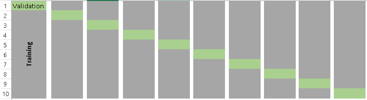

# Model Validation

At this point we have covered various concepts of statistical modeling but one fundamental question remains, "Is my model any good?"
Answering this question is of fundamental importance and there is no single way to determine the appropriateness of a model. 
We have covered techniques such as $R^2$, $R^2_{adj}$ and AIC but all three of those measures essentially measure how well the fitted model *fits* the data you used to make the fit. 
Generally speaking, we should consider other measures to validate our models as well.

## Underfitting vs. Overfitting Models

We have seen that increasing the complexity of a statistical model will always imporove the explanatory power on a response variable.  This is seen by the fact that $R^2$ will always imporve as the number of predictors increases.  In fact, you can show that if a regression model has $k = n$ parameters (i.e., if the number of $\beta$-coefficients in the model is the same as the sample size of the data it is being fit to), then you guarantee $R^2$ = 100%!

Of course, all this means is that such a model perfectly fits the data *it was built with*. At the same time, this model may be a very poor predictor of new (unobserved) individuals.  So, using the *same* data to assess the quality of a model is not exactly a great way to assess its predictive performance.  

Consider the following three models fit to the same data points:

```{r ch10-1, echo=FALSE, message=FALSE, warning=FALSE, fig.height=4, fig.width=10}
x <- runif(80, 5, 8)
y <- exp(x) + abs(rnorm(80, 0, 500))
d <- data.frame(x,y)
p1 <- ggplot(d, aes(x=x, y=y)) + 
  geom_smooth(method="lm", se=FALSE) + 
  geom_point() + 
  coord_cartesian(xlim = c(5,8), ylim=c(0,3500)) +
  xlab(" ") + ylab(" ") +
  theme_minimal()
p2 <- ggplot(d, aes(x=x, y=y)) + 
  geom_smooth(span=0.75, se=FALSE) + 
  geom_point() + 
  coord_cartesian(xlim = c(5,8), ylim=c(0,3500)) +
  xlab(" ") + ylab(" ") +
  theme_minimal()
p3 <- ggplot(d, aes(x=x, y=y)) + 
  geom_smooth(span=0.05, se=FALSE) + 
  geom_point() + 
  coord_cartesian(xlim = c(5,8), ylim=c(0,3500)) +
  xlab(" ") + ylab(" ") +
  theme_minimal()
grid.arrange(nrow=1,p1,p2,p3)
```

**The model on the left is underfit:** it misses the clear curvature in the relationship between the predictor and response.  So, from a trend perspective, it would systematically mispredict future observations that are produced by the same process.

**The model on the right, however, is overfit:** if you look closely, you'll see that it falls much closer to the observed data values than either of the other two models.  So this overly complicated model can predict its OWN data very well -- but that is because the model you see is catching a lot of the specific random behavior in this particular data set.  It isn't hard to imagine that a *new* data set, generated by the same process but exhibiting different random behavior, would be poorly predicted by even this complicated model!

**The model in the middle appears to be the preferred one to generalize and make predictions from**.  This is because it captures the systemic trend in the predictor/response relationship, but *that's all*.  It strikes a happy medium between two situations that can lead to poor predictive performance of a model on future observations.

### The Bias-Variance Trade-off

So here is the dilemma:

* We want to avoid overfitting because it gives too much predictive power to specific quirks in our data. 
* We want to avoid underfitting because we will ignore important general features in our data. 

**How do we balance the two?** This is known as the bias-variance trade-off. *Bias* corresponds to underfitting (our predictions are too vague to account for general pattern that do exist in the sample) and *variance* corresponds to overfitting (our predictions as so specific that they only reflect our specific sample).

## Validation Techniques

Overfitting results in low prediction error on the observed data but high prediction error on new (unobserved) data, while underfitting results in the opposite.  Measuring these type of errors can be accomodated using a process called **cross-validation** (CV).  CV comprises a set of techniques that enable us to measure the performance of a statistical model with regard to how well it can predict results in new datasets.  

There are three general approaches to this, which are detailed below.  They all involve splitting your data into partitions, and using some part(s) of the the data to build models and the remaining part(s) to test your model's predictive performance. It should go without saying that the methods we discuss here require that you have fairly large data sets (many cases, large $n$) so that we have ample information with which to build models.

## Basic Validation with a single holdout sample

The most basic idea behind CV involves dividing your data into two partitions, or subsets:

* A **training set** on which we build our model.  It is called a *training* set because we use this data partition to *train* the model for prediction.
* A **test set** (or validation set) which is used to test our model by estimating the prediction error resulting from predicting new observations.

Commonly used split proportions in practice are 80% for training data and 20% for test data, though this can be altered.  To assess model predictive performance, a good choice is to look at the model's **residual standard error** as calculated on the **test data**.  Formulaically, the residual standard error is the square root of the mean squared prediction error values.

**Example: Estimating Bodyfat Percentage.** Let's revisit the bodyfat percentage problem from Chapter 9 in the textbook.  Recall that the goal was to develop a model that would do well at predicting a man's bodyfat percentage by simply taking some selected circumference measurements around their body.  Let's use this data to do some model validation.

The first thing we need to do is split the data set consisting of $n$ = 252 men into a training set and a test set. This is done using the code below, creating a random 80/20 training/test split using R's `sample` function:

```{r ch10-2}
set.seed(54321)   # Set a seed value for reproducability purposes in this document

# Randomly select 80% of the data (rows)
index <- sample(1:nrow(bodyfat), size=floor(.80*nrow(bodyfat)))
train <- bodyfat %>% 
  filter(row_number() %in% index)
test  <- bodyfat %>% 
  filter(!row_number() %in% index)
```

The vector `index` consists of randomly selecting row numbers (cases) from the `bodyfat` dataset.  The size of the selection is set to be 80% of the number of rows in the datset itself.  Below we check to see how many cases landed in each of the training and test data sets:

```{r ch10-3}
nrow(bodyfat)
nrow(train)
nrow(test)
```

We have split the original sample of $n$ = 252 men into a training set of 201 men and a test (validation) set of 51 men.

### Use the training data to fit and select models

We now use the training data (named `train` by us above) to build our model.  We can use any or all of the techniques we have already covered to this point to build ("train") our model: stepwise regression, variable deletion, transformations, etc.  We use a best-subsets approach below, much like we did back in Chapter 9.  **It is critical to remember that everything we do in the model fitting stage is done on the training data only.**

### Model training:

Check various models' performance based on $R^2_{adj}$ and BIC:

```{r ch10-4}
bodyfat.gsub <- regsubsets(bodyfat.pct ~ ., data=train, nbest=4, nvmax=13)
stats <- summary(bodyfat.gsub)
gsub.df <- data.frame(Model.Number=1:length(stats$adjr2), Adjusted.R2=stats$adjr2, BIC=stats$bic)
p1 <- ggplot(gsub.df, aes(x=Model.Number, y=Adjusted.R2)) + 
  geom_line() + 
  geom_point(color="red", size=2) + 
  theme_minimal() +
  ylab("Adjusted R-squared") + xlab("Model Number")
p2 <- ggplot(gsub.df, aes(x=Model.Number, y=BIC)) + 
  geom_line() + 
  geom_point(color="red", size=2) + 
  theme_minimal() +
  ylab("BIC") + xlab("Model Number")
grid.arrange(p1,p2, nrow=2)
```

The estimated $\beta$-coefficients for the predictors of the best fitting model based on maximizing $R^2_{adj}$ are as follows:

```{r ch10-5}
coef(bodyfat.gsub, which.max(gsub.df$Adjusted.R2))
```

We see that this criterion selects a 10-predictor model.  While this is OK, it would involve a lot of body measuring in practice, and so might not be the best choice from an implementation prespective.  Its adjusted $R^2_{adj}$ is found as follows:

```{r ch10-6}
max(gsub.df$Adjusted.R2)
```

Now, let's look at what model is selected as optimal when minimizing BIC:

```{r ch10-7}
coef(bodyfat.gsub, which.min(gsub.df$BIC))
```

The best fitting model based on BIC has four predictors: `weight`, `abdomen`, `biceps`, and `wrist`.  As a corrolary assessment, we can check the value of $R^2_{adj}$ for this 4-predictor model:

```{r ch10-8}
gsub.df$Adjusted.R2[which.min(gsub.df$BIC)]
```

The best fitting model based on BIC is much simpler (4 predictors instead of 10), and its adjusted $R^2_{adj}$ is not noticeably lower than the 10-predictor model (0.7427 vs. 0.7549).  **So, let's choose to use the four predictor model.**

### Model validation step:

Now, let's use this model to predict bodyfat percentages for the men in the holdout (test) dataset. First we fit the chosen model on the training dataset. Then we use that model to predict the holdout values in the testing set.

```{r ch10-9}
fit1 <- lm(bodyfat.pct ~ weight + abdomen + biceps + wrist, data=train)
test.predictions <- predict(fit1, newdata=test)
```

The residual standard error (or equivalently, the square root of the mean squared residuals -- or **root mean squared error**) can be calculated on the test data to see how well our model predicts future observations. Below we manually calculate this value for explanation.

```{r ch10-10}
# Calculate observed - predicted bodyfat for test data
residuals <- test$bodyfat.pct - test.predictions          

# Calculate and display the residual std error
test.rse <- sqrt(mean(residuals^2))
test.rse
```

This is an estimate of the average residual (prediction error) size for individuals in an independent sample of men.  Using an Empirical Rule-style argument, we can be about 95% confident that our model will produce a predicted male bodyfat percentage that is within about $2\times 4.68 = 9.36\%$ of the actual value.

Compare this result to the artificially optimistic residual standard error we get by naively predicting the results for the *same men* we used to fit the model, using all the original data:

```{r ch10-11}
# Fit model to all the data
full.sample.fit <- lm(bodyfat.pct ~ weight + abdomen + biceps + wrist, data=bodyfat)  

# Predict all men in the same sample, 
# and calculate their residuals and residual std error
full.predictions <- predict(full.sample.fit, newdata=bodyfat)
residuals <- bodyfat$bodyfat.pct - full.predictions     
full.rse <- sqrt(mean(residuals^2)) 
full.rse
```

The result might look better, but it is biased toward the sample it came from!

## Hold-out sample validation using `caret`

The above example was quite involved and done so for the sake of explanation.  We can instead use some features in the `tidyverse` and the add-on `caret` library to effectively do the same thing.

```{r ch10-12}
# Create a balanced 80/20 split of the sample based on the response variable
train.index <- bodyfat$bodyfat.pct %>%
  createDataPartition(p = 0.8, list = FALSE)

train.data <- bodyfat %>%
  filter(row_number() %in% train.index)   # 80% goes into training data
test.data <- bodyfat %>%
  filter(!row_number() %in% train.index)  # The rest goes into test data

# Verify balance between training and test data on the response variable:
ggplot() + 
  geom_density(data=train.data, aes(x = bodyfat.pct), 
               fill = "#00BCD8", alpha = 0.3) + 
  geom_density(data=test.data, aes(x = bodyfat.pct),
               fill = "#F8766D", alpha = 0.3)

# Build/fit our model
fitted.model <- lm(bodyfat.pct ~ weight + abdomen + biceps + wrist, data=train.data)

# Make predictions and compute RMSE and MAE
predictions <- fitted.model %>% 
  predict(test.data)
data.frame(RMSE = RMSE(predictions, test.data$bodyfat.pct),
           MAE = MAE(predictions, test.data$bodyfat.pct))
```

The `caret` package can easily provide us with the root mean squared error RMSE (residual standard error) like before, but can also provide other measures of model performance.  Two measures are typically employed:

* **Root Mean Squared Error** (RMSE), which measures the average prediction error made by the model when predicting the outcome for a future observation.  This is what we have already calculated.  Lower values of RMSE are better.
* **Mean Absolute Error** (MAE).  This is an alternative to RMSE that is less sensitive to outliers in your data. It corresponds to the average *absolute* difference between observed and predicted outcomes. Lower values of MAE are also better.

Both of these are meassured in the same units as the response variable.  In the above example, the mean absolute error in bodyfat prediction is 3.265% and the root means squared error is 3.9% (note this is different than our previous derivation because a different training and testing set were declared). 

**Disadvantages.** The single holdout sample method is only useful when you have a large data set that can be partitioned. The key disadvantage, however, is that we build a model only using a fraction of the available data, which may possibly leave out some interesting information, leading to higher bias. We try to mitigate this by ensuring the training and test data sets are balanced with respect to the response variable (using `createDataPartition` from the `caret` package), but the potential for bias still exists as it could come from imbalance among the predictors, etc.

As a result, test error rates using a single holdout sample can be highly unstable depending on which observations are included in the training set.  So, we'd like to consider using more comprehensive approaches.

-----------------------------

## "Leave one out" Cross-Validation (LOOCV)

More comprehensive methods **involve doing the training/testsing in multiple stages across many partitions in the data.** One such method that admittedly takes the proces to an extreme is called "leave-one-out" cross-validation.  This method is as follows:

1. Leave out one data point (observation) and build the model on the remaining $n-1$ data points.
2. Use the model from step 1 to predict the single data point that was left out.  Record the test error associated with this prediction.
3. Repeat the process above for **all** $n$ data points.  This means you will fit $n$ models!
4. Calculate the overall prediction error by averaging all the test errors recorded for the individual points through the process.  We can still use RMSE or MAE for this.

This is a very intensive process as you might imagine, but it is actually very easy to do in `caret`:

```{r ch10-13}
# Set training control method as LOOCV
train.control <- trainControl(method = "LOOCV")

# Train the model
LOOCV.model <- train(bodyfat.pct ~ weight + abdomen + biceps + wrist, 
                     data = bodyfat, 
                     method = "lm",
                     trControl = train.control)

# Display results
LOOCV.model
```

The function `trainControl()` defines the partitioning method for the coming validation step.  Then we use the `train()` function in `caret` to execute the process.  We first specify the model form (we are still choosing to use the 4-predictor model here), run the process on the master data set (here, `bodyfat`), use linear regression (`method="lm"`), and specify the partitioning method to use.

The resulting output list the RMSE and MAE, along with a pseudo R-squared type measure (looking at predictor error compared to variance in the response).

**LOOCV Disadvantages.** On the surface, LOOCV seems like it might be the preferred approach since we use almost all the data ($n-1$ data points) to independently predict every possible holdout. However, it can be computationally intensive, and might result in higher variation in the prediction error if some data points are outliers. So, ideally we will use a good ratio of testing data points ... a solution provided by the next method, which is a sort of compromise between a single holdout sample and LOOCV.

-----------------------------

## $k$-fold Cross-Validation

The $k$-fold cross-validation method evaluates model performance on different subsets of the training data and then calculates the average prediction error rate across all the different subsets.  We purposefully choose a number of subsets, known as **folds** of the data, into which we partition the data. The process is as follow:

1. Randomly split the data into $k$ subsets, or **folds**.  Note that $k$ is determined by the user; typically a value of 5 or 10 is used.
2. Hold out one fold, and train the model on all other folds combined
3. Test the model on the held-out fold and record the prediction errors
4. Repeat this process until each of the $k$ folds has served as a test set
5. Calculate the average of the $k$ recorded errors. This is will be the performance measure for the model.

Visually, the folds can be thought of as something like the below example, a $k=10$ fold segmentation.

```{r ch10-14, echo=FALSE, out.width = '100%'}

```

The most obvious advantage of $k$-fold CV compared to LOOCV is computational. The question is: *what is a good value for $k$?*  Consider the following:

* **A low value of $k$ (few folds) leads to more bias potential.** It is not hard to see that using a small value of $k$ is not that much different than just using the first method described, a single holdout sample.
* **A high value of *k* (many folds) leads to more variance in the prediction error.** In fact, if $k=n$, then you are doing LOOCV.

It has been shown in practice that using $k$ = 5 or 10 yields test error rates that do not appreciably suffer from excessive bias nor high prediction error variance.

The following example uses `caret` to perform a 5-fold cross validation to estimate the prediction error for predicting bodyfat percentage in men from the `weight`, `abdomen`, `biceps`, and `wrist` measurement predictors.

```{r ch10-15}
# Set training control method as 5-fold CV
train.control <- trainControl(method = "cv", number = 5)

# Train the model
kfoldCV.model <- train(bodyfat.pct ~ weight + abdomen + biceps + wrist, 
                       data = bodyfat, 
                       method = "lm",
                       trControl = train.control)

# Display results
kfoldCV.model
```

Here we see similar output as the LOOCV but the procedure runs substantially quicker. $k$-fold cross-validation is generally recommended over the other two methods in practice due to its balance between variability, bias and computational run-time.

## A final note

As with many topics in this text, we are merely *scratching the surface* on this topic. However, we have outlined the basic building blocks on modern model validation. Several variants exist including

* Segmenting your data into *training*, *tuning* and *testing* sets. Cconsider the brief discussion on selecting a *tuning* parameter for LASSO and Ridge regression in the previous chapter. The tuning set can be used to select that parameter, then the final model can be validated with the testing set.
* Repeating $k$-fold CV multiple times. Performing $k$-fold CV one time is not too different than the single training and testing set approach, data is segmented randomly into sets. A different random permutation will result in a different RMSE (we saw this above!). It is possible to repeat the $k$-fold CV multiple times and aggregate all the results. If computational power allows, this is typically done in practice.


